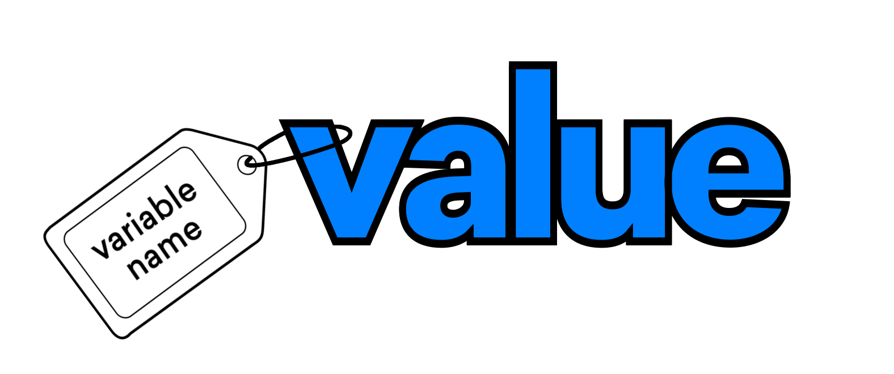
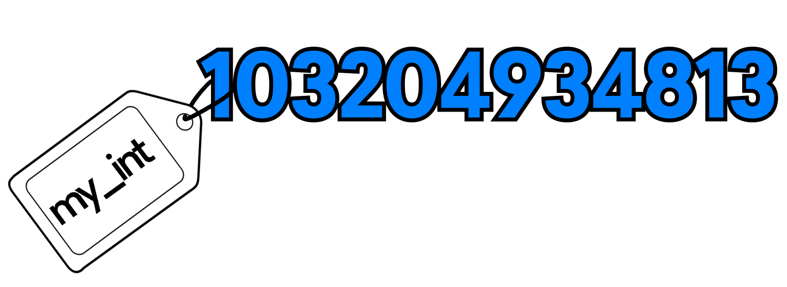
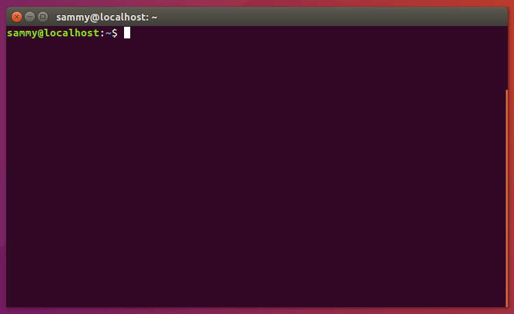
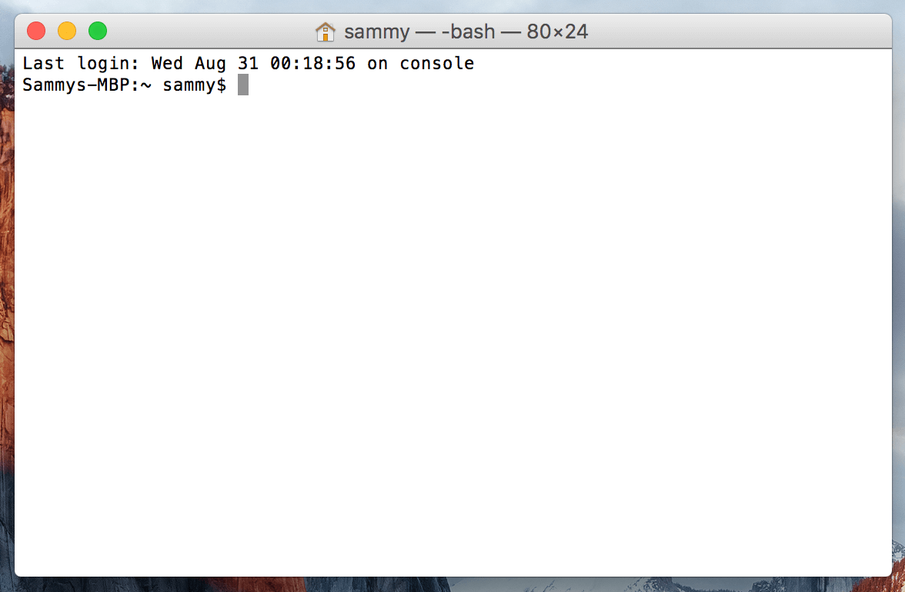

<!--
author:   Lisa Tagliaferri

date:     2017-10-26

email:    LiaScript@web.de

version:  1.0.0

language: en

narrator: US English Female

comment:  DigitalOcean’s How To Code in Python 3 tutorial series is available for free as an open educational eBook in both EPUB and PDF formats. Having these tutorials together in an eBook format provides you with a resource that you can use on your favorite e-reader without maintaining a constant internet connection. This way, you can use the book to learn key concepts while offline, or as a reference guide while you are coding on your computer.

persistent:  true

logo:     media/cover.jpg

import:   https://raw.githubusercontent.com/LiaTemplates/PyScript/0.0.2/README.md

@repl: @PyScript.repl(```@0```)

-->

Author: Lisa Tagliaferri
Publisher: DigitalOcean


This work is licensed under a Creative Commons
Attribution-NonCommercial-ShareAlike 4.0 International License.

ISBN 978-0-9997730-0-0

# How To Code in Python 3

<article>

## About DigitalOcean

DigitalOcean is a cloud services platform delivering the simplicity developers
love and businesses trust to run production applications at scale. It provides
highly available, secure and scalable compute, storage and networking solutions
that help developers build great software faster. Founded in 2012 with offices
in New York and Cambridge, MA, DigitalOcean offers transparent and affordable
pricing, an elegant user interface, and one of the largest libraries of open
source resources available. For more information, please visit
https://www.digitalocean.com or follow
[\@digitalocean](https://twitter.com/digitalocean) on Twitter.

Read this book online and receive server credit via https://do.co/python-book

</article>

<article>

## DigitalOcean Community Team

**Director of Community:** Etel Sverdlov

**Technical Writers:** Melissa Anderson, Brian Boucheron, Mark Drake, Justin
Ellingwood, Katy Howard, Lisa Tagliaferri

**Technical Editors:** Brian Hogan, Hazel Virdó

</article>


## Introduction


### Why Learn To Code

Software and technology are becoming increasingly integrated into our everyday
lives, allowing us to accomplish tasks, navigate to destinations, make
purchases, and stay connected with friends. Because of how pervasive software
now is to the human experience, it is important for all of us to learn some of
the key foundational elements of computer programming. While some may choose to
study computer science as part of their formal education, everyone can benefit
from an understanding of algorithmic thinking and computational processes.
Learning how the software that we use on a daily basis is made can allow us as
end users to evaluate how and why these applications are developed, enabling us
to think critically about these tools and how to improve them.

Just like any other product, computer programs are designed and developed by
people who have unconscious biases, make errors, and may not be considering all
aspects of a problem they are trying to solve. Though development teams may do
thorough testing and work to create sophisticated and useful programs, they do
not always meet the needs and expectations of all users. While not everyone
needs to learn to code complex programs, learning how coding works can help
shape the future of technology and increase the number of stakeholders, decision
makers, and knowledge producers who can work to build better software for
everyone.

Some of us may choose to solve challenging problems within the technology
sector, but for those of us not working in computer science, a programming
background can still be a great asset to our professional fields. Computer
programming provides many applications across domains, and can help us solve
problems in specialities such as medicine, economics, sociology, history, and
literature, to name a few. By integrating technology's methodologies into our
own fields, we can leverage computational logic and software design and
development practices in our work. When we synthesize knowledge across spheres
and collaborate with people from different backgrounds, we can innovate in new,
more inclusive ways that can enact meaningful impact across many communities.


### Why Learn Python

Extremely versatile and popular among developers, Python is a good
general-purpose language that can be used in a variety of applications. For
those with an understanding of English, Python is a very human-readable
programming language, allowing for quick comprehension. Because Python supports
multiple styles including scripting and object-oriented programming, it is
considered to be a multi-paradigm language that enables programmers to use the
most suitable style to complete a project. Increasingly used in industry, Python
offers a lot of potential for those who would like to begin coding while also
being a good choice for those looking to pick up an additional programming
language.

Learning the key concepts of Python can help you understand how programs work
while also imparting foundational logic that can serve you in other domains.
Understanding what Python and computer programming can offer you both as a user
and as a developer is important as technology is further integrated into daily
life.

As you work through this book, you will be able to increase your awareness of
computer programming, improve your logical thinking, and eventually become a
producer of software. Being able to create software that runs is a very
rewarding endeavor, and can help you serve those around you by increasing their
access and empowering them to become collaborators. The more communities
involved in the creation of software development, the more communities there
will be whose needs are served by software.


### How To Use This Book

This book is designed to be used in a way that makes sense for you. While it is
arranged to ramp up an emerging developer, do not be constrained by the order:
feel free to move throughout the book in a way that makes sense for you. Once
you are familiar with the concepts, you can continue to use the book as a source
of reference.

If you use the book in the order it is laid out, you'll begin your exploration
in Python by understanding the key differences between Python 3 and the previous
versions of the language. From there, you'll set up a programming environment
for your relevant local or server-based system, and begin by learning general
Python code structure, syntax, and data types. Along the way, you'll gain a
solid grounding in computational logic within Python, which can help you learn
other programming languages. While the beginning of the book focuses on
scripting in Python, the end of the book will take you through object-oriented
coding in Python, which can make your code more modular, flexible, and complex
without repetition. By the end of the book, you'll learn how to debug your
Python code and finally how to port Python code across versions.

When you are done with the book, we encourage you to look at
[project-based tutorials](https://www.digitalocean.com/community/tags/project?type=tutorials)
to put your knowledge into play while creating projects that can help you solve
problems. While you are working on these projects, you can continue to refer to
the chapters in this book as reference material.

As part of your learning process and once you feel comfortable, we recommend
that you
[contribute to an open-source project](https://www.digitalocean.com/community/tutorial_series/an-introduction-to-open-source)
to improve programs and drive greater access via software and technical
documentation pull requests or repository maintenance. Our community is bigger
than just us and building software together can make sure that everyone has an
opportunity to participate in the technology we use every day.


## Python 2 vs Python 3: Practical Considerations

Python is an extremely readable and versatile programming language. With a name
inspired by the British comedy group Monty Python, it was an important
foundational goal of the Python development team to make the language fun to
use. Easy to set up, and written in a relatively straightforward style with
immediate feedback on errors, Python is a great choice for beginners.

As Python is a multiparadigm language ‒ that is, it supports multiple
programming styles including scripting and object-oriented ‒ it is good for
general purpose use. Increasingly used in industry by organizations such as
United Space Alliance (NASA's main shuttle support contractor), and Industrial
Light & Magic (the VFX and animation studio of Lucasfilm), Python offers a lot
of potential for those looking to pick up an additional programming language.

Developed in the late 1980s and first published in 1991, Python was authored by
Guido van Rossum, who is still very active in the community. Conceived as a
successor to the ABC programming language, Python's first iteration already
included exception handling, [functions](#How-To-Define-Functions), and
[classes with inheritance](https://www.digitalocean.com/community/tutorials/understanding-inheritance-in-python-3).
When an important Usenet newsgroup discussion forum called comp.lang.python was
formed in 1994, Python's user base grew, paving the way for Python to become one
of the most popular programming languages for open source development.


### General Overview

Before looking into potential opportunities related to ‒ and the key
programmatic differences between ‒ Python 2 and Python 3, let's take a look into
the background of the more recent major releases of Python.


#### Python 2

Published in late 2000, Python 2 signalled a more transparent and inclusive
language development process than earlier versions of Python with the
implementation of PEP (Python Enhancement Proposal), a technical specification
that either provides information to Python community members or describes a new
feature of the language.

Additionally, Python 2 included many more programmatic features including a
cycle-detecting garbage collector to automate memory management, increased
Unicode support to standardize characters, and list comprehensions to create a
list based on existing lists. As Python 2 continued to develop, more features
were added, including unifying Python's types and classes into one hierarchy in
Python version 2.2.


#### Python 3

Python 3 is regarded as the future of Python and is the version of the language
that is currently in development. A major overhaul, Python 3 was released in
late 2008 to address and amend intrinsic design flaws of previous versions of
the language. The focus of Python 3 development was to clean up the codebase and
remove redundancy, making it clear that there was only one way to perform a
given task.

Major modifications to Python 3.0 included changing the `print` statement into a
built-in function, improve the way integers are divided, and providing more
Unicode support.

At first, Python 3 was slowly adopted due to the language not being backwards
compatible with Python 2, requiring people to make a decision as to which
version of the language to use. Additionally, many package libraries were only
available for Python 2, but as the development team behind Python 3 has
reiterated that there is an end of life for Python 2 support, more libraries
have been ported to Python 3. The increased adoption of Python 3 can be shown by
the number of Python packages that now provide Python 3 support, which at the
time of writing includes 339 of the 360 most popular Python packages.


#### Python 2.7

Following the 2008 release of Python 3.0, Python 2.7 was published on July 3,
2010 and planned as the last of the 2.x releases. The intention behind Python
2.7 was to make it easier for Python 2.x users to port features over to Python 3
by providing some measure of compatibility between the two. This compatibility
support included enhanced modules for version 2.7 like `unittest` to support
test automation, `argparse` for parsing command-line options, and more
convenient classes in `collections`.

Because of Python 2.7's unique position as a version in between the earlier
iterations of Python 2 and Python 3.0, it has persisted as a very popular choice
for programmers due to its compatibility with many robust libraries. When we
talk about Python 2 today, we are typically referring to the Python 2.7 release
as that is the most frequently used version.

Python 2.7, however, is considered to be a legacy language and its continued
development, which today mostly consists of bug fixes, will cease completely in
2020.


### Key Differences

While Python 2.7 and Python 3 share many similar capabilities, they should not
be thought of as entirely interchangeable. Though you can write good code and
useful programs in either version, it is worth understanding that there will be
some considerable differences in code syntax and handling.

Below are a few examples, but you should keep in mind that you will likely
encounter more syntactical differences as you continue to learn Python.


#### Print

In Python 2, `print` is treated as a statement instead of a function, which was
a typical area of confusion as many other actions in Python require arguments
inside of parentheses to execute. If you want your console to print out `Sammy
the Shark is my favorite sea creature` in Python 2 you can do so with the
following `print` statement:

``` python
print "Sammy the Shark is my favorite sea creature"
```

With Python 3, `print()` is now explicitly treated as a function, so to print
out the same string above, you can do so simply and easily using the syntax of a
function:

``` python
print("Sammy the Shark is my favorite sea creature")
```

This change made Python's syntax more consistent and also made it easier to
change between different print functions. Conveniently, the `print()` syntax is
also backwards-compatible with Python 2.7, so your Python 3 `print()` functions
can run in either version.


#### Division with Integers

In Python 2, any number that you type without decimals is treated as the
programming type called **integer**. While at first glance this seems like an
easy way to handle programming types, when you try to divide integers together
sometimes you expect to get an answer with decimal places (called a **float**),
as in:

$$
    5 / 2 = 2.5
$$

However, in Python 2 integers were strongly typed and would not change to a
float with decimal places even in cases when that would make intuitive sense.

When the two numbers on either side of the division `/` symbol are integers,
Python 2 does **floor division** so that for the quotient `x` the number
returned is the largest integer less than or equal to `x`. This means that when
you write `5 / 2` to divide the two numbers, Python 2.7 returns the largest
integer less than or equal to 2.5, in this case `2`:

``` python
a = 5 / 2
print a
```

__Output__ `2`

To override this, you could add decimal places as in `5.0 / 2.0` to get the
expected answer `2.5`.

In Python 3, [integer division](#multiplication-and-division) became more
intuitive, as in:

``` python
a = 5 / 2
print(a)
```

__Output__ `2.5`

You can still use `5.0 / 2.0` to return `2.5`, but if you want to do floor
division you should use the Python 3 syntax of `//`, like this:

``` python
b = 5 // 2
print(b)
```

__Output__ `2`

This modification in Python 3 made dividing by integers much more intuitive and
is a feature that is **not** backwards compatible with Python 2.7.


#### Unicode Support

When programming languages handle the
**[string](https://www.digitalocean.com/community/tutorial_series/working-with-strings-in-python-3)**
type ‒ that is, a sequence of characters ‒ they can do so in a few different
ways so that computers can convert numbers to letters and other symbols.

Python 2 uses the ASCII alphabet by default, so when you type `"Hello, Sammy!"`
Python 2 will handle the string as ASCII. Limited to a couple of hundred
characters at best in various extended forms, ASCII is not a very flexible
method for encoding characters, especially non-English characters.

To use the more versatile and robust Unicode character encoding, which supports
over 128,000 characters across contemporary and historic scripts and symbol
sets, you would have to type `u"Hello, Sammy!"`, with the `u` prefix standing
for Unicode.

Python 3 uses Unicode by default, which saves programmers extra development
time, and you can easily type and display many more characters directly into
your program. Because Unicode supports greater linguistic character diversity as
well as the display of emojis, using it as the default character encoding
ensures that mobile devices around the world are readily supported in your
development projects.

If you would like your Python 3 code to be backwards-compatible with Python 2,
though, you can keep the `u` before your string.


#### Continued Development

The biggest difference between Python 3 and Python 2 is not a syntactical one,
but the fact that Python 2.7 will lose continued support in 2020 and Python 3
will continue to be developed with more features and more bug fixes.

Recent developments have included
[formatted string literals](#How-To-Use-String-Formatters), simpler
customization of [class creation](#How-To-Construct-Classes-and-Define-Objects),
and a cleaner syntactical way to handle matrix multiplication.

Continued development of Python 3 means that developers can rely on having
issues fixed in a timely manner, and programs can be more effective with
increased functionality being built in over time.

### Additional Points to Consider

As someone starting Python as a new programmer, or an experienced programmer new
to the Python language, you will want to consider what you are hoping to achieve
in learning the language.

If you are hoping just to learn without a set project in mind, you will likely
most want to take into account that Python 3 will continue to be supported and
developed, while Python 2.7 will not.

If, however, you are planning to join an existing project, you will likely most
want to see what version of Python the team is using, how a different version
may interact with the legacy codebase, if the packages the project uses are
supported in a different version, and what the implementation details of the
project are.

If you are beginning a project that you have in mind, it would be worthwhile to
investigate what packages are available to use and with which version of Python
they are compatible. As noted above, though earlier versions of Python 3 had
less compatibility with libraries built for versions of Python 2, many have
ported over to Python 3 or are committed to doing so in the next four years.


### Conclusion

Python is a versatile and well-documented programming language to learn, and
whether you choose to work with Python 2 or Python 3, you will be able to work
on exciting software projects.

Though there are several key differences, it is not too difficult to move from
Python 3 to Python 2 with a few tweaks, and you will often find that Python 2.7
can easily run Python 3 code, especially when you are starting out. You can
learn more about this process by reading the tutorial
[How To Port Python 2 Code to Python 3](#How-To-Port-Python-2-Code-to-Python-3).

It is important to keep in mind that as more developer and community attention
focuses on Python 3, the language will become more refined and in-line with the
evolving needs of programmers, and less support will be given to Python 2.7.


## How To Write Comments

Comments are lines that exist in computer programs that are ignored by compilers
and interpreters. Including comments in programs makes code more readable for
humans as it provides some information or explanation about what each part of a
program is doing.

Depending on the purpose of your program, comments can serve as notes to
yourself or reminders, or they can be written with the intention of other
programmers being able to understand what your code is doing.

In general, it is a good idea to write comments while you are writing or
updating a program as it is easy to forget your thought process later on, and
comments written later may be less useful in the long term.


### Comment Syntax

Comments in Python begin with a hash mark (`#`) and whitespace character and
continue to the end of the line.

Generally, comments will look something like this:

``` python  @repl
# This is a comment
```

Because comments do not execute, when you run a program you will not see any
indication of the comment there. Comments are in the source code for humans to
read, not for computers to execute.

In a "Hello, World!" program, a comment may look like this:

``` python  @repl
# Print “Hello, World!” to console
print("Hello, World!")
```

In a [`for` loop](#How-To-Construct-For-Loops) that iterates over a
[list](#Understanding-Lists), comments may look like this:

``` python  @repl
# Define sharks variable as a list of strings
sharks = ['hammerhead', 'great white', 'dogfish', 'frilled', 'bullhead', 'requiem']

# For loop that iterates over sharks list and prints each string item
for shark in sharks:
   print(shark)
```

Comments should be made at the same indent as the code it is commenting. That
is, a [function definition](#How-To-Define-Functions) with no indent would have
a comment with no indent, and each indent level following would have comments
that are aligned with the code it is commenting.

For example, here is how the `again()` function from the
[How To Make a Simple Calculator Program in Python 3 tutorial](https://www.digitalocean.com/community/tutorials/how-to-make-a-simple-calculator-program-in-python-3)
is commented, with comments following each indent level of the code:

``` python  @repl
# ...

# Define again() function to ask user if they want to use the calculator again
def again():

    # Take input from user
    calc_again = input('''
Do you want to calculate again?
Please type Y for YES or N for NO.
''')

    # If user types Y, run the calculate() function
    if calc_again == 'Y':
        calculate()

    # If user types N, say good-bye to the user and end the program
    elif calc_again == 'N':
        print('See you later.')

    # If user types another key, run the function again
    else:
        again()
```

Comments are made to help programmers, whether it is the original programmer or
someone else using or collaborating on the project. If comments cannot be
properly maintained and updated along with the code base, it is better to not
include a comment rather than write a comment that contradicts or will
contradict the code.

When commenting code, you should be looking to answer the *why* behind the code
as opposed to the *what* or *how*. Unless the code is particularly tricky,
looking at the code can generally tell what the code is doing or how it is doing
it.


### Block Comments

Block comments can be used to explain more complicated code or code that you
don't expect the reader to be familiar with. These longer-form comments apply to
some or all of the code that follows, and are also indented at the same level as
the code.

In block comments, each line begins with the hash mark and a single space. If
you need to use more than one paragraph, they should be separated by a line that
contains a single hash mark.

Here is an example of a block comment that defines what is happening in the
`main()` function defined below:

``` python  @repl
# The main function will parse arguments via the parser variable.  These
# arguments will be defined by the user on the console.  This will pass
# the word argument the user wants to parse along with the filename the
# user wants to use, and also provide help text if the user does not
# correctly pass the arguments.

def main():
  parser = argparse.ArgumentParser()
  parser.add_argument(
      "word",
      help="the word to be searched for in the text file."
  )
  parser.add_argument(
      "filename",
      help="the path to the text file to be searched through"
  )
...
```

Block comments are typically used when operations are less straightforward and
are therefore demanding of a thorough explanation. You should try to avoid
over-commenting the code and should tend to trust other programmers to
understand Python unless you are writing for a particular audience.


### Inline Comments

Inline comments occur on the same line of a statement, following the code
itself. Like other comments, they begin with a hash mark and a single whitespace
character.

Generally, inline comments look like this:

``` python
[code]  # Inline comment about the code
```

Inline comments should be used sparingly, but can be effective for explaining
tricky or non-obvious parts of code. They can also be useful if you think you
may not remember a line of the code you are writing in the future, or if you are
collaborating with someone who you know may not be familiar with all aspects of
the code.

For example, if you don't use a lot of [math](#How-To-Do-Math-with-Operators) in
your Python programs, you or your collaborators may not know that the following
creates a complex number, so you may want to include an inline comment about
that:

``` python  @repl
z = 2.5 + 3j  # Create a complex number
```

Inline comments can also be used to explain the reason behind doing something,
or some extra information, as in:

``` python  @repl
x = 8  # Initialize x with an arbitrary number
```

Comments that are made in line should be used only when necessary and when they
can provide helpful guidance for the person reading the program.


### Commenting Out Code for Testing

In addition to using comments as a way to document code, the hash mark can also
be used to comment out code that you don't want to execute while you are testing
or debugging a program you are currently creating. That is, when you experience
errors after implementing new lines of code, you may want to comment a few of
them out to see if you can troubleshoot the precise issue.

Using the hash mark can also allow you to try alternatives while you're
determining how to set up your code. For example, you may be deciding between
using a [`while` loop](#How-To-Construct-While-Loops) or a `for` loop in a
Python game, and can comment out one or the other while testing and determining
which one may be best:

``` python  @repl
import random

number = random.randint(1, 25)

# number_of_guesses = 0

for i in range(5):
# while number_of_guesses < 5:
    print('Guess a number between 1 and 25:')
    guess = input()
    guess = int(guess)

    # number_of_guesses = number_of_guesses + 1

    if guess < number:
        print('Your guess is too low')

    if guess > number:
        print('Your guess is too high')

    if guess == number:
        break

if guess == number:
    print('You guessed the number!')

else:
    print('You did not guess the number. The number was ' + str(number))
```

Commenting out code with the hash mark can allow you to try out different
programming methods as well as help you find the source of an error through
systematically commenting out and running parts of a program.


### Conclusion

Using comments within your Python programs helps to make your programs more
readable for humans, including your future self. Including appropriate comments
that are relevant and useful can make it easier for others to collaborate with
you on programming projects and make the value of your code more obvious.

From here, you may want to read about Python's
[Docstrings in PEP 257](https://www.python.org/dev/peps/pep-0257/) to provide
you with more resources to properly document your Python projects.


## Understanding Data Types

In Python, like in all programming languages, data types are used to classify
one particular type of data. This is important because the specific data type
you use will determine what values you can assign to it and what you can do to
it (including what operations you can perform on it).

In this tutorial, we will go over the important data types native to Python.
This is not an exhaustive investigation of data types, but will help you become
familiar with what options you have available to you in Python.


### Background

One way to think about data types is to consider the different types of data
that we use in the real world. An example of data in the real world are numbers:
we may use whole numbers (0, 1, 2, ...), integers (..., -1, 0, 1, ...), and
irrational numbers ($\pi$), for example.

Usually, in math, we can combine numbers from different types, and get some kind
of an answer. We may want to add 5 to π, for example:

$$ 5 + \pi $$

We can either keep the equation as the answer to account for the irrational
number, or round π to a number with a brief number of decimal places, and then
add the numbers together:

$$ 5 + \pi = 5 + 3.14 = 8.14 $$

But, if we start to try to evaluate numbers with another data type, such as
words, things start to make less sense. How would we solve for the following
equation?

$$ sky + 8 $$

For computers, each data type can be thought of as being quite different, like
words and numbers, so we will have to be careful about how we use them to assign
values and how we manipulate them through operations.


### Numbers

Any [number](#Built-in-Python-3-Functions-for-Working-with-Numbers) you enter in
Python will be interpreted as a number; you are not required to declare what
kind of data type you are entering. Python will consider any number written
without decimals as an **integer** (as in `138`) and any number written with
decimals as a **float** (as in `138.0`).


#### Integers

Like in [math](#How-To-Do-Math-with-Operators), **integers** in computer
programming are whole numbers that can be positive, negative, or 0 (..., `-1`,
`0`, `1`, ...). An integer can also be known as an `int`. As with other
programming languages, you should not use commas in numbers of four digits or
more, so when you write 1,000 in your program, write it as `1000`.

We can print out an integer in a simple way like this:

``` python  @repl
print(-25)
```

__Output__ `-25`

Or, we can declare a **variable**, which in this case is essentially a symbol of
the number we are using or manipulating, like so:

``` python  @repl
my_int = -25
print(my_int)
```

__Output__ `-25`

We can do math with integers in Python, too:

``` python  @repl
int_ans = 116 - 68
print(int_ans)
```

__Output__ `48`

Integers can be used in many ways within Python programs, and as you continue to
learn more about the language you will have a lot of opportunities to work with
integers and understand more about this data type.


#### Floating-Point Numbers

A **floating-point number** or a **float** is a real number, meaning that it can
be either a rational or an irrational number. Because of this, floating-point
numbers can be numbers that can contain a fractional part, such as `9.0` or
`-116.42`. Simply speaking, for the purposes of thinking of a `float` in a
Python program, it is a number that contains a decimal point.

Like we did with the integer, we can print out a floating-point number in a
simple way like this:

``` python  @repl
print(17.3)
```

__Output__ `17.3`

We can also declare a variable that stands in for a float, like so:

``` python  @repl
my_flt = 17.3
print(my_flt)
```

__Output__ `17.3`

And, just like with integers, we can do math with floats in Python, too:

``` python  @repl
flt_ans = 564.0 + 365.24
print(flt_ans)
```

__Output__ `929.24`

With integers and floating-point numbers, it is important to keep in mind that

$ 3 \neq 3.0 $ as `3` refers to an integer while `3.0` refers to a float.

### Booleans

The **[Boolean](#Understanding-Boolean-Logic)** data type can be one of two
values, either **True** or **False**. Booleans are used to represent the truth
values that are associated with the logic branch of mathematics, which informs
algorithms in computer science.

Whenever you see the data type Boolean, it will start with a capitalized B
because it is named for the mathematician George Boole. The values `True` and
`False` will also always be with a capital T and F respectively, as they are
special values in Python.

Many operations in math give us answers that evaluate to either True or False:

* __greater than__

  ``` python @repl
  500 > 100  # True
  ```

  ``` python @repl
  1 > 5      # False
  ```

* __less than__

  ``` python @repl
  200 < 400  # True
  ```

  ``` python @.repl
  4 < 2      # False
  ```

* __equal__

  ``` python @repl
  5 == 5     # True
  ```

  ``` python @repl
  500 == 400 # False
  ```

Like with numbers, we can store a Boolean value in a variable:

``` python  @repl
my_bool = 5 > 8
```

We can then print the Boolean value with a call to the `print()` function:

``` python  @repl
print(my_bool)
```

Since 5 is not greater than 8, we will receive the following output:

__Ouput__ `False`

As you write more programs in Python, you will become more familiar with how
Booleans work and how different functions and operations evaluating to either
True or False can change the course of the program.


### Strings

A **string** is a sequence of one or more characters (letters, numbers, symbols)
that can be either a constant or a variable. Strings exist within either single
quotes `'` or double quotes `"` in Python, so to create a string, enclose a
sequence of characters in quotes:

``` python  @repl
'This is a string in single quotes.'
```

``` python  @repl
"This is a string in double quotes."
```

You can choose to use either single quotes or double quotes, but whichever you
decide on you should be consistent within a program.

The simple program "[Hello, World!](#How-To-Write-Your-First-Python-3-Program)"
demonstrates how a string can be used in computer programming, as the characters
that make up the phrase `Hello, World!` are a string.

``` python  @repl
print("Hello, World!")
```

As with other data types, we can store strings in variables:

``` python  @repl
hw = "Hello, World!"
```

And print out the string by calling the variable:

``` python  @repl
print(hw)
```

__Ouput__ `Hello, World!`

Like numbers, there are many operations that we can perform on strings within
our programs in order to manipulate them to achieve the results we are seeking.
Strings are important for communicating information to the user, and for the
user to communicate information back to the program.


### Lists

A **[list](#Understanding-Lists)** is a mutable, or changeable, ordered sequence
of elements. Each element or value that is inside of a list is called an
**item**. Just as strings are defined as characters between quotes, lists are
defined by having values between square brackets `[ ]`.

A list of integers looks like this:

``` python  @repl
[-3, -2, -1, 0, 1, 2, 3]
```

A list of floats looks like this:

``` python  @repl
[3.14, 9.23, 111.11, 312.12, 1.05]
```

A list of strings:

``` python  @repl
['shark', 'cuttlefish', 'squid', 'mantis shrimp']
```

If we define our string list as `sea_creatures`:

``` python  @repl
sea_creatures = ['shark', 'cuttlefish', 'squid', 'mantis shrimp']
```

We can print them out by calling the variable:

``` python  @repl
print(sea_creatures)
```

And we see that the output looks exactly like the list that we created:

__Output__ `['shark', 'cuttlefish', 'squid', 'mantis shrimp']`

Lists are a very flexible data type because they are mutable in that they can
have values added, removed, and changed. There is a data type that is similar to
lists but that can't be changed, and that is called a tuple.


### Tuples

A **[tuple](#Understanding-Tuples)** is used for grouping data. It is an
immutable, or unchangeable, ordered sequence of elements.

Tuples are very similar to lists, but they use parentheses `( )` instead of
square brackets and because they are immutable their values cannot be modified.

A tuple looks like this:

``` python  @repl
('blue coral', 'staghorn coral', 'pillar coral')
```

We can store a tuple in a variable and print it out:

``` python  @repl
coral = ('blue coral', 'staghorn coral', 'pillar coral')
print(coral)
```

__Ouput__ `('blue coral', 'staghorn coral', 'pillar coral')`

Like in the other data types, Python prints out the tuple just as we had typed
it, with parentheses containing a sequence of values.


### Dictionaries

The **[dictionary](#Understanding-Dictionaries)** is Python's built-in
**mapping** type. This means that dictionaries map **keys** to **values** and
these key-value pairs are a useful way to store data in Python. A dictionary is
constructed with curly braces on either side `{ }`.

Typically used to hold data that are related, such as the information contained
in an ID, a dictionary looks like this:

``` python  @repl
{'name': 'Sammy', 'animal': 'shark', 'color': 'blue', 'location': 'ocean'}
```

You will notice that in addition to the curly braces, there are also colons
throughout the dictionary. The words to the left of the colons are the keys.
Keys can be made up of any immutable data type. The keys in the dictionary above
are: `'name', 'animal', 'color', 'location'`.

The words to the right of the colons are the values. Values can be comprised of
any data type. The values in the dictionary above are: `'Sammy', 'shark',
'blue', 'ocean'`.

Like the other data types, let's store the dictionary inside a variable, and
print it out:

``` python  @repl
sammy = {'name': 'Sammy', 'animal': 'shark', 'color': 'blue',  'location': 'ocean'}
print(sammy)
```

__Output__ `{'color': 'blue', 'animal': 'shark', 'name': 'Sammy', 'location': 'ocean'}`

If we want to isolate Sammy's color, we can do so by calling `sammy['color']`.
Let's print that out:

``` python  @repl
print(sammy['color'])
```

__Output__ `blue`

As dictionaries offer key-value pairs for storing data, they can be important
elements in your Python program.


### Conclusion

At this point, you should have a better understanding of some of the major data
types that are available for you to use in Python. Each of these data types will
become important as you develop programming projects in the Python language.

You can learn about each of the data types above in more detail by reading the
following specific tutorials: - [Numbers](#How-To-Do-Math-with-Operators) -
[Booleans](#Understanding-Boolean-Logic) -
[Strings](https://www.digitalocean.com/community/tutorial_series/working-with-strings-in-python-3)
- [Lists](#Understanding-Lists) - [Tuples](#Understanding-Tuples) -
- [Dictionaries](#Understanding-Dictionaries)

Once you have a solid grasp of data types available to you in Python, you can
learn how to
[convert data types](https://www.digitalocean.com/community/tutorials/how-to-conver-data-types-in-python-3).


## An Introduction to Working with Strings

A **string** is a sequence of one or more characters (letters, numbers, symbols)
that can be either a constant or a variable. Made up of Unicode, strings are
immutable sequences, meaning they are unchanging.

Because text is such a common form of data that we use in everyday life, the
string data type is a very important building block of programming.

This Python tutorial will go over how to create and print strings, how to
concatenate and replicate strings, and how to store strings in variables.


### Creating and Printing Strings

Strings exist within either single quotes `'` or double quotes `"` in Python, so
to create a string, enclose a sequence of characters in one or the other:

``` python  @repl
'This is a string in single quotes.'
```

``` python  @repl
"This is a string in double quotes."
```

You can choose to use either single quotes or double quotes, but whichever you
decide on you should be consistent within a program.

We can print out strings by simply calling the `print()` function:

``` python  @repl
print("Let's print out this string.")
```

__Output__ `Let's print out this string.`

With an understanding of how strings are formatted in Python, let's take a look
at how we can work with and manipulate strings in programs.


### String Concatenation

Concatenation means joining strings together end-to-end to create a new string.
To concatenate strings, we use the `+` operator. Keep in mind that when we work
with
[numbers, `+` will be an operator for addition](#addition-and-subtraction), but
when used with strings it is a joining operator.

Let's combine the strings `"Sammy"` and `"Shark"` together with concatenation
through a `print()` statement:

``` python  @repl
print("Sammy" + "Shark")
```

__Output__ `SammyShark`

If we would like a whitespace between the two strings, we can simply include the
whitespace within a string, like after the word "Sammy":

``` python  @repl
print("Sammy " + "Shark")
```

__Output__ `Sammy Shark`

Be sure not to use the `+` operator between two different data types. We can't
concatenate strings and integers together, for instance. So, if we try to write:

``` python  @repl
print("Sammy" + 27)
```

We will receive the following error:

__Output__ `TypeError: Can't convert 'int' object to str implicitly`

If we wanted to create the string `"Sammy27"`, we could do so by putting the
number `27` in quotes (`"27"`) so that it is no longer an integer but is instead
a string.
[Converting numbers to strings](#converting-with-strings) for concatenation can
be useful when dealing with zip codes or phone numbers, for example, as we don't
want to perform addition between a country code and an area code, but we do want
them to stay together.

When we combine two or more strings through concatenation we are creating a new
string that we can use throughout our program.


### String Replication

There may be times when you need to use Python to automate tasks, and one way
you may do this is through repeating a string several times. You can do so with
the `*` operator. Like the `+` operator,
[the `*` operator has a different use when used with numbers](#multiplication-and-division),
where it is the operator for multiplication. When used with one string and one
integer, `*` is the **string replication operator**, repeating a single string
however many times you would like through the integer you provide.

Let's print out "Sammy" 9 times without typing out "Sammy" 9 times with the `*`
operator:

``` python  @repl
print("Sammy" * 9)
```

__Output__ `SammySammySammySammySammySammySammySammySammy`

With string replication, we can repeat the single string value the amount of
times equivalent to the integer value.


### Storing Strings in Variables

**[Variables](#How-To-Use-Variables)** are symbols that you can use to store
data in a program. You can think of them as an empty box that you fill with some
data or value. Strings are data, so we can use them to fill up a variable.
Declaring strings as variables can make it easier for us to work with strings
throughout our Python programs.

To store a string inside a variable, we simply need to assign a variable to a
string. In this case let's declare `my_str` as our variable:

``` python  @repl
my_str = "Sammy likes declaring strings."
```

Now that we have the variable `my_str` set to that particular string, we can
print the variable like so:

``` python  @repl
print(my_str)
```

And we will receive the following output:

__Output__ `Sammy likes declaring strings.`

By using variables to stand in for strings, we do not have to retype a string
each time we want to use it, making it simpler for us to work with and
manipulate strings within our programs.


### Conclusion

This tutorial went over the basics of working with the string data type in the
Python 3 programming language. Creating and printing strings, concatenating and
replicating strings, and storing strings in variables will provide you with the
fundamentals to use strings in your Python 3 programs.

Continue learning more about strings by taking a look at the following
tutorials: -
[How To Format Text in Python 3](#An-Introduction-to-String-Functions) -
[An Introduction to String Functions](#An-Introduction-to-String-Functions) -
[How To Index and Slice Strings](#How-To-Index-and-Slice-Strings) -
[How To Use String Formatters](#How-To-Use-Variables)


## How To Format Text

As strings are often made up of written text, there are many instances when we
may want to have greater control over how strings look to make them more
readable for humans through punctuation, line breaks, and indentation.

In this tutorial, we'll go over some of the ways we can work with Python strings
to make sure that all output text is formatted correctly.


### String Literals

Let's first differentiate between a **string literal** and a **string value**. A
string literal is what we see in the source code of a computer program,
including the quotation marks. A string value is what we see when we call the
`print()` function and run the program.

In the "Hello, World!" program, the string literal is `"Hello, World!"` while
the string value is `Hello, World!` without the quotation marks. The string
value is what we see as the output in a terminal window when we run a Python
program.

But some string values may need to include quotation marks, like when we are
quoting a source. Because string literals and string values are not equivalent,
it is often necessary to add additional formatting to string literals to ensure
that string values are displayed the way in which we intend.


### Quotes and Apostrophes

Because we can use single quotes or double quotes within Python, it is simple to
embed quotes within a string by using double quotes within a string enclosed by
single quotes:

``` python  @repl
'Sammy says, "Hello!"'
```

Or, to use a possessive apostrophe in a string enclosed by double quotes:

``` python  @repl
"Sammy's balloon is red."
```

In the way we combine single and double quotes, we can control the display of
quotation marks and apostrophes within our strings.


### Multiple Lines

Printing strings on multiple lines can make text more readable to humans. With
multiple lines, strings can be grouped into clean and orderly text, formatted as
a letter, or used to maintain the linebreaks of a poem or song lyrics.

To create strings that span multiple lines, triple single quotes `'''` or triple
double quotes `"""` are used to enclose the string.

``` python  @repl
'''
This string is on
multiple lines
within three single
quotes on either side.
'''
```

``` python  @repl
"""
This string is on
multiple lines
within three double
quotes on either side.
"""
```

With triple quotes, you can print strings on multiple lines to make text,
especially lengthy text, easier to read.


### Escape Characters

Another way to format strings is to use an **escape character**. Escape
characters all start with the backslash key ( `\ ` ) combined with another
character within a string to format the given string a certain way.

Here is a list of several of the common escape characters:

| Escape character | How it formats                  |
|:----------------:| ------------------------------- |
|       `\ `       | New line in a multi-line string |
|      `\\ `       | Backslash                       |
|       `\'`       | Apostrophe or single quote      |
|       `\"`       | Double quote                    |
|       `\n`       | Line break                      |
|       `\t`       | Tab (horizontal indentation)    |

Let's use an escape character to add the quotation marks to the example on
quotation marks above, but this time we'll use double quotes:

``` python  @repl
print("Sammy says, \"Hello!\"")
```

__Output__ `Sammy says, "Hello!"`

By using the escape character `\"` we are able to use double quotes to enclose a
string that includes text quoted between double quotes.

Similarly, we can use the escape character `\'` to add an apostrophe in a string
that is enclosed in single quotes:

``` python  @repl
print('Sammy\'s balloon is red.')
```

__Output__ `Sammy's balloon is red.`

Because we are now using the escape character we can have an apostrophe within a
string that uses single quotes.

When we use triple quotes like we did above, we will see that there is a space
at the top and bottom when we print the string. We can remove those spaces by
using the `\` escape key at the top of our string and again at the end of the
string while keeping the text within the program very readable.

``` text
"""\
This multi-line string
has no space at the
top or the bottom
when it prints.\
"""
```

Similarly, we can use the `` escape character to break lines without hitting the
`enter` or `return` key:

``` text
print("This string
spans multiple
lines.")
```

__Output__

``` bash
This string
spans multiple
lines.
```

We can combine escape characters, too. Let's print a multi-line string and
include tab spacing for an itemized list, for example:

``` text
print("1.   Shark
1.  Shrimp
2.  Squid")
```


__Output__

``` bash
1.  Shark
2.  Shrimp
10. Squid
```

The horizontal indentation provided with the \` \` escape character ensures
alignment within the second column in the example above, making the output
extremely readable for humans.

Though the \`\` escape character works well for short string literals, it is
important to ensure that source code is also readable to humans. In the case of
lengthy strings, the triple quote approach to multi-line strings is often
preferable.

Escape characters are used to add additional formatting to strings that
may be difficult or impossible to achieve. Without escape characters,
how would you construct the string
`Sammy says, "The balloon's color is red."`?


### Raw Strings

What if we don't want special formatting within our strings? For example, we may
need to compare or evaluate strings of computer code that use the backslash on
purpose, so we won't want Python to use it as an escape character.

A **raw string** tells Python to ignore all formatting within a string,
including escape characters.

We create a raw string by putting an `r` in front of the string, right before
the beginning quotation mark:

``` python  @repl
print(r"Sammy says,\"The balloon\'s color is red.\"")
```

__Output__ `Sammy says,\"The balloon\'s color is red.\"`

By constructing a raw string by using `r` in front of a given string, we can
retain backslashes and other characters that are used as escape characters.


### Conclusion

This tutorial went over several ways to format text in Python 3 through working
with strings. By using techniques such as escape characters or raw strings, we
are able to ensure that the strings of our program are rendered correctly
on-screen so that the end user is able to easily read all of the output text.

Continue learning more about strings by taking a look at the following
tutorials: -
[An Introduction to String Functions](#An-Introduction-to-String-Functions) -
[How To Index and Slice Strings](#How-To-Index-and-Slice-Strings) -
[How To Use String Formatters](#How-To-Use-Variables)


## An Introduction to String Functions

Python has several built-in functions associated with the
[string data type](#An-Introduction-to-Working-with-Strings). These functions
let us easily modify and manipulate strings. We can think of functions as being
actions that we perform on elements of our code. Built-in functions are those
that are defined in the Python programming language and are readily available
for us to use.

In this tutorial, we'll go over several different functions that we can use to
work with strings in Python 3.


### Making Strings Upper and Lower Case

The functions `str.upper()` and `str.lower()` will return a string with all the
letters of an original string converted to upper- or lower-case letters. Because
strings are immutable data types, the returned string will be a new string. Any
characters in the string that are not letters will not be changed.

Let's convert the string `Sammy Shark` to be all upper case:

``` python  @repl
ss = "Sammy Shark"
print(ss.upper())
```

__Output__ `SAMMY SHARK`

Now, let's convert the string to be all lower case:

``` python  @repl
print(ss.lower())
```

__Output__ `sammy shark`

The `str.upper()` and `str.lower()` functions make it easier to evaluate and
compare strings by making case consistent throughout. That way if a user writes
their name all lower case, we can still determine whether their name is in our
database by checking it against an all upper-case version, for example.


### Boolean Methods

Python has some string methods that will evaluate to a
[Boolean value](#Understanding-Boolean-Logic). These methods are useful when we
are creating forms for users to fill in, for example. If we are asking for a
post code we will only want to accept a numeric string, but when we are asking
for a name, we will only want to accept an alphabetic string.

There are a number of string methods that will return Boolean values:

| Method            | `True` if                                                    |
| ----------------- | ------------------------------------------------------------ |
| `str.isalnum()`   | String consists of only alphanumeric characters (no symbols) |
| `str.isalpha()`   | String consists of only alphabetic characters (no symbols)   |
| `str.islower()`   | String's alphabetic characters are all lower case            |
| `str.isnumeric()` | String consists of only numeric characters                   |
| `str.isspace()`   | String consists of only whitespace characters                |
| `str.istitle()`   | String is in title case                                      |
| `str.isupper()`   | String's alphabetic characters are all upper case            |

Let's look at a couple of these in action:

``` python  @repl
number = "5"
letters = "abcdef"

print(number.isnumeric())
print(letters.isnumeric())
```

__Output__

``` bash
True
False
```

Using the `str.isnumeric()` method on the string `5` returns a value of `True`,
while using the same method on the string `abcdef` returns a value of `False`.

Similarly, we can query whether a string's alphabetic characters are in title
case, upper case, or lower case. Let's create a few strings:

``` python  @repl
movie = "2001: A SAMMY ODYSSEY"
book = "A Thousand Splendid Sharks"
poem = "sammy lived in a pretty how town"
```

Now let's try the Boolean methods that check for case:

``` python  @repl
print(movie.islower())
print(movie.isupper())
```

``` python  @repl
print(book.istitle())
print(book.isupper())
```

``` python  @repl
print(poem.istitle())
print(poem.islower())
```

Now we can run these small programs and see the output:

Todo

``` bash  Output of movie string
False
True
```

``` bash  Output of book string
True
False
```

``` bash  Output of poem string
False
True
```

Checking whether characters are lower case, upper case, or title case, can help
us to sort our data appropriately, as well as provide us with the opportunity to
standardize data we collect by checking and then modifying strings as needed.

Boolean string methods are useful when we want to check whether something a user
enters fits within given parameters.


### Determining String Length

The string method `len()` returns the number of characters in a string. This
method is useful for when you need to enforce minimum or maximum password
lengths, for example, or to truncate larger strings to be within certain limits
for use as abbreviations.

To demonstrate this method, we'll find the length of a sentence-long string:

``` python  @repl
open_source = "Sammy contributes to open source."
print(len(open_source))
```

__Output__ `33`

We set the variable `open_source` equal to the string `"Sammy contributes to
open source."` and then we passed that variable to the `len()` method with
`len(open_source)`. We then passed the method into the `print()` method so that
we could see the output on the screen from our program.

Keep in mind that any character bound by single or double quotation marks ‒
including letters, numbers, whitespace characters, and symbols ‒ will be counted
by the `len()` method.


### join(), split(), and replace() Methods

The `str.join()`, `str.split()`, and `str.replace()` methods are a few
additional ways to manipulate strings in Python.

The `str.join()` method will concatenate two strings, but in a way that passes
one string through another.

Let's create a string:

``` python  @repl
balloon = "Sammy has a balloon."
```

Now, let's use the `str.join()` method to add whitespace to that string, which
we can do like so:

``` python  @repl
" ".join(balloon)
```

If we print this out:

``` python  @repl
print(" ".join(balloon))
```

We will see that in the new string that is returned there is added space
throughout the first string:

__Output__ `S a m m y   h a s   a   b a l l o o n .`

We can also use the `str.join()` method to return a string that is a
reversal from the original string:

``` python  @repl
print("".join(reversed(balloon)))
```

__Output__ `.noollab a sah ymmaS`

We did not want to add any part of another string to the first string, so we
kept the quotation marks touching with no space in between.

The `str.join()` method is also useful to combine a list of strings into a new
single string.

Let's create a comma-separated string from a list of strings:

``` python  @repl
print(",".join(["sharks", "crustaceans", "plankton"]))
```

__Ouput__ `sharks,crustaceans,plankton`

If we want to add a comma and a space between string values in our new string,
we can simply rewrite our expression with a whitespace after the comma: `",
".join(["sharks", "crustaceans", "plankton"])`.

Just as we can join strings together, we can also split strings up. To do this,
we will use the `str.split()` method:

``` python  @repl
print(balloon.split())
```

__Output__ `['Sammy', 'has', 'a', 'balloon.']`

The `str.split()` method returns a list of strings that are separated by
whitespace if no other parameter is given.

We can also use `str.split()` to remove certain parts of an original string. For
example, let's remove the letter `a` from the string:

``` python  @repl
print(balloon.split("a"))
```

__Output__ `['S', 'mmy h', 's ', ' b', 'lloon.']`

Now the letter `a` has been removed and the strings have been separated where
each instance of the letter `a` had been, with whitespace retained.

The `str.replace()` method can take an original string and return an
updated string with some replacement.

Let's say that the balloon that Sammy had is lost. Since Sammy no longer has
this balloon, we will change the substring `"has"` from the original string
`balloon` to `"had"` in a new string:

``` python  @repl
print(balloon.replace("has","had"))
```

Within the parentheses, the first substring is what we want to be replaced, and
the second substring is what we are replacing that first substring with. Our
output will look like this:

__Output__ `Sammy had a balloon.`

Using the string methods `str.join()`, `str.split()`, and `str.replace()` will
provide you with greater control to manipulate strings in Python.


### Conclusion

This tutorial went through some of the common built-in methods for the string
data type that you can use to work with and manipulate strings in your Python
programs.

You can learn more about other data types in
"[Understanding Data Types](#Understanding-Data-Types)," read more about strings in
"[AnIntroduction to Working with Strings](#An-Introduction-to-Working-with-Strings),"
and learn about changing the way strings look in
"[How To Format Text in Python 3](#An-Introduction-to-String-Functions)."


## How To Index and Slice Strings

The Python string data type is a sequence made up of one or more individual
characters that could consist of letters, numbers, whitespace characters, or
symbols. Because a string is a sequence, it can be accessed in the same ways
that other sequence-based data types are, through indexing and slicing.

This tutorial will guide you through accessing strings through indexing, slicing
them through their character sequences, and go over some counting and character
location methods.


### How Strings are Indexed

Like the [list data type](#Understanding-Lists) that has items that correspond
to an index number, each of a string's characters also correspond to an index
number, starting with the index number 0.

For the string `Sammy Shark!` the index breakdown looks like this:

``` ascii
+---+---+---+---+---+---+---+---+---+---+----+----+
| S | a | m | m | y |   | S | h | a | r | k  | !  |
+---+---+---+---+---+---+---+---+---+---+----+----+
| 0 | 1 | 2 | 3 | 4 | 5 | 6 | 7 | 8 | 9 | 10 | 11 |
+---+---+---+---+---+---+---+---+---+---+----+----+
```

As you can see, the first `S` starts at index 0, and the string ends at index 11
with the `!` symbol.

We also notice that the whitespace character between `Sammy` and `Shark` also
corresponds with its own index number. In this case, the index number associated
with the whitespace is 5.

The exclamation point (`!`) also has an index number associated with it. Any
other symbol or punctuation mark, such as `*#$&.;?`, is also a character and
would be associated with its own index number.

The fact that each character in a Python string has a corresponding index number
allows us to access and manipulate strings in the same ways we can with other
sequential data types.


### Accessing Characters by Positive Index Number

By referencing index numbers, we can isolate one of the characters in a string.
We do this by putting the index numbers in square brackets. Let's declare a
string, print it, and call the index number in square brackets:

``` python  @repl
ss = "Sammy Shark!"
print(ss[4])
```

__Output__ `y`

When we refer to a particular index number of a string, Python returns the
character that is in that position. Since the letter `y` is at index number 4 of
the string `ss = "Sammy Shark!"`, when we print `ss[4]` we receive `y` as the
output.

Index numbers allow us to access specific characters within a string.


### Accessing Characters by Negative Index Number

If we have a long string and we want to pinpoint an item towards the end, we can
also count backwards from the end of the string, starting at the index number
`-1`.

For the same string `Sammy Shark!` the negative index breakdown looks like this:

``` ascii
+-----+-----+-----+----+----+----+----+----+----+----+----+----+
| S   | a   | m   | m  | y  |    | S  | h  | a  | r  | k  | !  |
+-----+-----+-----+----+----+----+----+----+----+----+----+----+
| -12 | -11 | -10 | -9 | -8 | -7 | -6 | -5 | -4 | -3 | -2 | -1 |
+-----+-----+-----+----+----+----+----+----+----+----+----+----+
```

By using negative index numbers, we can print out the character `r`, by
referring to its position at the -3 index, like so:

``` python  @repl
print(ss[-3])
```

__Output__ `r`

Using negative index numbers can be advantageous for isolating a single
character towards the end of a long string.


### Slicing Strings

We can also call out a range of characters from the string. Say we would like to
just print the word `Shark`. We can do so by creating a **slice**, which is a
sequence of characters within an original string. With slices, we can call
multiple character values by creating a range of index numbers separated by a
colon `[x:y]`:

``` python  @repl
print(ss[6:11])
```

__Output__ `Shark`

When constructing a slice, as in `[6:11]`, the first index number is where the
slice starts (inclusive), and the second index number is where the slice ends
(exclusive), which is why in our example above the range has to be the index
number that would occur just after the string ends.

When slicing strings, we are creating a **substring**, which is essentially a
string that exists within another string. When we call `ss[6:11]`, we are
calling the substring `Shark` that exists within the string `Sammy Shark!`.

If we want to include either end of a string, we can omit one of the numbers in
the `string[n:n]` syntax. For example, if we want to print the first word of
string `ss` ‒ "Sammy" ‒ we can do so by typing:

``` python  @repl
print(ss[:5])
```

__Output__ `Sammy`

We did this by omitting the index number before the colon in the slice syntax,
and only including the index number after the colon, which refers to the end of
the substring.

To print a substring that starts in the middle of a string and prints to the
end, we can do so by including only the index number before the colon, like so:

``` python  @repl
print(ss[7:])
```

__Output__ `hark!`

By including only the index number before the colon and leaving the second index
number out of the syntax, the substring will go from the character of the index
number called to the end of the string.

You can also use negative index numbers to slice a string. As we went through
before, negative index numbers of a string start at -1, and count down from
there until we reach the beginning of the string. When using negative index
numbers, we'll start with the lower number first as it occurs earlier in the
string.

Let's use two negative index numbers to slice the string `ss`:

``` python  @repl
print(ss[-4:-1])
```

__Output__ `ark`

The substring "ark" is printed from the string "Sammy Shark!" because the
character "a" occurs at the -4 index number position, and the character "k"
occurs just before the -1 index number position.


### Specifying Stride while Slicing Strings

String slicing can accept a third parameter in addition to two index numbers.
The third parameter specifies the **stride**, which refers to how many
characters to move forward after the first character is retrieved from the
string. So far, we have omitted the stride parameter, and Python defaults to the
stride of 1, so that every character between two index numbers is retrieved.

Let's look again at the example above that prints out the substring "Shark":

``` python  @repl
print(ss[6:11])
```

__Output__ `Shark`

We can obtain the same results by including a third parameter with a stride of
1:

``` python  @repl
print(ss[6:11:1])
```

__Output__ `Shark`

So, a stride of 1 will take in every character between two index numbers of a
slice. If we omit the stride parameter then Python will default with 1.

If, instead, we increase the stride, we will see that characters are skipped:

``` python  @repl
print(ss[0:12:2])
```

__Output__ `SmySak`

Specifying the stride of 2 as the last parameter in the Python syntax
`ss[0:12:2]` skips every other character. Let's look at the characters that are
printed in red:

todo

[S]{.highlight}a[m]{.highlight}m[y]{.highlight}
[S]{.highlight}h[a]{.highlight}r[k]{.highlight}!

Note that the whitespace character at index number 5 is also skipped with a
stride of 2 specified.

If we use a larger number for our stride parameter, we will have a significantly
smaller substring:

``` python  @repl
print(ss[0:12:4])
```

__Output__ `Sya`

Specifying the stride of 4 as the last parameter in the Python syntax
`ss[0:12:4]` prints only every fourth character. Again, let's look at the
characters that are printed in red:

[S]{.highlight}amm[y]{.highlight} Sh[a]{.highlight}rk!

In this example the whitespace character is skipped as well.

Since we are printing the whole string we can omit the two index numbers and
keep the two colons within the syntax to achieve the same result:

``` python  @repl
print(ss[::4])
```

__Output__ `Sya`

Omitting the two index numbers and retaining colons will keep the whole string
within range, while adding a final parameter for stride will specify the number
of characters to skip.

Additionally, you can indicate a negative numeric value for the stride, which we
can use to print the original string in reverse order if we set the stride to
-1:

``` python  @repl
print(ss[::-1])
```

__Output__ `!krahS ymmaS`

The two colons without specified parameter will include all the characters from
the original string, a stride of 1 will include every character without
skipping, and negating that stride will reverse the order of the characters.

Let's do this again but with a stride of -2:

``` python  @repl
print(ss[::-2])
```

__Output__ `!rh ma`

In this example, `ss[::-2]`, we are dealing with the entirety of the original
string as no index numbers are included in the parameters, and reversing the
string through the negative stride. Additionally, by having a stride of -2 we
are skipping every other letter of the reversed string:

[!]{.highlight}k[r]{.highlight}a[h]{.highlight}S[\[whitespace\]]{.highlight}y[m]{.highlight}m[a]{.highlight}S

The whitespace character is printed in this example.

By specifying the third parameter of the Python slice syntax, you are indicating
the stride of the substring that you are pulling from the original string.


### Counting Methods

While we are thinking about the relevant index numbers that correspond to
characters within strings, it is worth going through some of the methods that
count strings or return index numbers. This can be useful for limiting the
number of characters we would like to accept within a user-input form, or
comparing strings. Like other sequential data types, strings can be counted
through several methods.

We'll first look at the `len()` method which can get the length of any data type
that is a sequence, whether ordered or unordered, including strings, lists,
[tuples](#Understanding-Tuples), and
[dictionaries](#Understanding-Dictionaries).

Let's print the length of the string `ss`:

``` python  @repl
print(len(ss))
```

__Output__ `12`

The length of the string "Sammy Shark!" is 12 characters long, including the
whitespace character and the exclamation point symbol.

Instead of using a variable, we can also pass a string right into the
`len()` method:

``` python  @repl
print(len("Let's print the length of this string."))
```

__Output__ `38`

The `len()` method counts the total number of characters within a string.

If we want to count the number of times either one particular character or a
sequence of characters shows up in a string, we can do so with the `str.count()`
method. Let's work with our string `ss = "Sammy Shark!"` and count the number of
times the character "a" appears:

``` python  @repl
print(ss.count("a"))
```

__Output__ `2`

We can search for another character:

``` python  @repl
print(ss.count("s"))
```

__Output__ `0`

Though the letter "S" is in the string, it is important to keep in mind that
each character is case-sensitive. If we want to search for all the letters in a
string regardless of case, we can use the `str.lower()` method to convert the
string to all lower-case first. You can read more about this method in
"[An Introduction to String Methods in Python 3](https://www.digitalocean.com/community/tutorials/an-introduction-to-string-methods-in-python-3#making-strings-upper-and-lower-case)."

Let's try `str.count()` with a sequence of characters:

``` python  @repl
likes = "Sammy likes to swim in the ocean, likes to spin up servers, and likes to smile."
print(likes.count("likes"))
```

__Output__ `3`

In the string `likes`, the character sequence that is equivalent to "likes"
occurs 3 times in the original string.

We can also find at what position a character or character sequence occurs in a
string. We can do this with the `str.find()` method, and it will return the
position of the character based on index number.

We can check to see where the first "m" occurs in the string `ss`:

``` python  @repl
print(ss.find("m"))
```

__Output__ `2`

The first character "m" occurs at the index position of 2 in the string "Sammy
Shark!" We can review the index number positions of the string `ss`
[above](#how-strings-are-indexed).

Let's check to see where the first "likes" character sequence occurs in the
string `likes`:

``` python  @repl
print(likes.find("likes"))
```

__Output__ `6`

The first instance of the character sequence "likes" begins at index number
position 6, which is where the character `l` of the sequence `likes` is
positioned.

What if we want to see where the second sequence of "likes" begins? We can do
that by passing a second parameter to the `str.find()` method that will start at
a particular index number. So, instead of starting at the beginning of the
string, let's start after the index number 9:

``` python  @repl
print(likes.find("likes", 9))
```

__Output__ `34`

In this second example that begins at the index number of 9, the first
occurrence of the character sequence "likes" begins at index number 34.

Additionally, we can specify an end to the range as a third parameter. Like
slicing, we can do so by counting backwards using a negative index number:

``` python  @repl
print(likes.find("likes", 40, -6))
```

__Output__ `64`

This last example searches for the position of the sequence "likes" between the
index numbers of 40 and -6. Since the final parameter entered is a negative
number it will be counting from the end of the original string.

The string methods of `len()`, `str.count()`, and `str.find()` can be used to
determine length, counts of characters or character sequences, and index
positions of characters or character sequences within strings.


### Conclusion

Being able to call specific index numbers of strings, or a particular
slice of a string gives us greater flexibility when working with this
data type. Because strings, like lists and tuples, are a sequence-based
data type, it can be accessed through indexing and slicing.

You can read more about [formatting strings](#An-Introduction-to-String-Functions)
and
[string methods](https://www.digitalocean.com/community/tutorials/an-introduction-to-string-methods-in-python-3)
to continue learning about strings.


## How To Convert Data Types

In Python, [data types](#Understanding-Data-Types) are used to classify one
particular type of data, determining the values that you can assign to the type
and the operations you can perform on it. When programming, there are times we
need to convert values between types in order to manipulate values in a
different way. For example, we may need to concatenate numeric values with
strings, or represent decimal places in numbers that were initialized as integer
values.

This tutorial will guide you through converting numbers, strings, tuples and
lists, as well as provide examples to help familiarize yourself with different
use cases.


### Converting Number Types

In Python, there are two [number data types](#numbers): [integers](#integers)
and [floating-point numbers](#floating-point-numbers) or floats. Sometimes you
are working on someone else's code and will need to convert an integer to a
float or vice versa, or you may find that you have been using an integer when
what you really need is a float. Python has built-in methods to allow you to
easily convert integers to floats and floats to integers.


#### Converting Integers to Floats

Python's method `float()` will convert integers to floats. To use this function,
add an integer inside of the parentheses:

``` python  @repl
float(57)
```

In this case, `57` will be converted to `57.0`.

You can also use this with a variable. Let's declare `f` as equal to `57`, and
then print out the new float:

``` python  @repl
f = 57
print(float(f))
```

__Output__ `57.0`

By using the `float()` function, we can convert integers to floats.


#### Converting Floats to Integers

Python also has a built-in function to convert floats to integers: `int()`.

The `int()` function works similarly to the `float()` function: you can add a
floating-point number inside of the parentheses to convert it to an integer:

``` python  @repl
int(390.8)
```

In this case, `390.8` will be converted to `390`.

You can also use this with variables. Let's declare `b` as equal to `125.0`, and
`c` as equal to `390.8`, then print out the new floats:

``` python  @repl
b = 125.0
c = 390.8

print(int(b))
print(int(c))
```


__Output__

``` bash
125
390
```

When converting floats to integers with the `int()` function, Python cuts off
the decimal and remaining numbers of a float to create an integer. Even though
we may want to round 390.8 up to 391, Python will not do this through the
`int()` function.


#### Numbers Converted Through Division

In Python 3, relevant quotients are converted from integers to floats when doing
[division](#multiplication-and-division) though they are not in
[Python 2](#Python-2-vs-Python-3:-Practical-Considerations). That is, when you
divide 5 by 2, in Python 3 you will get a float for an answer (2.5):

``` python  @repl
a = 5 / 2
print(a)
```

__Output__ `2.5`

In Python 2, since you were dealing with two integers, you would receive an
integer back as your answer, instead: `5 / 2 = 2`. Read
"[Python 2 vs Python 3: Practical Considerations](#Python-2-vs-Python-3:-Practical-Considerations)"
for more information about the differences between Python 2 and Python 3.

### Converting with Strings

A
**[string](https://www.digitalocean.com/community/tutorial_series/working-with-strings-in-python-3)**
is a sequence of one or more characters (letters, numbers, symbols). Strings are
a common form of data in computer programs, and we may need to convert strings
to numbers or numbers to strings fairly often, especially when we are taking in
user-generated data.


#### Converting Numbers to Strings

We can convert numbers to strings through using the `str()` method. We'll pass
either a number or a variable into the parentheses of the method and then that
numeric value will be converted into a string value.

Let's first look at converting integers. To convert the integer `12` to a string
value, you can pass `12` into the `str()` method:

``` python  @repl
str(12)
```

When running `str(12)` in the Python interactive shell with the `python` command
in a terminal window, you'll receive the following output:

__Output__ `'12'`

The quotes around the number 12 signify that the number is no longer an integer
but is now a string value.

With variables we can begin to see how practical it can be to convert integers
to strings. Let's say we want to keep track of a user's daily programming
progress and are inputting how many lines of code they write at a time. We would
like to show this feedback to the user and will be printing out string and
integer values at the same time:

``` python  @repl
user = "Sammy"
lines = 50

print("Congratulations, " + user + "! You just wrote " + lines + " lines of code.")
```

When we run this code, we receive the following error:

__Output__ `TypeError: Can't convert 'int' object to str implicitly`

We're not able to concatenate strings and integers in Python, so we'll have to
convert the variable `lines` to be a string value:

``` python  @repl
user = "Sammy"
lines = 50

print("Congratulations, " + user + "! You just wrote " + str(lines) + " lines of code.")
```

Now, when we run the code, we receive the following output that congratulates
our user on their progress:

__Output__ `Congratulations, Sammy! You just wrote 50 lines of code.`

If we are looking to convert a float to a string rather than an integer to a
string, we follow the same steps and format. When we pass a float into the
`str()` method, a string value of the float will be returned. We can use either
the float value itself or a variable:

``` python  @repl
print(str(421.034))

f = 5524.53
print(str(f))
```


__Output__

``` bash
421.034
5524.53
```

We can test to make sure it's right by concatenating with a string:

``` python  @repl
f = 5524.53
print("Sammy has " + str(f) + " points.")
```

__Output__ `Sammy has 5524.53 points.`

We can be sure our float was properly converted to a string because the
concatenation was performed without error.


#### Converting Strings to Numbers

Strings can be converted to numbers by using the `int()` and `float()` methods.

If your string does not have decimal places, you'll most likely want to convert
it to an integer by using the `int()` method.

Let's use the example of the user Sammy keeping track of lines of code written
each day. We may want to manipulate those values with math to provide more
interesting feedback for the user, but those values are currently stored in
strings:

``` python  @repl
lines_yesterday = "50"
lines_today = "108"

lines_more = lines_today - lines_yesterday

print(lines_more)
```

__Output__ `TypeError: unsupported operand type(s) for -: 'str' and 'str'`

Because the two numeric values were stored in strings, we received an error. The
operand `-` for subtraction is not a valid operand for two string values.

Let's modify the code to include the `int()` method that will convert the
strings to integers, and allow us to do math with values these that were
originally strings.

``` python  @repl
lines_yesterday = "50"
lines_today = "108"

lines_more = int(lines_today) - int(lines_yesterday)

print(lines_more)
```

__Output__ `58`

The variable `lines_more` is automatically an integer, and it is equal to the
numeric value of 58 in this example.

We can also convert the numbers in the example above to float values by using
the `float()` method in place of the `int()` method. Instead of receiving the
output of `58`, we'll receive the output of `58.0`, a float.

The user Sammy is earning points in decimal values

``` python  @repl
total_points = "5524.53"
new_points = "45.30"

new_total_points = total_points + new_points

print(new_total_points)
```

__Output__ `5524.5345.30`

In this case, using the `+` operand with two strings is a valid operation, but
it is concatenating two strings rather than adding two numeric values together.
So, our output looks unusual since it just places the two values next to each
other.

We'll want to convert these strings to floats prior to performing any math with
the `float()` method:

``` python  @repl
total_points = "5524.53"
new_points = "45.30"

new_total_points = float(total_points) + float(new_points)

print(new_total_points)
```

__Output__ `5569.83`

Now that we have converted the two strings to floats, we receive the anticipated
result that adds `45.30` to `5524.53`.

If we try to convert a string value with decimal places to an integer, we'll
receive an error:

``` python  @repl
f = "54.23"
print(int(f))
```

__Output__ `ValueError: invalid literal for int() with base 10: '54.23'`

If we pass a decimal value in a string to the `int()` method we'll receive an
error because it will not convert to an integer.

Converting strings to numbers enables us to quickly modify the data type we are
working with so that we can perform operations on numeric values that were
originally cast as strings.

### Converting to Tuples and Lists

You can use the methods `list()` and `tuple()` to convert the values passed to
them into the list and tuple data type respectively. In Python: - a
**[list](#Understanding-Lists)** is a mutable ordered sequence of elements that
is contained within square brackets `[ ]`. - a
**[tuple](#Understanding-Tuples)** is an immutable ordered sequence of elements
contained within parentheses `( )`.


#### Converting to Tuples

Let's start with converting a list to a tuple. Converting a list to a tuple,
because it's an immutable data type, can allow substantial optimization to the
programs that we create. When we use the method `tuple()` it will return the
tuple version of the value passed to it.

``` python  @repl
print(tuple(['pull request', 'open source', 'repository', 'branch']))
```

__Output__ `('pull request', 'open source', 'repository', 'branch')`

We see that a tuple is printed out in the output, as the items are now contained
within parentheses rather than square brackets.

Let's use `tuple()` with a variable that represents a list:

``` python  @repl
sea_creatures = ['shark', 'cuttlefish', 'squid', 'mantis shrimp']
print(tuple(sea_creatures))
```

__Output__ `('shark', 'cuttlefish', 'squid', 'mantis shrimp')`

Again, we see that the list value is changed to a tuple value, indicated by the
parentheses. We can convert any iterable type to a tuple, including strings:

``` python  @repl
print(tuple('Sammy'))
```

__Output__ `('S', 'a', 'm', 'm', 'y')`

Because we can iterate through strings, we can convert them to tuples with the
`tuple()` method. With data types that are not iterable, however, like integers
and floats, we will receive a type error:

``` python  @repl
print(tuple(5000))
```

__Output__ `TypeError: 'int' object is not iterable`

While it is possible to convert the integer to a string and then convert to a
tuple, as in `tuple(str(5000))`, it is best to opt for readable code over
complicated conversions.


#### Converting to Lists

Converting values, especially tuples, to lists can be useful when you need to
have a mutable version of that value.

We'll use the `list()` method to convert the following tuple to a list. Because
the syntax for creating a list uses parentheses, be sure to include the
parentheses of the `list()` method, and in this case the `print()` method as
well:

``` python  @repl
print(list(('blue coral', 'staghorn coral', 'pillar coral')))
```

__Output__ `['blue coral', 'staghorn coral', 'pillar coral']`

The square brackets signal that a list has been returned from the original tuple
value that was passed through the `list()` method.

To make the code more readable, we can remove one of the pairs of parentheses by
using a variable:

``` python  @repl
coral = ('blue coral', 'staghorn coral', 'pillar coral')
list(coral)
```

If we print `list(coral)` we would receive the same output as above.

Just like tuples, strings can be converted to lists:

``` python  @repl
print(list('shark'))
```

__Output__ `['s', 'h', 'a', 'r', 'k']`

Here the string `'shark'` was converted to a list, providing a mutable version
of the original value.

### Conclusion

This Python tutorial demonstrated how to convert several of the important native
data types to other data types, primarily through built-in methods. Being able
to convert data types in Python provides you with extra flexibility when writing
your programs.


## How To Use Variables

**Variables** are an important programming concept to master. They are
essentially symbols that stand in for a value you're using in a program.

This tutorial will cover some variable basics and how to best use them within
the Python 3 programs you create.


### Understanding Variables

In technical terms, a variable is assigning a storage location to a value that
is tied to a symbolic name or identifier. The variable name is used to reference
that stored value within a computer program.

You can think of a variable as a label that has a name on it, which you tie onto
a value:



Let's say we have an integer, `103204934813`, and we want to store it in a
variable rather than continuously retype the long number over and over again.
Instead, let's use something that's easy to remember like the variable `my_int`:

``` python  @repl
my_int = 103204934813
```

If we think of it like a label that is tied to the value, it will look something
like this:



The label has the variable name `my_int` written on it, and is tied to the
integer value `103204934813`.

The phrase `my_int = 103204934813` is an **assignment statement**, which
consists of a few parts:

- the variable name (`my_int`)
- the **assignment operator**, also known as the equal sign (`=`)
- the value that is being tied to the variable name (`103204934813`)

Together, those three parts make up the statement that sets the variable
`my_int` equal to the value of the integer `103204934813`.

As soon as we set a variable equal to a value, we **initialize** or create that
variable. Once we have done that, we are set to use the variable instead of the
value. In Python, variables do not need explicit declaration prior to use like
some programming languages; you can start using the variable right away.

As soon as we set `my_int` equal to the value of `103204934813`, we can use
`my_int` in the place of the integer, so let's print it out:

``` python  @repl
print(my_int)
```

__Output__ `103204934813`

Using variables, we can quickly and easily do
[math](#How-To-Do-Math-with-Operators). With `my_int = 1040`, let's subtract the
integer value 813:

``` python  @repl
print(my_int - 813)
```

__Output__ `103204934000`

In this example, Python does the math for us, subtracting 813 from the variable
`my_int` to return the sum `103204934000`.

Speaking of math, variables can be set equal to the result of a math equation.
Let's add two numbers together and store the value of the sum into the variable
`x`:

``` python  @repl
x = 76 + 145
```

The above example may look like something you're already familiar with: algebra.
In algebra, letters and other symbols are used to represent numbers and
quantities within formulas and equations, just like how variables are symbolic
names that represent the value of a data type. For correct Python syntax, you'll
need to make sure that your variable is on the left side of any equations.

Let's go ahead and print `x`:

``` python  @repl
print(x)
```

__Output__ `221`

Python returned the value `221` because the variable `x` was set equal to the
sum of `76` and `145`.

Variables can represent any data type, not just integers:

``` python  @repl
my_string = 'Hello, World!'
my_flt = 45.06
my_bool = 5 > 9 #A Boolean value will return either True or False
my_list = ['item_1', 'item_2', 'item_3', 'item_4']
my_tuple = ('one', 'two', 'three')
my_dict = {'letter': 'g', 'number': 'seven', 'symbol': '&'}
```

If you print any of the above variables, Python will return what that variable
is equivalent to. For example, let's work with the assignment statement for the
[list data type](#Understanding-Lists) above:

``` python  @repl
my_list = ['item_1', 'item_2', 'item_3', 'item_4']
print(my_list)
```

__Output__ `['item_1', 'item_2', 'item_3', 'item_4']`

We passed the list value of `['item_1', 'item_2', 'item_3', 'item_4']` to the
variable `my_list`, and then used the `print()` function to print out that value
by calling `my_list`.

Variables work by carving out a little area of memory within your computer which
accepts specified values that are then associated with that space.


### Naming Variables: Rules and Style

The naming of variables is quite flexible, but there are some rules you need to
keep in mind:

- Variable names must only be one word (as in no spaces)
- Variable names must be made up of only letters, numbers, and
  underscore (`_`)
- Variable names cannot begin with a number

Following the rules above, let's look at both valid and invalid variable names:

| Valid         | Invalid       | Why Invalid                       |
| ------------- | ------------- | --------------------------------- |
| `my_int`      | `my-int`      | Hyphens are not permitted         |
| `int4`        | `4int`        | Cannot begin with a number        |
| `MY_INT`      | `$MY_INT`     | Cannot use symbols other than `_` |
| `another_int` | `another int` | Cannot be more than one word      |

Something else to keep in mind when naming variables, is that they are
case-sensitive, meaning that `my_int`, `MY_INT`, `My_Int`, and `mY_iNt` are all
completely different variables. You should avoid using similar variable names
within a program to ensure that both you and your current and future
collaborators can keep your variables straight.

Finally, some notes about style. Conventionally speaking, when naming variables
it is customary to begin them with a lower-case letter and to use underscores
when separating words. Beginning with an upper-case letter is not invalid, and
some people may prefer camelCase or mixed upper- and lower-case letters when
writing their variables, but these are less conventional choices.

| Conventional Style | Unconventional Style | Why Unconventional                       |
| ------------------ | -------------------- | ---------------------------------------- |
| `my_int`           | `myInt`              | camelCase not conventional               |
| `int4`             | `Int4`               | Upper-case first letter not conventional |
| `my_first_string`  | `myFirstString`      | camelCase not conventional               |

The most important style choice you can make is to be consistent. If you begin
working on an existing project that has been using camelCase for its variable
names, then it is best to continue using the existing style.

[PEP 8](https://www.python.org/dev/peps/pep-0008/) is the official Python code
style guide and it addresses many of the stylistic questions you may have about
Python. In general, readability and consistency are favored over other stylistic
concerns.


### Reassigning Variables

As the word **variable** implies, Python variables can be readily changed. This
means that you can connect a different value with a previously assigned variable
very easily through simple reassignment.

Being able to reassign is useful because throughout the course of a program, you
may need to accept user-generated values into already initialized variables, or
may have to change the assignment to something you previously defined.

Knowing that you can readily and easily reassign a variable can also be useful
in situations where you may be working on a large program that was begun by
someone else and you are not clear yet on what has already been defined.

Let's assign `x` first as an integer, and then reassign it as a
[string](https://www.digitalocean.com/community/tutorial_series/working-with-strings-in-python-3):

``` python  @repl
#Assign x to be an integer
x = 76
print(x)

#Reassign x to be a string
x = "Sammy"
print(x)
```


__Output__

``` bash
    76
    Sammy
```

The example above shows that we can first assign the variable `x` and assign it
with the value of an integer, and then reassign the variable `x` assigning it
this time with the value of a string.

If we rewrote the program this way:

``` python  @repl
x = 76
x = "Sammy"
print(x)
```

We would only receive the second assigned value as the output since that was the
most recent assignment:

__Output__ `Sammy`

Reassigning variables can be useful in some cases, but you will want to be aware
of the readability of your code and work to make your program as clear as
possible.


### Multiple Assignment

With Python, you can assign one single value to several variables at the same
time. This lets you initialize several variables at once, which you can reassign
later in the program yourself, or through user input.

Through multiple assignment, you can set the variables `x`, `y`, and `z`
to the value of the integer `0`:

``` python  @repl
x = y = z = 0
print(x)
print(y)
print(z)
```


__Output__

``` bash
0
0
0
```

In this example, all three of the variables (`x`, `y`, and `z`) are assigned to
the same memory location. They are each equal to the value of 0.

Python also allows you to assign several values to several variables within the
same line. Each of these values can be of a different data type:

``` python  @repl
j, k, l = "shark", 2.05, 15
print(j)
print(k)
print(l)
```


__Output__

``` bash
shark
2.05
15
```

In the example above, the variable `j` was assigned to the string `"shark"`, the
variable `k` was assigned to the float `2.05`, and the variable `l` was assigned
to the integer `15`.

This approach to assigning multiple variables to multiple values in one line can
keep your lines of code down, but make sure you are not compromising readability
for fewer lines of code.


### Global and Local Variables

When using variables within a program, it is important to keep **variable
scope** in mind. A variable's scope refers to the particular places it is
accessible within the code of a given program. This is to say that not all
variables are accessible from all parts of a given program ‒ some variables will
be global and some will be local.

**Global variables** exist outside of [functions](#How-To-Define-Functions).
**Local variables** exist within functions.

Let's take a look at global and local variables in action:

``` python  @repl
#Create a global variable, outside of a function
glb_var = "global"

#Define a function
def var_function():
    lcl_var = "local" #Create a local variable, inside function
    print(lcl_var)

#Call function to print local variable
var_function()

#Print global variable outside function
print(glb_var)
```


__Output__

``` bash
local
global
```

The above program assigns the global variable `glb_var` outside of any function,
then defines the function `var_function()`. Inside of the function a local
variable called `lcl_var` is assigned and then printed out. The program ends by
calling the `var_function()` and then printing the `glb_var`.

Because `glb_var` is a global variable, we can refer to it in `var_function()`.
Let's modify the small program above to do that:

``` python  @repl
glb_var = "global"

def var_function():
    lcl_var = "local"
    print(lcl_var)
    print(glb_var) #Print glb_var within function

var_function()
print(glb_var)
```

__Output__

``` bash
local
global
global
```

We now have the global variable `glb_var` printed out twice, because it is
printed both by the function and outside of the function.

What if we try to call the local variable outside of the function?

``` python  @repl
glb_var = "global"

def var_function():
    lcl_var = "local"
    print(lcl_var)

print(lcl_var)
```

__Output__ `NameError: name 'lcl_var' is not defined`

We cannot use a local variable outside of the function it is assigned in. If we
try to do so, we'll receive a `NameError` in return.

Let's look at another example where we use the same variable name for a global
variable and a local variable:

``` python  @repl
num1 = 5 #Global variable

def my_function():
    num1 = 10 #Use the same variable name num1
    num2 = 7 #Assign local variable

    print(num1) #Print local variable num1
    print(num2) #Print local variable num2

#Call my_function()
my_function()

#Print global variable num1
print(num1)
```

__Output__

``` bash
10
7
5
```

Because the local variable of `num1` is assigned locally within a function, when
we call that function we see `num1` as equal to the local value of `10`. When we
print out the global value of `num1` after calling `my_function()`, we see that
the global variable `num1` is still equal to the value of `5`.

It is possible to assign global variables within a function by using Python's
`global` statement:

``` python  @repl
def new_shark():
    #Assign variable as global
    global shark
    shark = "Sammy"

#Call new_shark() function
new_shark()

#Print global variable shark
print(shark)
```

Even though the variable `shark` was assigned locally within the `new_shark()`
function, it is accessible outside of the function because of the `global`
statement used before the assignment of the variable within the function. Due to
that `global` statement, when we call `print(shark)` outside of the function we
don't receive an error. Though you *can* assign a global variable within a
function, you likely will not need to do this often, and should err on the side
of readable code.

Something else to keep in mind is that if you reference a variable
within a function, without also assigning it a value, that variable is
implicitly global. In order to have a local variable, you must assign a
value to it within the body of the function.

When working with variables, it is important to decide whether it is more
appropriate to use a global or local variable. Usually it is best to keep
variables local, but when you are using the same variable throughout several
functions, you may want to initialize a global variable. If you are working with
the variable only within one function or one
[class](#How-To-Construct-Classes-and-Define-Objects), you'll probably want to
use a local variable instead.


### Conclusion

This tutorial went through some of the common use cases of variables within
Python 3. Variables are an important building block of programming, serving as
symbols that stand in for the value of a
[data type](https://www.digitalocean.com/community/tutorials/understanding-data-tyes-in-python-3)
you are using in a program.


## How To Use String Formatters

Python's `str.format()` method of the
[string](https://www.digitalocean.com/community/tutorial_series/working-with-strings-in-python-3)
class allows you to do [variable](#How-To-Use-Variables) substitutions and value
formatting. This lets you [concatenate](#string-concatenation) elements together
within a string through positional formatting.

This tutorial will guide you through some of the common uses of formatters in
Python, which can help make your code and program more readable and user
friendly.


### Using Formatters

Formatters work by putting in one or more **replacement fields** or placeholders
‒ defined by a pair of curly braces `{}` ‒ into a string and calling the
`str.format()` method. You'll pass into the method the value you want to
concatenate with the string. This value will be passed through in the same place
that your placeholder is positioned when you run the program.

Let's print out a string that uses a formatter:

``` python  @repl
print("Sammy has {} balloons.".format(5))
```

__Output__ `Sammy has 5 balloons.`

In the example above, we constructed a string with a pair of curly braces as a
placeholder:

``` python  @repl
"Sammy has {} balloons."
```

We then added the `str.format()` method and passed the value of the integer `5`
to that method. This places the value of `5` into the string where the curly
braces were:

``` bash
Sammy has 5 balloons.
```

We can also assign a variable to be equal to the value of a string that has
formatter placeholders:

``` python  @repl
open_string = "Sammy loves {}."
print(open_string.format("open source"))
```

__Output__ `Sammy loves open source.`

In this second example, we concatenated the string `"open source"` with the
larger string, replacing the curly braces in the original string.

Formatters in Python allow you to use curly braces as placeholders for values
that you'll pass through with the `str.format()` method.


### Using Formatters with Multiple Placeholders

You can use multiple pairs of curly braces when using formatters. If we'd like
to add another variable substitution to the sentence above, we can do so by
adding a second pair of curly braces and passing a second value into the method:

``` python  @repl
new_open_string = "Sammy loves {} {}."                      #2 {} placeholders
print(new_open_string.format("open-source", "software"))    #Pass 2 strings into method, separated by a comma
```

__Output__ `Sammy loves open-source software.`

To add another substitution, we added a second pair of curly braces into the
original string. Then, we passed two strings into the `str.format()` method,
separating them by a comma.

Following the same syntax, we can add additional substitutions:

``` python  @repl
sammy_string = "Sammy loves {} {}, and has {} {}."                      #4 {} placeholders
print(sammy_string.format("open-source", "software", 5, "balloons"))    #Pass 4 strings into method
```

__Output__ `Sammy loves open-source software, and has 5 balloons.`

In `sammy_string` we added 4 pairs of curly braces as placeholders for variable
substitution. We then passed 4 values into the `str.format()` method, mixing
string and integer data types. Each of these values are separated by a comma.


### Reordering Formatters with Positional and Keyword Arguments

When we leave curly braces empty without any parameters, Python will replace the
values passed through the `str.format()` method in order. As we have seen, so
far, a formatter construction with two empty curly braces with two values passed
through will look like this:

``` python  @repl
print("Sammy the {} has a pet {}!".format("shark", "pilot fish"))
```

__Output__ `Sammy the shark has a pet pilot fish!`

The first pair of curly braces is substituted with the string value of
`"shark"`, and the second pair is substituted with the string value of
`"pilot fish"`.

The values that exist within the method look like this:

``` python  @repl
("shark", "pilot fish")
```

They are essentially the [tuple data type](#Understanding-Tuples) and each
individual value contained in the tuple can be called by its index number, which
starts with the index number 0.

We can pass these index numbers into the curly braces that serve as the
placeholders in the original string:

``` python  @repl
print("Sammy the {0} has a pet {1}!".format("shark", "pilot fish"))
```

In the above example, the output will be what we get without passing index
numbers into the braces as we are calling the values in the tuple in order:

__Output__ `Sammy the shark has a pet pilot fish!`

But, if we reverse the index numbers with the parameters of the placeholders we
can reverse the values being passed into the string:

``` python  @repl
print("Sammy the {1} has a pet {0}!".format("shark", "pilot fish"))
```

__Output__ `Sammy the pilot fish has a pet shark!`

If you call an index number of 2 in a tuple that has values at index positions 0
and 1, then you are calling on a value that is out of range. When you call an
index number that is out of range, you'll receive an error message:

``` python  @repl
print("Sammy the {2} has a pet {1}!".format("shark", "pilot fish"))
```

__Output__ `IndexError: tuple index out of range`

The error message we see refers to the tuple only having values at index numbers
0 and 1, therefore placing index number 2 out of range.

Let's add a few more placeholders and a few more values to pass to them, so we
can understand how we can reorder formatters a little better. First, here is a
new string with four placeholders:

``` python  @repl
print("Sammy is a {}, {}, and {} {}!".format("happy", "smiling", "blue", "shark"))
```

__Output__ `Sammy is a happy, smiling and blue shark!`

Without parameters, the values that are passed into the `str.format()` method
are concatenated into the string in order.

The string values contained in the tuple correspond to the following index
numbers:

``` ascii
+---------+-----------+--------+---------+
| 'happy' | 'smiling' | 'blue' | 'shark' |
+---------+-----------+--------+---------+
|    0    |     1     |   2    |    3    |
+---------+-----------+--------+---------+
```

Let's use the index numbers of the values to change the order that they appear
in the string:

``` python  @repl
print("Sammy is a {3}, {2}, and {1} {0}!".format("happy", "smiling", "blue", "shark"))
```

__Output__ `Sammy is a shark, blue, and smiling happy!`

Since we started with index number 3, we called the last value of `"shark"`
first. The other index numbers included as parameters change the order of how
the words appear within the original string.

In addition to positional arguments, we can also introduce keyword arguments
that are called by their keyword name:

``` python  @repl
print("Sammy the {0} {1} a {pr}.".format("shark", "made", pr = "pull request"))
```

__Output__ `Sammy the shark made a pull request.`

This example shows the use of a keyword argument being used with positional
arguments. We can fill in the keyword argument `pr` alongside positional
arguments, and can move these arguments around to change the resulting string:

``` python  @repl
print("Sammy the {pr} {1} a {0}.".format("shark", "made", pr = "pull request"))
```

__Output__ `Sammy the pull request made a shark.`

Positional and keyword arguments used with string formatters give us more
control over manipulating our original strings through reordering.


### Specifying Type

We can include more parameters within the curly braces of our syntax. We'll use
the format code syntax `{field_name:conversion}`, where `field_name` specifies
the index number of the argument to the `str.format()` method that we went
through in the
[reordering section](#reordering-formatters-with-positional-and-keyword-arguments),
and `conversion` refers to the conversion code of the data type that you're
using with the formatter.

The conversion type refers to the the single-character type code that Python
uses. The codes that we'll be using here are `s` for string, `d` to display
decimal integers (10-base), and `f` which we'll use to display floats with
decimal places. You can read more about the
[Format-Specification Mini-Language](https://docs.python.org/3.6/library/string.html#format-specification-mini-language)
through Python 3's official documentation.

Let's look at an example where we have an integer passed through the method, but
want to display it as a float by adding the `f` conversion type argument:

``` python  @repl
print("Sammy ate {0:f} percent of a {1}!".format(75, "pizza"))
```

__Output__ `Sammy ate 75.000000 percent of a pizza!`

We used the syntax of `{field_name:conversion}` for the first curly brace
replacement field to output a float. The second curly braces only uses the first
parameter `{field_name}`.

In the example above, there are a lot of numbers displaying after the decimal
point, but you can limit those. When you are specifying `f` for float values,
you can additionally specify the precision of that value by including a full
stop `.` followed by the number of digits after the decimal you would like to
include.

If Sammy ate 75.765367% of the pizza, but we don't need to have a high level of
accuracy, we can limit the places after the decimal to 3 by adding `.3` before
the conversion type `f`:

``` python  @repl
print("Sammy ate {0:.3f} percent of a pizza!".format(75.765367))
```

__Output__ `Sammy ate 75.765 percent of a pizza!`

If we just want one decimal place, we can rewrite the string and method like so:

``` python  @repl
print("Sammy ate {0:.1f} percent of a pizza!".format(75.765367))
```

__Output__ `Sammy ate 75.8 percent of a pizza!`

Note that modifying precision will cause the number to be rounded.

Although we display a number with no decimal places as a float, if we try to
change the float to an integer by using the `d` conversion type, we will receive
an error:

``` python  @repl
print("Sammy ate {0:d} percent of a pizza!".format(75.765367))
```

__Output__ `ValueError: Unknown format code 'd' for object of type 'float'`

If you would like no decimal places to be shown, you can write your formatter
like so:

``` python  @repl
print("Sammy ate {0:.0f} percent of a pizza!".format(75.765367))
```

__Output__ `Sammy ate 75 percent of a pizza!`

This will not
[convert your float to an integer](#converting-number-types), but instead limit
the number of places shown after the decimal point.


### Padding Variable Substitutions

Because the placeholders are replacement fields, you can **pad** or create space
around an element by increasing field size through additional parameters. This
can be useful when we need to organize a lot of data visually.

We can add a number to indicate field size (in terms of characters) after the
colon `:` in the curly braces of our syntax:

``` python  @repl
print("Sammy has {0:4} red {1:16}!".format(5, "balloons"))
```

__Output__ `Sammy has    5 red balloons        !`

In the example above, we gave the number `5` a character field size of 4, and
the string `balloons` a character field size of 16 (because it is a long
string).

As we see, by default strings are left-justified within the field, and numbers
are right-justified. You can modify this by placing an alignment code just
following the colon. `<` will left-align the text in a field, `^` will center
the text in the field, and `>` will right-align it.

Let's left-align the number and center the string:

``` python  @repl
print("Sammy has {0:<4} red {1:^16}!".format(5, "balloons"))
```

__Output__ `Sammy has 5    red     balloons    !`

Now we see that `5` is left-aligned, providing space in the field before `red`,
and `balloons` is centered in its field with space to the left and right of it.

By default, when we make a field larger with formatters, Python will fill the
field with whitespace characters. We can modify that to be a different character
by specifying the character we want it to be directly following the colon:

``` python  @repl
print("{:*^20s}".format("Sammy"))
```

__Output__ `*******Sammy********`

We are accepting the string being passed to `str.format()` in the index position
of 0 since we did not specify otherwise, including the colon, and specifying
that we will use `*` instead of space to fill up the field. We're centering the
string with `^`, specifying that the field is 20 characters in size, and also
indicating that we are working with a string conversion type by including `s`.

We can combine these parameters with other parameters we've used before:

``` python  @repl
print("Sammy ate {0:5.0f} percent of a pizza!".format(75.765367))
```

__Output__ `Sammy ate    76 percent of a pizza!`

In the parameters within the curly braces, we specified the index field number
of the float and included the colon, indicated the size of the field number and
included the full stop, wrote in the number of places after the decimal place,
and then specified the conversion type of `f`.


### Using Variables

So far, we have passed integers, floats, and strings into the `str.format()`
method, but we can also pass variables through the method. This works just like
any other variable.

``` python  @repl
nBalloons = 8
print("Sammy has {} balloons today!".format(nBalloons))
```

__Output__ `Sammy has 8 balloons today!`

We can use variables for both the original string and what is passed into the
method :

``` python  @repl
sammy = "Sammy has {} balloons today!"
nBalloons = 8
print(sammy.format(nBalloons))
```

__Output__ `Sammy has 8 balloons today!`

Variables can be easily substituted for each part of our formatter syntax
construction. This makes it easier to work with when we are taking in
user-generated input and assigning those values to variables.


### Using Formatters to Organize Data

Formatters can be seen in their best light when they are being used to organize
a lot of data in a visual way. If we are showing databases to users, using
formatters to increase field size and modify alignment can make your output more
readable.

Let's look at a typical [for loop](#How-To-Construct-For-Loops) in Python that
will print out `i`, `i*i`, and `i*i*i` in the range from 3 to 12:

``` python  @repl
for i in range(3,13):
    print(i, i*i, i*i*i)
```


__Output__

``` bash
3 9 27
4 16 64
5 25 125
6 36 216
7 49 343
8 64 512
9 81 729
10 100 1000
11 121 1331
12 144 1728
```

While the output is organized in a way, the numbers overflow into each other's
columns, making the bottom of the output less readable. If you are working with
a bigger data set with many small and big numbers, this can pose a problem.

Let's use formatters to give more space to these numbers:

``` python  @repl
for i in range(3,13):
    print("{:3d} {:4d} {:5d}".format(i, i*i, i*i*i))
```

Here, in our curly braces, we didn't add the field name for index number and
started with the colon, followed by the number for the field size, and a `d`
conversion type since we're working with integers. In this example, we
accommodated for the size of each expected output, giving 2 extra character
spaces for each, depending on the maximum possible number size, so our output
looks like this:


__Output__

``` bash
      3    9    27
      4   16    64
      5   25   125
      6   36   216
      7   49   343
      8   64   512
      9   81   729
     10  100  1000
     11  121  1331
     12  144  1728
```

We can specify a consistent field size number in order to have even columns,
making sure that we accommodate the larger numbers:

``` python  @repl
for i in range(3,13):
    print("{:6d} {:6d} {:6d}".format(i, i*i, i*i*i))
```


__Output__

``` bash
         3      9     27
         4     16     64
         5     25    125
         6     36    216
         7     49    343
         8     64    512
         9     81    729
        10    100   1000
        11    121   1331
        12    144   1728
```

We can also manipulate the alignment of the columns by adding `<`, `^`, and `>`
for text alignment, change `d` to `f` to add decimal places, change field name
index numbers, and more to ensure that we are displaying the data as we would
like.


### Conclusion

Using formatters for variable substitution can be effective way to concatenate
strings and organize values and data. Formatters represent a simple but
non-descriptive way for passing variable substitutions into a string, and are
useful for making sure output is readable and user friendly.


## How To Do Math with Operators

Numbers are extremely common in programming. They are used to represent things
like screen size dimensions, geographic locations, money and points, the amount
of time that passes in a video, positions of game avatars, and colors through
assigning numeric codes.

Being able to effectively perform mathematical operations in programming is an
important skill to develop because of how frequently you'll be working with
numbers. Though a high-level understanding of mathematics can certainly help you
become a better programmer, it is not a prerequisite. If you don't have a
background in mathematics, try to think of math as a tool to accomplish what you
would like to achieve, and as a way to improve your logical thinking.

We'll be working with two of Python's most used numeric data types,
**integers** and **floats**:

- [Integers](#integers) are whole numbers that can be
  positive, negative, or 0 (..., `-1`, `0`, `1`, ...).
- [Floats](#floating-point-numbers) are real numbers, they
  contain a decimal point (as in `9.0` or `-2.25`).

This tutorial will go over operators that can be used with number data types in
Python.


### Operators

An **operator** is a symbol or function that indicates an operation. For
example, in math the plus sign or + is the operator that indicates addition.

In Python, we will see some familiar operators that are brought over from math,
but other operators we will use are specific to computer programming.

Here is a quick reference table of math-related operators in Python. We'll be
covering all of the following operations in this tutorial.

|               Operation                | What it returns                             |
|:--------------------------------------:| ------------------------------------------- |
|   [x + y](#addition-and-subtraction)   | Sum of `x` and `y`                          |
|   [x - y](#addition-and-subtraction)   | Difference of `x` and `y`                   |
|   [-x](#unary-arithmetic-operations)   | Changed sign of `x`                         |
|   [+x](#unary-arithmetic-operations)   | Identity of `x`                             |
| [x \* y](#multiplication-and-division) | Product of `x` and `y`                      |
| [x / y](#multiplication-and-division)  | Quotient of x and y                         |
| [x // y](#multiplication-and-division) | Quotient from floor division of `x` and `y` |
|            [x % y](#modulo)            | Remainder of `x / y`                        |
|           [x \*\* y](#power)           | `x` to the `y` power                        |

We'll also be covering
[compound assignment operators](#assignment-operators), including
`+=` and `*=`, that combine an arithmetic operator with the `=` operator.


### Addition and Subtraction

In Python, addition and subtraction operators perform just as they do in
mathematics. In fact, you can use the Python programming language as a
calculator.

Let's look at some examples, starting with integers:

``` python  @repl
print(1 + 5)
```

__Output__ `6`

Instead of passing integers directly into the `print` statement, we can
initialize variables to stand for integer values:

``` python  @repl
a = 88
b = 103

print(a + b)
```

__Output__ `191`

Because integers can be both positive and negative numbers (and 0 too), we can
add a negative number with a positive number:

``` python  @repl
c = -36
d = 25

print(c + d)
```

__Output__ `-11`

Addition will behave similarly with floats:

``` python  @repl
e = 5.5
f = 2.5

print(e + f)
```

__Output__ `8.0`

Because we added two floats together, Python returned a float value with a
decimal place.

The syntax for subtraction is the same as for addition, except you'll change
your operator from the plus sign (`+`) to the minus sign (`-`):

``` python  @repl
g = 75.67
h = 32

print(g - h)
```

__Output__ `43.67`

Here, we subtracted an integer from a float. Python will return a float if at
least one of the numbers involved in an equation is a float.


### Unary Arithmetic Operations

A unary mathematical expression consists of only one component or element, and
in Python the plus and minus signs can be used as a single element paired with a
value to return the value's identity (`+`), or change the sign of the value
(`-`).

Though not commonly used, the plus sign indicates the identity of the value. We
can use the plus sign with positive values:

``` python  @repl
i = 3.3
print(+i)
```

__Output__ `3.3`

When we use the plus sign with a negative value, it will also return the
identity of that value, and in this case it would be a negative value:

``` python  @repl
j = -19
print(+j)
```

__Output__ `-19`

With a negative value the plus sign returns the same negative value.

The minus sign, alternatively, changes the sign of a value. So, when we pass a
positive value we'll find that the minus sign before the value will return a
negative value:

``` python  @repl
i = 3.3
print(-i)
```

__Output__ `-3.3`

Alternatively, when we use the minus sign unary operator with a negative value,
a positive value will be returned:

``` python  @repl
j = -19
print(-j)
```

__Output__ `19`

The unary arithmetic operations indicated by the plus sign and minus sign will
return either the value's identity in the case of `+i`, or the opposite sign of
the value as in `-i`.


### Multiplication and Division

Like addition and subtraction, multiplication and division will look very
similar to how they do in mathematics. The sign we'll use in Python for
multiplication is `*` and the sign we'll use for division is `/`.

Here's an example of doing multiplication in Python with two float
values:

``` python  @repl
k = 100.1
l = 10.1

print(k * l)
```

__Output__ `1011.0099999999999`

When you divide in Python 3, your quotient will always be returned as a float,
even if you use two integers:

``` python  @repl
m = 80
n = 5

print(m / n)
```

__Output__ `16.0`

This is one of the
[major changes between Python 2 and Python 3](#division-with-integers).
Python 3's approach provides a fractional answer so that when you use `/` to
divide `11` by `2` the quotient of `5.5` will be returned. In Python 2 the
quotient returned for the expression `11 / 2` is `5`.

Python 2's `/` operator performs **floor division**, where for the quotient `x`
the number returned is the largest integer less than or equal to `x`. If you run
the above example of `print(80 / 5)` with Python 2 instead of Python 3, you'll
receive `16` as the output without the decimal place.

In Python 3, you can use `//` to perform floor division. The expression
`100 // 40` will return the value of `2`. Floor division is useful when you need
a quotient to be in whole numbers.


### Modulo

The `%` operator is the modulo, which returns the remainder rather than the
quotient after division. This is useful for finding numbers that are multiples
of the same number, for example.

Let's look at the modulo in action:

``` python  @repl
o = 85
p = 15

print(o % p)
```

__Output__ `10`

To break this down, 85 divided by 15 returns the quotient of 5 with a remainder
of 10. The value `10` is what is returned here because the modulo operator
returns the remainder of a division expression.

If we use two floats with the modulo, a float value will be returned for the
remainder:

``` python  @repl
q = 36.0
r = 6.0

print(o % p)
```

__Output__ `0.0`

In the case of 36.0 divided by 6.0, there is no remainder, so the value of `0.0`
is returned.


### Power

The `**` operator in Python is used to raise the number on the left to the power
of the exponent of the right. That is, in the expression `5 ** 3`, 5 is being
raised to the 3rd power. In mathematics, we often see this expression rendered
as 5³, and what is really going on is 5 is being multiplied by itself 3 times.
In Python, we would get the same result of `125` by running either `5 ** 3` or
`5 * 5 * 5`.

Let's look at an example with variables:

``` python  @repl
s = 52.25
t = 7

print(s ** t)
```

``` python  @repl
1063173305051.292
```

Raising the float `52.25` to the power of `7` through the `**` operator results
in a large float value returned.


### Operator Precedence

In Python, as in mathematics, we need to keep in mind that operators will be
evaluated in order of precedence, not from left to right or right to left.

If we look at the following expression:

``` python  @repl
u = 10 + 10 * 5
```

We may read it left to right, but remember that multiplication will be done
first, so if we call `print(u)`, we will receive the following value:

__Output__ `60`

This is because `10 * 5` evaluates to `50`, and then we add `10` to return `60`
as the final result.

If instead we would like to add the value `10` to `10`, then multiply that sum
by `5`, we can use parentheses just like we would in math:

``` python  @repl
u = (10 + 10) * 5
print(u)
```

__Output__ `100`

One way to remember the order of operation is through the acronym **PEMDAS**:

| Order | Letter | Stands for         |
|:-----:|:------:| ------------------ |
|   1   | **P**  | **P**arentheses    |
|   2   | **E**  | **E**xponent       |
|   3   | **M**  | **M**ultiplication |
|   4   | **D**  | **D**ivision       |
|   5   | **A**  | **A**ddition       |
|   6   | **S**  | **S**ubtraction    |

You may be familiar with another acronym for the order of operations, such as
**BEDMAS** or **BODMAS**. Whatever acronym works best for you, try to keep it in
mind when performing math operations in Python so that the results that you
expect are returned.


### Assignment Operators

The most common assignment operator is one you have already used: the equals
sign `=`. The `=` assignment operator assigns the value on the right to a
variable on the left. For example, `v = 23` assigns the value of the integer
`23` to the variable `v`.

When programming, it is common to use compound assignment operators that perform
an operation on a variable's value and then assign the resulting new value to
that variable. These compound operators combine an arithmetic operator with the
`=` operator, so for addition we'll combine `+` with `=` to get the compound
operator `+=`. Let's see what that looks like:

``` python  @repl
w = 5
w += 1
print(w)
```

__Output__ `6`

First, we set the variable `w` equal to the value of `5`, then we used the `+=`
compound assignment operator to add the right number to the value of the left
variable *and then* assign the result to `w`.

Compound assignment operators are used frequently in the case of
**[for loops](#How-To-Construct-For-Loops)**, which you'll use when you want to repeat a
process several times:

``` python  @repl
for x in range (0, 7):
    x *= 2
    print(x)
```


__Output__

``` bash
0
2
4
6
8
10
12
```

With the for loop, we were able to automate the process of the `*=` operator
that multiplied the variable `w` by the number `2` and then assigned the result
in the variable `w` for the next iteration of the for loop.

Python has a compound assignment operator for each of the arithmetic operators
discussed in this tutorial:

``` python  @repl
y += 1          # add then assign value

y -= 1          # subtract then assign value

y *= 2          # multiply then assign value

y /= 3          # divide then assign value

y // = 5        # floor divide then assign value

y **= 2         # increase to the power of then assign value

y %= 3          # return remainder then assign value
```

Compound assignment operators can be useful when things need to be incrementally
increased or decreased, or when you need to automate certain processes in your
program.


### Conclusion

This tutorial covered many of the operators you'll use with the integer and
float numeric data types. If you would like to keep reading about numbers in
Python, you can continue onto
[Built-in Python 3 Functions for Working with Numbers](#Built-in-Python-3-Functions-for-Working-with-Numbers).

To learn more about other data types, take a look at
[Understanding Data Types in Python 3](#Understanding-Data-Types), and learn
about how to convert data types by reading
[How To Convert Data Types in Python 3](#How-To-Convert-Data-Types).


## Built-in Python 3 Functions for Working with Numbers

Python 3 comes with many built-in functions that you can readily use in any
program that you're working on. Some functions enable you to
[convert data types](#How-To-Convert-Data-Types), and others are specific to a
certain type, like
[strings](https://www.digitalocean.com/community/tutorials/an-introduction-to-string-methods-in-python-3).

This tutorial will go through a few of the built-in functions that can be used
with numeric data types in Python 3. We'll go over the following functions: -
`abs()` for absolute value - `divmod()` to find a quotient and remainder
simultaneously - `pow()` to raise a number to a certain power - `round()` to
round a number to a certain decimal point - `sum()` to calculate the sum of the
items in an iterable data type

Becoming familiar with these methods can give you more flexibility when
programming so that you can make informed decisions when deciding what operators
and functions to use. We'll go through some of these functions with examples
throughout this tutorial.


#### Absolute Value

The built-in function `abs()` will return the absolute value of a number that
you pass to it. In mathematics, **absolute value** refers to the distance that a
number is on the number line from 0. Absolute value does not take into
consideration which direction from zero the number lies, meaning that negative
numbers will be represented with positive numbers.

To give some examples, the absolute value of `15` is `15`, the absolute value of
`-74` is `74`, and the absolute value of `0` is `0`.

Absolute value is an important concept for calculus and real analysis, but it
also makes sense when we think about everyday situations like distance
travelled. For example, if we are trying to get somewhere that is 58 miles away
but we travel 93 miles instead, we overshot our original destination. If we want
to calculate now how many miles left to travel to get to the intended
destination, we'll end up with a negative number, but we can't travel negative
miles.

Let's use `abs()` to solve this problem:

``` python  @repl
miles_from_origin = 58  # Miles destination is from origin
miles_travelled = 93    # Miles travelled from origin to destination (too many)

# Calculate how many miles destination is from current location:
miles_to_go = miles_from_origin - miles_travelled

print(miles_to_go)      # Print how many miles left (a negative number)
print(abs(miles_to_go)) # Use absolute value to account for negative number
```

__Output__

``` bash
-35
35
```

In the output, we see that if we don't use the `abs()` function, in this
instance we have a negative number, `-35`. Though we may be in a position where
`miles_travelled` is less than `miles_from_origin`, including the `abs()`
function takes the possibility of a negative number into account.

With a negative number, `abs()` will return a positive number as absolute values
are always positive numbers or zero.

Let's go through using `abs()` with a positive number and zero:

``` python  @repl
print(abs(89.9))
print(abs(0))
```


__Output__

``` bash
89.9
0
```

We're most likely to use `abs()` with a variable that may be positive or
negative in an instance when we are looking only for a positive number. To
account for a negative input or result, we'll use `abs()` to modify what is
returned to be a positive number.


#### Finding the Quotient and Remainder in One Function

Because both floor division (which returns a quotient), and modulo division
(which returns a remainder), are closely related, it can be useful to use a
function that combines both operations at once.

The Python built-in function `divmod()` combines the two, returning first the
quotient that comes from floor division, then the remainder.

Because `divmod()` will be working with two numbers, we need to pass two numbers
to it.

``` python  @repl
divmod(a,b)
```

With this function we are basically performing the following:

``` python  @repl
a // b
a & b
```

Let's say we have written a book that is 80,000 words long. With our publisher,
we have the option of either 300 or 250 words per page, and we'd like to get a
sense of how many pages we would have in each case. With `divmod()` we can see
immediately how many pages we would have, and how many words would be spilled
over onto an additional page.

``` python  @repl
words = 80000       # How many words in our book
per_page_A = 300    # Option A, 300 words per page
per_page_B = 250    # Option B, 25- words per page

print(divmod(words,per_page_A)) # Calculate Option A
print(divmod(words,per_page_B)) # Calculate Option B
```


__Output__

``` bash
    (266, 200)
    (320, 0)
```

In Option A, we will have 266 pages filled with words and 200 words left over (⅔
of a page) for a total of 267 pages, and in Option B we'll have an even 320-page
book. If we want to be environmentally-conscious, we can choose Option A, but if
we want to look more impressive with a bigger-sized book we may choose Option B.

Because the function `divmod()` can take both integers and floats, let's also go
through an example that uses floats:

``` python  @repl
a = 985.5
b = 115.25

print(divmod(a,b))
```

__Output__ `(8.0, 63.5)`

In this example, `8.0` is the floor quotient of 985.5 divided by 115.25, and
`63.5` is the remainder.

Keep in mind that you can use the floor division operator `//` and the modulo
operator `%` to verify what `divmod()` did:

``` python  @repl
print(a//b)
print(a%b)
```

``` python  @repl
8.0
63.5
```

When using the `divmod()` function in Python. we get both the whole number of
times the division occurs and the remainder returned.


### Power

In Python, you can use [the operator](#power) `**` to raise a number
by an exponent, or you can use the built-in function `pow()` which takes in two
numbers.

To see how the `pow()` function works, let's say we are doing research on
bacteria and want to see how many bacteria we'll have at the end of the day if
we start with 1. The particular bacteria we're working with doubles each hour,
so we'll be calculating 2 (doubling) to the power of the total number of hours
(24 in our case).

``` python  @repl
hours = 24
total_bacteria = pow(2,hours)

print(total_bacteria)
```


__Output__ `16777216`

We passed two integers to the `pow()` function and determined that by the end of
this 24-hour period, we'll have over 16 million bacteria.

In mathematics, if we want to calculate 3 to the power of 3, it is generally
written like this:

3³

The computation that we are completing is 3 x 3 x 3, which is equal to 27.

To calculate 3³ in Python, we would type out `pow(3,3)`.

The function `pow()` will take both integers and floats, and provides an
alternative to using the `**` operator when you intend to raise numbers to a
certain power.


### Rounding Numbers

Being able to quickly and readily round numbers becomes important when working
with floats that have a lot of decimal places. The built-in Python function
`round()` takes in two numbers, one to be rounded, and one that specifies the
number of decimal places to include.

We'll use the function to take a float with more than 10 decimal places and use
the `round()` function to reduce decimal places to 4:

``` python  @repl
i = 17.34989436516001
print(round(i,4))
```

__Output__ `17.3499`

In the example above, the float `17.34989436516001` is rounded to `17.3499`
because we have specified that the number of decimal places should be limited to
4.

Note also that the `round()` function rounds numbers up, so instead of providing
`17.3498` as the output, it has provided `17.3499` because the number following
the decimal number 8 is the number 9. Any number that is followed by the number
5 or greater will be rounded up to the next whole number.

Let's break down the syntax for `round()`:

``` bash
round(number to round,number of decimal places)
```

In everyday life, rounding numbers happens often, especially when working with
money; we can't split up a penny evenly among several friends.

Let's go through an example of a simple program that can calculate a tip. Here
we'll provide figures, but we could rewrite the program to bring in
user-provided numbers instead. In this example, 3 friends went to a restaurant
who want to split a bill of \$87.93 evenly, along with adding a 20% tip.

``` python  @repl
bill = 87.93                # Total bill
tip = 0.2                   # 20% tip
split = 3                   # Number of people splitting the bill

total = bill + (bill * tip) # Calculate the total bill

each_pay = total / split    # Calculate what each person pays

print(each_pay)             # What each person pays before rounded

print(round(each_pay,2))    # Round the number — we can’t split pennies
```


__Output__

``` bash
5.172000000000004
35.17
```

In this program, we ask first for output of the number after we calculate the
total bill plus tip divided by 3, which evaluates to a number with a lot of
decimal places: `35.172000000000004`. Since this number doesn't make sense as a
monetary figure, we use the `round()` function and limit the decimal places to
2, so that we can provide an output that the 3 friends can actually work with:
`35.17`.

If you would prefer to round to a number with only 0 as a decimal value, you can
do so by using 0 as the second parameter in the `round()` function:

``` python  @repl
round(345.9874590348545304636,0)
```

This would evaluate to `346.0`.

You can also pass integers into `round()` without receiving an error, in case
you receive user input in the form of an integer rather than a float. When an
integer is passed as the first parameter, an integer will be returned.


### Calculating a Sum

The `sum()` function is used for calculating sums of numeric compound data
types, including [lists](#Understanding-Lists), [tuples](#Understanding-Tuples),
and [dictionaries](#Understanding-Dictionaries).

We can pass a list to the `sum()` function to add all the items in the list
together in order from left to right:

``` python  @repl
some_floats = [1.1, 2.2, 3.3, 4.4, 5.5, 6.6, 7.7, 8.8, 9.9]
print(sum(some_floats))
```

__Output__ `49.5`

This will work similarly with tuples and dictionaries:

``` python  @repl
print(sum((8,16,64,512)))   # Calculate sum of numbers in tuple
print(sum({-10: 'x', -20: 'y', -30: 'z'}))  # Calculate sum of numbers in dictionary
```


__Output__

``` bash
600 # Sum of numbers in tuple
-60 # Sum of numbers in dictionary
```

The `sum()` function can take up to 2 arguments, so you can add an additional
number in integer or float form to add to the numbers that make up the argument
in the first position:

``` python  @repl
some_floats = [1.1, 2.2, 3.3, 4.4, 5.5, 6.6, 7.7, 8.8, 9.9]

print(sum(some_floats, 0.5))
print(sum({-10: 'x', -20: 'y', -30: 'z'},60))
```


__Output__

``` bash
50.0
0
```

When you don't include a second argument, the `sum()` function defaults to
adding 0 to the iterable compound data type.


### Conclusion

This tutorial covered some built-in methods that you can use with numeric data
types in the Python programming language.

To learn more about working with numbers, you can read
"[How To Do Math in Python 3 with Operators](#How-To-Do-Math-with-Operators)",
and to learn more about lists, take a look at
"[Understanding Lists in Python 3](#Understanding-Lists)."


## Understanding Boolean Logic

The Boolean data type can be one of two values, either **True** or **False**. We
use Booleans in programming to make comparisons and to control the flow of the
program.

Booleans represent the truth values that are associated with the logic branch of
mathematics, which informs algorithms in computer science. Named for the
mathematician George Boole, the word Boolean always begins with a capitalized B.
The values `True` and `False` will also always be with a capital T and F
respectively, as they are special values in Python.

In this tutorial, we'll go over the basics you'll need to understand how
Booleans work, including Boolean comparison and logical operators, and truth
tables.


### Comparison Operators

In programming, comparison operators are used to compare values and evaluate
down to a single Boolean value of either True or False.

The table below shows Boolean comparison operators.

| Operator | What it means            |
|:--------:| ------------------------ |
|   `==`   | Equal to                 |
|   `!=`   | Not equal to             |
|   `\<`   | Less than                |
|   `\>`   | Greater than             |
|  `\<=`   | Less than or equal to    |
|  `\>=`   | Greater than or equal to |

To understand how these operators work, let's assign two integers to two
variables in a Python program:

``` python  @repl
x = 5
y = 8
```

We know that in this example, since `x` has the value of `5`, it is less than
`y` which has the value of `8`.

Using those two variables and their associated values, let's go through the
operators from the table above. In our program, we'll ask Python to print out
whether each comparison operator evaluates to either True or False. To help us
and other humans better understand this output, we'll have Python also print a
[string](https://www.digitalocean.com/community/tutorial_series/working-with-strings-in-python-3)
to show us what it's evaluating.

``` python  @repl
x = 5
y = 8

print("x == y:", x == y)
print("x != y:", x != y)
print("x < y:", x < y)
print("x > y:", x > y)
print("x <= y:", x <= y)
print("x >= y:", x >= y)
```


__Output__

``` bash
x == y: False
x != y: True
x < y: True
x > y: False
x <= y: True
x >= y: False
```

Following mathematical logic, in each of the expressions above, Python has
evaluated:

- Is 5 (`x`) equal to 8 (`y`)? **False**
- Is 5 not equal to 8? **True**
- Is 5 less than 8? **True**
- Is 5 greater than 8? **False**
- Is 5 less than or equal to 8? **True**
- Is 5 not less than or equal to 8? **False**

Although we used integers here, we could substitute them with float values.

Strings can also be used with Boolean operators. They are case-sensitive unless
you employ an additional
[string method](https://www.digitalocean.com/community/tutorials/an-introduction-to-string-methods-in-python-3#making-strings-upper-and-lower-case).

We can look at how strings are compared in practice:

``` python  @repl
Sammy = "Sammy"
sammy = "sammy"

print("Sammy == sammy: ", Sammy == sammy)
```

__Output__ `Sammy == sammy:  False`

The string `"Sammy"` above is not equal to the string `"sammy"`, because they
are not exactly the same; one starts with an upper-case `S` and the other with a
lower-case `s`. But, if we add another variable that is assigned the value of
`"Sammy"`, then they will evaluate to equal:

``` python  @repl
Sammy = "Sammy"
sammy = "sammy"
also_Sammy = "Sammy"

print("Sammy == sammy: ", Sammy == sammy)
print("Sammy == also_Sammy", Sammy == also_Sammy)
```


__Output__

``` bash
Sammy == sammy:  False
Sammy == also_Sammy:  True
```

You can also use the other comparison operators including `>` and `<` to compare
two strings. Python will compare these strings lexicographically using the ASCII
values of the characters.

We can also evaluate Boolean values with comparison operators:

``` python  @repl
t = True
f = False

print("t != f: ", t != f)
```

__Output__ `t != f:  True`

The above code block evaluated that `True` is not equal to `False`.

Note the difference between the two operators `=` and `==`.

``` python  @repl
x = y   # Sets x equal to y
x == y  # Evaluates whether x is equal to y
```

The first, `=` is the assignment operator, which will set one value equal to
another. The second, `==` is a comparison operator which will evaluate whether
two values are equal.


### Logical Operators

There are three logical operators that are used to compare values. They evaluate
expressions down to Boolean values, returning either `True` or `False`. These
operators are `and`, `or`, and `not` and are defined in the table below.

| Operator | What it means                | What it looks like |
|:--------:| ---------------------------- |:------------------:|
|  `and`   | True if both are true        |     `x and y`      |
|   `or`   | True if at least one is true |      `x or y`      |
|  `not`   | True only if false           |      `not x`       |

Logical operators are typically used to evaluate whether two or more expressions
are true or not true. For example, they can be used to determine if the grade is
passing **and** that the student is registered in the course, and if both cases
are true then the student will be assigned a grade in the system. Another
example would be to determine whether a user is a valid active customer of an
online shop based on whether they have store credit **or** have made a purchase
in the past 6 months.

To understand how logical operators work, let's evaluate three
expressions:

``` python  @repl
print((9 > 7) and (2 < 4))  # Both original expressions are True
print((8 == 8) or (6 != 6)) # One original expression is True
print(not(3 <= 1))          # The original expression is False
```


__Output__

``` bash
True
True
True
```

In the first case, `print((9 > 7) and (2 < 4))`, both `9 > 7` and `2 < 4` needed
to evaluate to True since the `and` operator was being used.

In the second case, `print((8 == 8) or (6 != 6))`, since `8 == 8` evaluated to
True, it did not make a difference that `6 != 6` evaluates to False because the
`or` operator was used. If we had used the `and` operator, this would evaluate
to False.

In the third case, `print(not(3 <= 1))`, the `not` operator negates the False
value that `3 <=1` returns.

Let's substitute floats for integers and aim for False evaluations:

``` python  @repl
print((-0.2 > 1.4) and (0.8 < 3.1)) # One original expression is False
print((7.5 == 8.9) or (9.2 != 9.2)) # Both original expressions are False
print(not(-5.7 <= 0.3))             # The original expression is True
```

In the example above, - `and` must have at least one False expression evaluate
to False, - `or` must have both expressions evaluate to False, - `not` must have
its inner expression be True for the new expression to evaluate to False.

If the results above seem unclear to you, we'll go through some
[truth tables](#truth-tables) below to get you up to speed.

You can also write compound statements using `and`, `or`, and `not`:

``` python  @repl
not((-0.2 > 1.4) and ((0.8 < 3.1) or (0.1 == 0.1)))
```

Let's look at the inner-most expression first: `(0.8 < 3.1) or (0.1 == 0.1)`.
This expression evaluates to True because both mathematical statements are True.

Now, we can take the returned value `True` and combine it with the next inner
expression: `(-0.2 > 1.4) and (True)`. This example returns `False` because the
mathematical statement `-0.2 > 1.4` is False, and `(False) and (True)` returns
False.

Finally, we have the outer expression: `not(False)`, which evaluates to True, so
the final returned value if we print this statement out is:

__Output__ `True`

The logical operators `and`, `or`, and `not` evaluate expressions and return
Boolean values.


### Truth Tables

There is a lot to learn about the logic branch of mathematics, but we can
selectively learn some of it to improve our algorithmic thinking when
programming.

Below are truth tables for the comparison operator `==`, and each of the logic
operators `and`, `or`, and `not`. While you may be able to reason them out, it
can also be helpful to work to memorize them as that can make your programming
decision-making process quicker.


#### == Truth Table

| x     | ==  | y     | Returns |
| ----- | --- | ----- | ------- |
| True  | ==  | True  | True    |
| False | ==  | True  | False   |
| True  | ==  | False | False   |
| False | ==  | False | True    |


#### AND Truth Table

| x     | and | y     | Returns |
| ----- | --- | ----- | ------- |
| True  | and | True  | True    |
| True  | and | False | False   |
| False | and | True  | False   |
| False | and | False | False   |


#### OR Truth Table

| x     | or  | y     | Returns |
| ----- | --- | ----- | ------- |
| True  | or  | True  | True    |
| True  | or  | False | True    |
| False | or  | True  | True    |
| False | or  | False | False   |


#### NOT Truth Table

| not | x     | Returns |
| --- | ----- | ------- |
| not | True  | False   |
| not | False | True    |

Truth tables are common mathematical tables used in logic, and are useful to
memorize or keep in mind when constructing algorithms (instructions) in computer
programming.

### Using Boolean Operators for Flow Control

To control the stream and outcomes of a program in the form of flow control
statements, we can use a **condition** followed by a **clause**.

A **condition** evaluates down to a Boolean value of True or False, presenting a
point where a decision is made in the program. That is, a condition would tell
us if something evaluates to True or False.

The **clause** is the block of code that follows the **condition** and dictates
the outcome of the program. That is, it is the **do this** part of the
construction "If `x` is True, then do this."

The code block below shows an example of comparison operators working in tandem
with [conditional statements](#How-To-Write-Conditional-Statements) to control
the flow of a Python program:

``` python  @repl
if grade >= 65:                 # Condition
    print("Passing grade")      # Clause

else:
    print("Failing grade")
```

This program will evaluate whether each student's grade is passing or failing.
In the case of a student with a grade of 83, the first statement will evaluate
to `True`, and the print statement of `Passing grade` will be triggered. In the
case of a student with a grade of 59, the first statement will evaluate to
`False`, so the program will move on to execute the print statement tied to the
`else` expression: `Failing grade`.

Because every single object in Python can be evaluated to True or False, the
[PEP 8 Style Guide](http://legacy.python.org/dev/peps/pep-0008/) recommends
against comparing a value to `True` or `False` because it is less readable and
will frequently return an unexpected Boolean. That is, you should **avoid**
using `if sammy == True:` in your programs. Instead, compare `sammy` to another
non-Boolean value that will return a Boolean.

Boolean operators present conditions that can be used to decide the eventual
outcome of a program through flow control statements.


### Conclusion

This tutorial went through comparison and logical operators belonging to the
Boolean type, as well as truth tables and using Booleans for program flow
control.

You can learn more about other data types in our
"[Understanding Data Types](#Understanding-Data-Types)" tutorial, and can read
about conditional statements in our
"[How To Write Conditional Statements](#How-To-Write-Conditional-Statements)
tutorial.


## Understanding Lists

A **list** is a data structure in Python that is a mutable, or changeable,
ordered sequence of elements. Each element or value that is inside of a list is
called an item. Just as
[strings](https://www.digitalocean.com/community/tutorial_series/working-with-strings-in-python-3)
are defined as characters between quotes, lists are defined by having values
between square brackets `[ ]`.

Lists are great to use when you want to work with many related values. They
enable you to keep data together that belongs together, condense your code, and
perform the same methods and operations on multiple values at once.

When thinking about Python lists and other data structures that are types of
collections, it is useful to consider all the different collections you have on
your computer: your assortment of files, your song playlists, your browser
bookmarks, your emails, the collection of videos you can access on a streaming
service, and more.

To get started, let's create a list that contains items of the string data type:

``` python  @repl
sea_creatures = ['shark', 'cuttlefish', 'squid', 'mantis shrimp', 'anemone']
```

When we print out the list, the output looks exactly like the list we
created:

``` python  @repl
print(sea_creatures)
```

__Output__ `['shark', 'cuttlefish', 'squid', 'mantis shrimp', 'anemone']`

As an ordered sequence of elements, each item in a list can be called
individually, through indexing. Lists are a compound data type made up of
smaller parts, and are very flexible because they can have values added,
removed, and changed. When you need to store a lot of values or iterate over
values, and you want to be able to readily modify those values, you'll likely
want to work with list data types.

In this tutorial, we'll go through some of the ways that we can work with lists
in Python.


### Indexing Lists

Each item in a list corresponds to an index number, which is an integer value,
starting with the index number `0`.

For the list `sea_creatures`, the index breakdown looks like this:

``` ascii
 'shark'   'cuttlefish'   'squid'   'mantis shrimp'   'anemone'
--------- -------------- --------- ----------------- -----------
    0           1            2             3              4
```

The first item, the string `'shark'` starts at index `0`, and the list
ends at index `4` with the item `'anemone'`.

Because each item in a Python list has a corresponding index number, we're able
to access and manipulate lists in the same ways we can with other sequential
data types.

Now we can call a discrete item of the list by referring to its index number:

``` python  @repl
print(sea_creatures[1])
```

__Output__ `cuttlefish`

The index numbers for this list range from `0`-`4`, as shown in the table above.
So to call any of the items individually, we would refer to the index numbers
like this:

``` python  @repl
sea_creatures[0] = 'shark'
sea_creatures[1] = 'cuttlefish'
sea_creatures[2] = 'squid'
sea_creatures[3] = 'mantis shrimp'
sea_creatures[4] = 'anemone'
```

If we call the list `sea_creatures` with an index number of any that is greater
than 4, it will be out of range as it will not be valid:

``` python  @repl
print(sea_creatures[18])
```

__Output__ `IndexError: list index out of range`

In addition to positive index numbers, we can also access items from the list
with a negative index number, by counting backwards from the end of the list,
starting at `-1`. This is especially useful if we have a long list and we want
to pinpoint an item towards the end of a list.

For the same list `sea_creatures`, the negative index breakdown looks like this:

``` ascii
 'shark'   'cuttlefish'   'squid'   'mantis shrimp'   'anemone'
--------- -------------- --------- ----------------- -----------
   -5           -4          -3            -2             -1
```

So, if we would like to print out the item `'squid'` by using its negative index
number, we can do so like this:

``` python  @repl
print(sea_creatures[-3])
```

__Output__ `squid`

We can concatenate string items in a list with other strings using the
`+` operator:

``` python  @repl
print('Sammy is a ' + sea_creatures[0])
```

__Output__ `Sammy is a shark`

We were able to concatenate the string item at index number `0` with the string
`'Sammy is a '`. We can also use the `+` operator to
[concatenate 2 or more lists together](#modifying-lists-with-operators).

With index numbers that correspond to items within a list, we're able to access
each item of a list discretely and work with those items.


### Modifying Items in Lists

We can use indexing to change items within the list, by setting an index number
equal to a different value. This gives us greater control over lists as we are
able to modify and update the items that they contain.

If we want to change the string value of the item at index `1` from
`'cuttlefish'` to `'octopus'`, we can do so like this:

``` python  @repl
sea_creatures[1] = 'octopus'
```

Now when we print `sea_creatures`, the list will be different:

``` python  @repl
print(sea_creatures)
```

__Output__ `['shark', 'octopus', 'squid', 'mantis shrimp', 'anemone']`

We can also change the value of an item by using a negative index number
instead:

``` python  @repl
sea_creatures[-3] = 'blobfish'
print(sea_creatures)
```

__Output__ `['shark', 'octopus', 'blobfish', 'mantis shrimp', 'anemone']`

Now `'blobfish'` has replaced `'squid'` at the negative index number of `-3`
(which corresponds to the positive index number of `2`).

Being able to modify items in lists gives us the ability to change and update
lists in an efficient way.


#### Slicing Lists

We can also call out a few items from the list. Let's say we would like to just
print the middle items of `sea_creatures`, we can do so by creating a **slice**.
With slices, we can call multiple values by creating a range of index numbers
separated by a colon `[x:y]`:

``` python  @repl
print(sea_creatures[1:4])
```

__Output__ `['octopus', 'blobfish', 'mantis shrimp']`

When creating a slice, as in `[1:4]`, the first index number is where the slice
starts (inclusive), and the second index number is where the slice ends
(exclusive), which is why in our example above the items at position, `1`, `2`,
and `3` are the items that print out.

If we want to include either end of the list, we can omit one of the numbers in
the `list[x:y]` syntax. For example, if we want to print the first 3 items of
the list `sea_creatures` ‒ which would be `'shark'`, `'octopus'`, `'blobfish'` ‒
we can do so by typing:

``` python  @repl
print(sea_creatures[:3])
```

__Output__ `['shark', 'octopus', 'blobfish']`

This printed the beginning of the list, stopping right before index `3`.

To include all the items at the end of a list, we would reverse the syntax:

``` python  @repl
print(sea_creatures[2:])
```

__Output__ `['blobfish', 'mantis shrimp', 'anemone']`

We can also use negative index numbers when slicing lists, just like with
positive index numbers:

``` python  @repl
print(sea_creatures[-4:-2])
print(sea_creatures[-3:])
```


__Output__

``` bash
    ['octopus', 'blobfish']
    ['blobfish', 'mantis shrimp', 'anemone']
```

One last parameter that we can use with slicing is called **stride**, which
refers to how many items to move forward after the first item is retrieved from
the list. So far, we have omitted the stride parameter, and Python defaults to
the stride of 1, so that every item between two index numbers is retrieved.

The syntax for this construction is `list[x:y:z]`, with `z` referring to stride.
Let's make a larger list, then slice it, and give the stride a value of 2:

``` python  @repl
numbers = [0, 1, 2, 3, 4, 5, 6, 7, 8, 9, 10, 11, 12]

print(numbers[1:11:2])
```

__Output__ `[1, 3, 5, 7, 9]`

Our construction `numbers[1:11:2]` prints the values between index numbers
inclusive of `1` and exclusive of `11`, then the stride value of `2` tells the
program to print out only every other item.

We can omit the first two parameters and use stride alone as a parameter with
the syntax `list[::z]`:

``` python  @repl
print(numbers[::3])
```

__Output__ `[0, 3, 6, 9, 12]`

By printing out the list `numbers` with the stride set to `3`, only every third
item is printed:

[**0**]{.highlight}, 1, 2, [**3**]{.highlight}, 4, 5,
[**6**]{.highlight}, 7, 8, [**9**]{.highlight}, 10, 11,
[**12**]{.highlight}

Slicing lists with both positive and negative index numbers and indicating
stride provides us with the control to manipulate lists and receive the output
we're trying to achieve.

### Modifying Lists with Operators

Operators can be used to make modifications to lists. We'll look at using the
`+` and `*` operators and their compound forms `+=` and `*=`.

The `+` operator can be used to concatenate two or more lists together:

``` python  @repl
sea_creatures = ['shark', 'octopus', 'blobfish', 'mantis shrimp', 'anemone']
oceans = ['Pacific', 'Atlantic', 'Indian', 'Southern', 'Arctic']

print(sea_creatures + oceans)
```

__Output__ `['shark', 'octopus', 'blobfish', 'mantis shrimp', 'anemone', 'Pacific', 'Atlantic', 'Indian', 'Southern', 'Arctic']`

Because the `+` operator can concatenate, it can be used to add an item (or
several) in list form to the end of another list. Remember to place the item in
square brackets:

``` python  @repl
sea_creatures = sea_creatures + ['yeti crab']
print (sea_creatures)
```

__Output__ `['shark', 'octopus', 'blobfish', 'mantis shrimp', 'anemone', 'yeti crab']`

The `*` operator can be used to multiply lists. Perhaps you need to make copies
of all the files in a directory onto a server, or share a playlist with friends
‒ in these cases you would need to multiply collections of data.

Let's multiply the `sea_creatures` list by 2 and the `oceans` list by 3:

``` python  @repl
print(sea_creatures * 2)
print(oceans * 3)
```

__Output__

``` bash
['shark', 'octopus', 'blobfish', 'mantis shrimp', 'anemone', 'yeti crab', 'shark', 'octopus', 'blobfish', 'mantis shrimp', 'anemone', 'yeti crab']
['Pacific', 'Atlantic', 'Indian', 'Southern', 'Arctic', 'Pacific', 'Atlantic', 'Indian', 'Southern', 'Arctic', 'Pacific', 'Atlantic', 'Indian', 'Southern', 'Arctic']
```

By using the `*` operator we can replicate our lists by the number of times we
specify.

We can also use compound forms of the `+` and `*` operators with the assignment
operator `=`. The `+=` and `*=` compound operators can be used to populate lists
in a quick and automated way. You can use these operators to fill in lists with
placeholders that you can modify at a later time with user-provided input, for
example.

Let's add an item in list form to the list `sea_creatures`. This item will act
as a placeholder, and we'd like to add this placeholder item several times. To
do this, we'll use the `+=` operator with a
[for loop](#How-To-Construct-For-Loops).

``` python  @repl
for x in range(1,4):
    sea_creatures += ['fish']
    print(sea_creatures)
```

__Output__

``` bash
['shark', 'octopus', 'blobfish', 'mantis shrimp', 'anemone', 'yeti crab', 'fish']
['shark', 'octopus', 'blobfish', 'mantis shrimp', 'anemone', 'yeti crab', 'fish', 'fish']
['shark', 'octopus', 'blobfish', 'mantis shrimp', 'anemone', 'yeti crab', 'fish', 'fish', 'fish']
```

For each iteration of the for loop, an extra list item of `'fish'` is added to
the original list `sea_creatures`.

The `*=` operator behaves in a similar way:

``` python  @repl
sharks = ['shark']

for x in range(1,4):
    sharks *= 2
    print(sharks)
```

__Output__

``` bash
['shark', 'shark']
['shark', 'shark', 'shark', 'shark']
['shark', 'shark', 'shark', 'shark', 'shark', 'shark', 'shark', 'shark']
```

The operators `+` and `*` can be used to concatenate lists and multiply lists.
The compound operators `+=` and `*=` can concatenate lists and multiply lists
and pass the new identity to the original list.


### Removing an Item from a List

Items can be removed from lists by using the `del` statement. This will delete
the value at the index number you specify within a list.

From the `sea_creatures` list, let's remove the item `'octopus'`. This item is
located at the index position of `1`. To remove the item, we'll use the `del`
statement then call the list variable and the index number of that item:

``` python  @repl
sea_creatures =['shark', 'octopus', 'blobfish', 'mantis shrimp', 'anemone', 'yeti crab']

del sea_creatures[1]
print(sea_creatures)
```

__Output__ `['shark', 'blobfish', 'mantis shrimp', 'anemone', 'yeti crab']`

Now the item at index position `1`, the string `'octopus'`, is no longer in our
list `sea_creatures`.

We can also specify a range with the `del` statement. Say we wanted to remove
not only the item `'octopus'`, but also `'blobfish'` and `'mantis shrimp'` as
well. We can call a range in `sea_creatures` with the `del` statement to
accomplish this:

``` python  @repl
sea_creatures =['shark', 'octopus', 'blobfish', 'mantis shrimp', 'anemone', 'yeti crab']

del sea_creatures[1:4]
print(sea_creatures)
```

__Output__ `['shark', 'anemone', 'yeti crab']`

By using a range with the `del` statement, we were able to remove the items
between the index number of `1` (inclusive), and the index number of `4`
(exclusive), leaving us with a list of 3 items following the removal of 3 items.

The `del` statement allows us to remove specific items from the list data type.


### Constructing a List with List Items

Lists can be defined with items that are made up of lists, with each bracketed
list enclosed inside the larger brackets of the parent list:

``` python  @repl
sea_names = [['shark', 'octopus', 'squid', 'mantis shrimp'],['Sammy', 'Jesse', 'Drew', 'Jamie']]
```

These lists within lists are called nested lists.

To access an item within this list, we will have to use multiple indices:

``` python  @repl
print(sea_names[1][0])
print(sea_names[0][0])
```


__Output__

``` bash
Sammy
shark
```

The first list, since it is equal to an item, will have the index number of 0,
which will be the first number in the construction, and the second list will
have the index number of 1. Within each inner nested list there will be separate
index numbers, which we will call in the second index number:

``` python  @repl
sea_names[0][0] = 'shark'
sea_names[0][1] = 'octopus'
sea_names[0][2] = 'squid'
sea_names[0][3] = 'mantis shrimp'

sea_names[1][0] = 'Sammy'
sea_names[1][1] = 'Jesse'
sea_names[1][2] = 'Drew'
sea_names[1][3] = 'Jamie'
```

When working with lists of lists, it is important to keep in mind that you'll
need to refer to more than one index number in order to access specific items
within the relevant nested list.


### Conclusion

The list data type is a flexible data type that can be modified throughout the
course of your program. This tutorial covered the basic features of lists,
including indexing, slicing, modifying, and concatenating lists.

From here, you can find out more about working with lists in Python by reading
"[How To Use List Methods](#How-To-Use-List-Methods)," and about
[list comprehensions](#Understanding-List-Comprehensions) to create lists based
on existing lists. To learn more about data types in general you can read our
"[Understanding Data Types](#Understanding-Data-Types)" tutorial.


## How To Use List Methods

Python 3 has a number of built-in data structures, including lists. Data
structures provide us with a way to organize and store data, and we can use
built-in methods to retrieve or manipulate that data.

To get the most out of this tutorial, you should have some familiarity with the
list data type, its syntax, and how it is indexed. You can review lists by
reading the tutorial [Understanding Lists in Python 3](#Understanding-Lists).

Here, we'll go through the built-in methods that you can use to work with lists.
We'll add items to and remove items from lists, extend lists, reverse and sort
lists, and more.

It is important to keep in mind that lists are mutable ‒ or changeable ‒ data
types. Unlike
[strings](https://www.digitalocean.com/community/tutorial_series/working-with-strings-in-python-3),
which are immutable, whenever you use a method on a list you will be affecting
the list itself and not a copy of the list.

For this tutorial, we'll be working primarily with a list comprised of an
inventory of various fish that we need to modify as fish are added to or removed
from a municipal aquarium.


### list.append()

The method `list.append(x)` will add an item (`x`) to the end of a list. We'll
start with a list of our fish that are dispersed throughout the aquarium.

``` python  @repl
fish = ['barracuda','cod','devil ray','eel']
```

This list is comprised of 4 string items, and their index numbers range from
`'barracuda'` at 0 to `'eel'` at index 3.

We just got a new fish into the aquarium today, and we would like to add that
fish to our list. We'll pass the string of our new fish type, `'flounder'` into
the `list.append()` method, and then print out our modified list to confirm that
the item was added.

``` python  @repl
fish.append('flounder')
print(fish)
```

__Output__ `['barracuda', 'cod', 'devil ray', 'eel', 'flounder']`

Now, we have a list of 5 string items that ends with the item we passed to the
`.append()` function.


### list.insert()

The `list.insert(i,x)` method takes two arguments, with `i` being the index
position you would like to add an item to, and `x` being the item itself.

Our aquarium acquired another new fish, an anchovy. You may have noticed that so
far the list `fish` is in alphabetical order. Because of this, we don't want to
just add the string `'anchovy'` to the end of `fish` with the `list.append()`
function. Instead, we'll use `list.insert()` to add `'anchovy'` to the beginning
of this list at index position `0`:

``` python  @repl
fish.insert(0,'anchovy')
print(fish)
```

__Output__ `['anchovy', 'barracuda', 'cod', 'devil ray', 'eel', 'flounder']`

In this case, we added the string item to the front of the list. Each of the
successive items will now be at a new index number as they have all moved down.
Therefore, `'barracuda'` will be at index 1, `'cod'` will be at index 2, and
`'flounder'` ‒ the last item ‒ will be at index 5.

If, at this point, we are bringing a damselfish to the aquarium and we wanted to
maintain alphabetical order based on the list above, we would put the item at
index `3`: `fish.insert(3,'damselfish')`.


### list.extend()

If we want to combine more than one list, we can use the `list.extend(L)`
method, which takes in a second list as its argument.

Our aquarium is welcoming four new fish from another aquarium that is closing.
We have these fish together in the list `more_fish`:

``` python  @repl
more_fish = ['goby','herring','ide','kissing gourami']
```

We'll now add the items from the list `more_fish` to the list `fish` and print
the list to ensure that the second list was incorporated:

``` python  @repl
fish.extend(more_fish)
print(fish)
```

__Output__ `['anchovy', 'barracuda', 'cod', 'devil ray', 'eel', 'flounder', 'goby', 'herring', 'ide', 'kissing gourami']`

At this point, the list `fish` is comprised of 10 items.


### list.remove()

When we need to remove an item from a list, we'll use the `list.remove(x)`
method which removes the first item in a list whose value is equivalent to `x`.

A group of local research scientists have come to visit the aquarium. They are
doing research on the kissing gourami species of fish. They have requested for
us to loan our kissing gourami to them, so we'd like to remove the `'kissing
gourami'` item from the list to reflect this change:

``` python  @repl
fish.remove('kissing gourami')
print(fish)
```

__Output__ `['anchovy', 'barracuda', 'cod', 'devil ray', 'eel', 'flounder', 'goby', 'herring', 'ide']`

Following the use of the `list.remove()` method, our list no longer has the
`'kissing gourami'` item.

If you pass an item in for `x` in `list.remove()` that does not exist in the
list, you'll receive the following error:

__Output__ `ValueError: list.remove(x): x not in list`

Keep in mind that `list.remove()` will only remove the first instance of the
item you pass to it, so if we had two kissing gouramis at our aquarium and we
only loaned one to the scientists, we could use the same construction of
`fish.remove('kissing gourami')` and still have the second kissing gourami on
our list.


### list.pop()

We can use the `list.pop([i])` method to return the item at the given index
position from the list and then remove that item. The square brackets around the
`i` for index tell us that this parameter is optional, so if we don't specify an
index (as in `fish.pop()`), the last item will be returned and removed.

Our devil ray has gotten too large for our aquarium, and thankfully an aquarium
a few towns over can accommodate the ray's needs. We'll use `.pop()` and specify
the index number (`3`) of the string item `'devil ray'` to remove the item from
our list, and through returning it we'll confirm that we are removing the
correct item.

``` python  @repl
print(fish.pop(3))
print(fish)
```

__Output__

``` bash
devil ray
['anchovy', 'barracuda', 'cod', 'eel', 'flounder', 'goby', 'herring', 'ide']
```

By using the `.pop()` method we were able to return and remove `'devil ray'`
from the list `fish`.

If we were to pass no parameters to this method and perform `fish.pop()`, the
last item `'ide'` would be returned and then removed from the list.


### list.index()

When lists start to get long, it becomes more difficult for us to count out our
items to determine at what index position a certain value is located. We can use
`list.index(x)`, where `x` is equivalent to an item value, to return the index
in the list where that item is located. If there is more than one item with
value `x`, this method will return the first index location.

``` python  @repl
print(fish)
print(fish.index('herring'))
```


__Output__

``` bash
['anchovy', 'barracuda', 'cod', 'eel', 'flounder', 'goby', 'herring', 'ide']
6
```

Although the list `fish` is not very long, we're still able to determine the
index position of the item `'herring'` without counting. The index of each item
is very important to know so that we are able to manipulate lists effectively.

We'll receive an error if we specify a value with `.index()` and no such value
exists in the given list: `ValueError: 'x' is not in list`.


### list.copy()

When we are working with a list and may want to manipulate it in multiple ways
while still having the original list available to us unchanged, we can use
`list.copy()` to make a copy of the list.

We'll pass the value returned from `fish.copy()` to the variable `fish_2`, and
then print out the value of `fish_2` to ensure that it is a list with the same
items as `fish`.

``` python  @repl
fish_2 = fish.copy()
print(fish_2)
```

__Output__ `['anchovy', 'barracuda', 'cod', 'eel', 'flounder', 'goby', 'herring', 'ide']`

At this point, both `fish` and `fish_2` are equivalent lists.


### list.reverse()

We can reverse the order of items in a list by using the `list.reverse()`
method. Perhaps it is more convenient for us to use reverse alphabetical order
rather than traditional alphabetical order. In that case, we need to use the
`.reverse()` method with the `fish` list to have the list be reversed in place.

``` python  @repl
fish.reverse()
print(fish)
```

__Output__ `['ide', 'herring', 'goby', 'flounder', 'eel', 'cod', 'barracuda', 'anchovy']`

After using the `.reverse()` method, our list begins with the item `'ide'`,
which was at the end of our list, and ends with `'anchovy'`, which was at the
beginning of the list.


### list.count()

The `list.count(x)` method will return the number of times the value `x` occurs
within a specified list. We may want to use this method when we have a long list
with a lot of matching values. If we had a larger aquarium, for example, and we
had an item for each and every neon tetra that we had, we could use `.count()`
to determine the total number of neon tetras we have at any given time.

We'll use our current list to count the number of times the item
`'goby'` appears:

``` python  @repl
print(fish.count('goby'))
```

__Output__ `1`

Because the string `'goby'` appears only one time, the number 1 is returned when
we use the `.count()` method.

Let's also use this method with an integer list. Our aquarium is committed to
providing great care for each and every fish, so we are keeping track of how old
each of our fish are so we can ensure that their diets meet fish's needs based
on their ages. This second list, `fish_ages` corresponds to the type of fish
from our other list, `fish`.

Because 1-year-old fish have special dietary needs, we're going to count how
many 1-year-old fish we have:

``` python  @repl
fish_ages = [1,2,4,3,2,1,1,2]
print(fish_ages.count(1))
```

__Output__ `3`

The integer `1` occurs in the list `fish_ages` 3 times, so when we use the
`.count()` method, the number 3 is returned.


### list.sort()

We can use the `list.sort()` method to sort the items in a list.

Just like `list.count()`, `list.sort()` can make it more apparent how many of a
certain integer value we have, and it can also put an unsorted list of numbers
into numeric order.

Let's use the integer list, `fish_ages` to see the `.sort()` method in action:

``` python  @repl
fish_ages.sort()
print(fish_ages)
```

__Output__ `[1, 1, 1, 2, 2, 2, 3, 4]`

By using `.sort()` with `fish_ages`, the integer values are returned in order.
In practice, since these ages correspond to specific fish, you would likely want
to make a copy of the original list prior to sorting it.


### list.clear()

When we're done with a list, we can remove all values contained in it by using
the `list.clear()` method.

The local government has decided to take over our aquarium, making it a public
space for the people in our city to enjoy. Since we're no longer working on the
aquarium ourselves, we no longer need to keep an inventory of the fish, so let's
clear the `fish` list:

``` python  @repl
fish.clear()
print(fish)
```

__Output__ `[]`

We receive square brackets as our output after using the `.clear()` function on
`fish`, letting us know that the list is now clear of all items.


### Conclusion

As a mutable, or changeable, ordered sequence of elements, lists are very
flexible data structures in Python. List methods enable us to work with lists in
a sophisticated manner. We can combine methods with [other ways to modify
lists](#Understanding-Lists) in order to have a full range of tools to use lists
effectively in our programs. From here, you can read about
[list comprehensions](https://www.digitalocean.com/community/tutorials/understanding-list-comprehesions-in-python-3)
to create lists based on existing lists.


## Understanding List Comprehensions

**List comprehensions** offer a succinct way to create [lists](#Understanding-Lists)
based on existing lists. When using list comprehensions, lists can be built by
leveraging any
[iterable](https://docs.python.org/3/glossary.html#term-iterable), including
[strings](#An-Introduction-to-Working-with-Strings) and
[tuples](#Understanding-Tuples).

Syntactically, list comprehensions consist of an iterable containing an
expression followed by a `for` clause. This can be followed by additional `for`
or `if` clauses, so familiarity with
**[for loops](#How-To-Construct-For-Loops)** and
**[conditional statements](#How-To-Write-Conditional-Statements)** will help you
understand list comprehensions better.

List comprehensions provide an alternative syntax to creating lists and other
sequential [data types](#Understanding-Data-Types). While other methods of
iteration, such as `for` loops, can also be used to create lists, list
comprehensions may be preferred because they can limit the number of lines used
in your program.


### List Comprehensions

In Python, list comprehensions are constructed like so:

``` python  @repl
list_variable = [x for x in iterable]
```

A list, or other iterable, is assigned to a variable. Additional variables that
stand for items within the iterable are constructed around a `for` clause. The
`in` keyword is used as it is in `for` loops, to iterate over the `iterable`.

Let's look at an example that creates a list based on a string:

``` python  @repl
shark_letters = [letter for letter in 'shark']
print(shark_letters)
```

Here, the new list is assigned to the variable `shark_letters`, and `letter` is
used to stand in for the items contained in the iterable string `'shark'`.

For us to confirm what the new list `shark_letters` looks like, we call for it
to `print()` and receive the following output:

__Output__ `['s', 'h', 'a', 'r', 'k']`

The list we created with the list comprehension is comprised of the items in the
string `'shark'`, that is, one string for each letter.

List comprehensions can be rewritten as `for` loops, though not every `for` loop
is able to be rewritten as a list comprehension.

Using our list comprehension that created the `shark_letters` list above, let's
rewrite it as a `for` loop. This may help us better understand how the list
comprehension works.

``` python  @repl
shark_letters = []

for letter in 'shark':
    shark_letters.append(letter)

print(shark_letters)
```

When creating a list with a `for` loop, the variable assigned to the list needs
to be initialized with an empty list, as it is in the first line of our code
block. The `for` loop then iterates over the item, using the variable `letter`
in the iterable string `'shark'`. Within the `for` loop, each item within the
string is
[added to the list with the `list.append(x)` method](#listappend%28%29).

Rewriting the list comprehension as a `for` loop provides us with the same
output:

__Output__ `['s', 'h', 'a', 'r', 'k']`

List comprehensions can be rewritten as `for` loops, and some `for` loops can be
rewritten to be list comprehensions to make code more succinct.


### Using Conditionals with List Comprehensions

List comprehensions can utilize conditional statements to modify existing lists
or other sequential data types when creating new lists.

Let's look at an example of an `if` statement used in a list comprehension:

``` python  @repl
fish_tuple = ('blowfish', 'clownfish', 'catfish', 'octopus')

fish_list = [fish for fish in fish_tuple if fish != 'octopus']
print(fish_list)
```

The list comprehension uses the tuple `fish_tuple` as the basis for the new list
called `fish_list`. The keywords of `for` and `in` are used, as they were in the
[section above](#list-comprehensions), and now an `if` statement is
added. The `if` statement says to only add those items that are not equivalent
to the string `'octopus'`, so the new list only takes in items from the tuple
that do not match `'octopus'`.

When we run this, we'll see that `fish_list` contains the same string items as
`fish_tuple` except for the fact that the string `'octopus'` has been omitted:

__Output__ `['blowfish', 'clownfish', 'catfish']`

Our new list therefore has every item of the original tuple except for the
string that is excluded by the conditional statement.

We'll create another example that uses
[mathematical operators](#How-To-Do-Math-with-Operators), [integers](#numbers),
and the [`range()` sequence type](#for-loops-using-range%28%29).

``` python  @repl
number_list = [x ** 2 for x in range(10) if x % 2 == 0]
print(number_list)
```

The list that is being created, `number_list`, will be populated with the
squared values of each item in the range from 0-9 **if** the item's value is
divisible by 2. The output is as follows:

__Output__ `[0, 4, 16, 36, 64]`

To break down what the list comprehension is doing a little more, let's think
about what would be printed out if we were just calling `x for x in range(10)`.
Our small program and output would then look like this:

``` python  @repl
number_list = [x for x in range(10)]
print(number_list)
```

__Output__ `[0, 1, 2, 3, 4, 5, 6, 7, 8, 9]`

Now, let's add the conditional statement:

``` python  @repl
number_list = [x for x in range(10) if x % 2 == 0]
print(number_list)
```

__Output__ `[0, 2, 4, 6, 8]`

The `if` statement has limited the items in the final list to only include those
items that are divisible by 2, omitting all of the odd numbers.

Finally, we can add the operator to have each `x` squared:

``` python  @repl
number_list = [x ** 2 for x in range(10) if x % 2 == 0]
print(number_list)
```

So each of the numbers in the previous list of `[0, 2, 4, 6, 8]` are now
squared:

__Output__ `[0, 4, 16, 36, 64]`

You can also replicate
[nested `if` statements](#nested-if-statements) with a list
comprehension:

``` python  @repl
number_list = [x for x in range(100) if x % 3 == 0 if x % 5 == 0]
print(number_list)
```

Here, the list comprehension will first check to see if the number `x` is
divisible by 3, and then check to see if `x` is divisible by 5. If `x` satisfies
both requirements it will print, and the output is:

__Output__ `[0, 15, 30, 45, 60, 75, 90]`

Conditional `if` statements can be used to control which items from an existing
sequence are included in the creation of a new list.


### Nested Loops in a List Comprehension

[Nested loops](#nested-for-loops) can be used to perform multiple
iterations in our programs.

This time, we'll look at an existing nested `for` loop construction and work our
way towards a list comprehension.

Our code will create a new list that iterates over 2 lists and performs
mathematical operations based on them. Here is our nested `for` loop code block:

``` python  @repl
my_list = []

for x in [20, 40, 60]:
    for y in [2, 4, 6]:
        my_list.append(x * y)

print(my_list)
```

When we run this code, we receive the following output:

__Output__ `[40, 80, 120, 80, 160, 240, 120, 240, 360]`

This code is multiplying the items in the first list by the items in the second
list over each iteration.

To transform this into a list comprehension, we will condense each of the lines
of code into one line, beginning with the `x * y` operation. This will be
followed by the outer `for` loop, then the inner `for` loop. We'll add a
`print()` statement below our list comprehension to confirm that the new list
matches the list we created with our nested `for` loop block above:

``` python  @repl
my_list = [x * y for x in [20, 40, 60] for y in [2, 4, 6]]
print(my_list)
```

__Output__ `[40, 80, 120, 80, 160, 240, 120, 240, 360]`

Our list comprehension takes the nested `for` loops and flattens them into one
line of code while still creating the exact same list to assign to the `my_list`
variable.

List comprehensions provide us with a succinct way of making lists, enabling us
to distill several lines of code into a single line. However, it is worth
keeping in mind that the readability of our code should always take precedence,
so when a list comprehension line becomes too long or unwieldy, it may be best
to break it out into loops.


### Conclusion

List comprehensions allow us to transform one list or other sequence into a new
list. They provide a concise syntax for completing this task, limiting our lines
of code.

List comprehensions follow the mathematical form of set-builder notation or set
comprehension, so they may be particularly intuitive to programmers with a
mathematical background.

Though list comprehensions can make our code more succinct, it is important to
ensure that our final code is as readable as possible, so very long single lines
of code should be avoided to ensure that our code is user friendly.


## Understanding Tuples

A **tuple** in Python looks like this:

``` python  @repl
coral = ('blue coral', 'staghorn coral', 'pillar coral', 'elkhorn coral')
```

A tuple is a data structure that is an immutable, or unchangeable, ordered
sequence of elements. Because tuples are immutable, their values cannot be
modified.

Tuples are used for grouping data. Each element or value that is inside of a
tuple is called an item.

Tuples have values between parentheses `(` `)` separated by commas `,`. Empty
tuples will appear as `coral = ()`, but tuples with even one value must use a
comma as in `coral = ('blue coral',)`.

If we `print()` the tuple above, we'll receive the following output, with the
tuple still typed by parentheses:

``` python  @repl
print(coral)
```

__Output__ `('blue coral', 'staghorn coral', 'pillar coral', 'elkhorn coral')`

When thinking about Python tuples and other data structures that are types of
collections, it is useful to consider all the different collections you have on
your computer: your assortment of files, your song playlists, your browser
bookmarks, your emails, the collection of videos you can access on a streaming
service, and more.

Tuples are similar to [lists](#Understanding-Lists), but their values can't be
modified. Because of this, when you use tuples in your code, you are conveying
to others that you don't intend for there to be changes to that sequence of
values. Additionally, because the values do not change, your code can be
optimized through the use of tuples in Python, as the code will be slightly
faster for tuples than for lists.


### Indexing Tuples

As an ordered sequence of elements, each item in a tuple can be called
individually, through indexing.

Each item corresponds to an index number, which is an integer value, starting
with the index number `0`.

For the `coral` tuple, the index breakdown looks like this:

``` ascii
 'blue coral'   'staghorn coral'   'pillar coral'   'elkhorn coral'
-------------- ------------------ ---------------- -----------------
      0                1                 2                 3
```

The first item, the string `'blue coral'` starts at index `0`, and the list ends
at index `4` with the item `'elkhorn coral'`.

Because each item in a Python tuple has a corresponding index number, we're able
to access items.

Now we can call a discrete item of the tuple by referring to its index number:

``` python  @repl
print(coral[2])
```

__Output__ `pillar coral`

The index numbers for this tuple range from `0`-`3`, as shown in the table
above. So to call any of the items individually, we would refer to the index
numbers like this:

``` python  @repl
coral[0] = 'blue coral'
coral[1] = 'staghorn coral'
coral[2] = 'pillar coral'
coral[3] = 'elkhorn coral'
```

If we call the tuple `coral` with an index number of any that is greater than
`3`, it will be out of range as it will not be valid:

``` python  @repl
print(coral[22])
```

__Output__ `IndexError: tuple index out of range`

In addition to positive index numbers, we can also access items from the tuple
with a negative index number, by counting backwards from the end of the tuple,
starting at `-1`. This is especially useful if we have a long tuple and we want
to pinpoint an item towards the end of a tuple.

For the same tuple `coral`, the negative index breakdown looks like this:

``` ascii
 'blue coral'   'staghorn coral'   'pillar coral'   'elkhorn coral'
-------------- ------------------ ---------------- -----------------
      -4               -3                -2               -1
```

So, if we would like to print out the item `'blue coral'` by using its negative
index number, we can do so like this:

``` python  @repl
print(coral[-4])
```

__Output__ `blue coral`

We can concatenate string items in a tuple with other strings using the `+`
operator:

``` python  @repl
print('This reef is made up of ' + coral[1])
```

__Output__ `This reef is made up of staghorn coral`

We were able to concatenate the string item at index number `0` with the string
`'This reef is made up of '`. We can also use the `+` operator to
[concatenate 2 or more tuples together](#concatenating-and-multiplying-tuples).

With index numbers that correspond to items within a tuple, we're able to access
each item of a tuple discretely.


### Slicing Tuples

We can use indexing to call out a few items from the tuple. Slices allow us to
call multiple values by creating a range of index numbers separated by a colon
`[x:y]`.

Let's say we would like to just print the middle items of `coral`, we can do so
by creating a slice.

``` python  @repl
print(coral[1:3])
```

__Output__ `('staghorn coral', 'pillar coral')`

When creating a slice, as in `[1:3]`, the first index number is where the slice
starts (inclusive), and the second index number is where the slice ends
(exclusive), which is why in our example above the items at position, `1` and
`2` are the items that print out.

If we want to include either end of the list, we can omit one of the numbers in
the `tuple[x:y]` syntax. For example, if we want to print the first 3 items of
the tuple `coral` ‒ which would be `'blue coral'`, `'staghorn coral'`, `'pillar
coral'` ‒ we can do so by typing:

``` python  @repl
print(coral[:3])
```

__Output__ `('blue coral', 'staghorn coral', 'pillar coral')`

This printed the beginning of the tuple, stopping right before index `3`.

To include all the items at the end of a tuple, we would reverse the syntax:

``` python  @repl
print(coral[1:])
```

__Output__ `('staghorn coral', 'pillar coral', 'elkhorn coral')`

We can also use negative index numbers when slicing tuples, just like with
positive index numbers:

``` python  @repl
print(coral[-3:-1])
print(coral[-2:])
```

__Output__

``` bash
('staghorn coral', 'pillar coral')
('pillar coral', 'elkhorn coral')
```

One last parameter that we can use with slicing is called **stride**, which
refers to how many items to move forward after the first item is retrieved from
the tuple.

So far, we have omitted the stride parameter, and Python defaults to the stride
of 1, so that every item between two index numbers is retrieved.

The syntax for this construction is `tuple[x:y:z]`, with `z` referring to
stride. Let's make a larger list, then slice it, and give the stride a value of
2:

``` python  @repl
numbers = (0, 1, 2, 3, 4, 5, 6, 7, 8, 9, 10, 11, 12)

print(numbers[1:11:2])
```

__Output__ `(1, 3, 5, 7, 9)`

Our construction `numbers[1:11:2]` prints the values between index numbers
inclusive of `1` and exclusive of `11`, then the stride value of `2` tells the
program to print out only every other item.

We can omit the first two parameters and use stride alone as a parameter with
the syntax `tuple[::z]`:

``` python  @repl
print(numbers[::3])
```

__Output__ `(0, 3, 6, 9, 12)`

By printing out the tuple `numbers` with the stride set to `3`, only every third
item is printed:

[**0**]{.highlight}, 1, 2, [**3**]{.highlight}, 4, 5,
[**6**]{.highlight}, 7, 8, [**9**]{.highlight}, 10, 11,
[**12**]{.highlight}

Slicing tuples with both positive and negative index numbers and indicating
stride provides us with the control to receive the output we're trying to
achieve.


### Concatenating and Multiplying Tuples

[Operators](#How-To-Do-Math-with-Operators) can be used to concatenate or
multiply tuples. Concatenation is done with the `+` operator, and multiplication
is done with the `*` operator.

The `+` operator can be used to concatenate two or more tuples together. We can
assign the values of two existing tuples to a new tuple:

``` python  @repl
coral = ('blue coral', 'staghorn coral', 'pillar coral', 'elkhorn coral')
kelp = ('wakame', 'alaria', 'deep-sea tangle', 'macrocystis')

coral_kelp = (coral + kelp)

print(coral_kelp)
```

__Output__ `('blue coral', 'staghorn coral', 'pillar coral', 'elkhorn coral', 'wakame', 'alaria', 'deep-sea tangle', 'macrocystis')`

Because the `+` operator can concatenate, it can be used to combine tuples to
form a new tuple, though it cannot modify an existing tuple.

The `*` operator can be used to multiply tuples. Perhaps you need to make copies
of all the files in a directory onto a server or share a playlist with friends ‒
in these cases you would need to multiply collections of data.

Let's multiply the `coral` tuple by 2 and the `kelp` tuple by 3, and assign
those to new tuples:

``` python  @repl
multiplied_coral = coral * 2
multiplied_kelp = kelp * 3

print(multiplied_coral)
print(multiplied_kelp)
```

__Output__

``` bash
('blue coral', 'staghorn coral', 'pillar coral', 'elkhorn coral', 'blue coral', 'staghorn coral', 'pillar coral', 'elkhorn coral')
('wakame', 'alaria', 'deep-sea tangle', 'macrocystis', 'wakame', 'alaria', 'deep-sea tangle', 'macrocystis', 'wakame', 'alaria', 'deep-sea tangle', 'macrocystis')
```

By using the `*` operator we can replicate our tuples by the number of times we
specify, creating new tuples based on the original data sequence.

Existing tuples can be concatenated or multiplied to form new tuples through
using the `+` and `*` operators.


### Tuple Functions

There are a few built-in functions that you can use to work with tuples. Let's
look at a few of them.


#### len()

Like with strings and lists, we can calculate the length of a tuple by using
`len()`, where we pass the tuple as a parameter, as in:

``` python  @repl
len(coral)
```
This function is useful for when you need to enforce minimum or maximum
collection lengths, for example, or to compare sequenced data.

If we print out the length for our tuples `kelp` and `numbers`, we'll
receive the following output:

``` python  @repl
print(len(kelp))
print(len(numbers))
```

__Output__

``` bash
4
13
```

We receive the above output because the tuple `kelp` has 4 items:

``` python  @repl
kelp = ('wakame', 'alaria', 'deep-sea tangle', 'macrocystis')
```

And the tuple `numbers` has 13 items:

``` python  @repl
numbers = (0, 1, 2, 3, 4, 5, 6, 7, 8, 9, 10, 11, 12)
```

Although these examples have relatively few items, the `len()` function provides
us with the opportunity to see how many items are in large tuples.


#### max() and min()

When we work with tuples composed of numeric items, (including
[integers](#integers) and [floats](#floating-point-numbers)) we can use the
`max()` and `min()` functions to find the highest and lowest values contained in
the respective tuple.

These functions allow us to find out information about quantitative data, such
as test scores, temperatures, prices, etc.

Let's look at a tuple comprised of floats:

``` python  @repl
more_numbers = (11.13, 34.87, 95.59, 82.49, 42.73, 11.12, 95.57)
```

To get the `max()`, we would pass the tuple into the function, as in
`max(more_numbers)`. We'll combine this with the `print()` function so that we
can output our results:

``` python  @repl
print(max(more_numbers))
```

__Output__ `95.59`

The `max()` function returned the highest value in our tuple.

Similarly, we can use the `min()` function:

``` python  @repl
print(min(more_numbers))
```

__Output__ `11.12`

Here, the smallest float was found in the tuple and printed out.

Just like with the `len()` function, the `max()` and `min()` functions can be
very useful when working with tuples that contain many values.

### How Tuples Differ from Lists

The primary way in which tuples are different from lists is that they cannot be
modified. This means that items cannot be added to or removed from tuples, and
items cannot be replaced within tuples.

You can, however, [concatenate](#concatenating-and-multiplying-tuples) 2 or more
tuples to form a new tuple.

Let's consider our `coral` tuple:

``` python  @repl
coral = ('blue coral', 'staghorn coral', 'pillar coral', 'elkhorn coral')
```

Say we want to replace the item `'blue coral'` with a different item called
`'black coral'`. If we try to change that output the same way we do with a list,
by typing:

``` python  @repl
coral[0] = 'black coral'
```

We will receive an error as our output:

__Output__ `TypeError: 'tuple' object does not support item assignment`

This is because tuples cannot be modified.

If we create a tuple and decide what we really need is a list, we can convert it
to a list. To convert a tuple to a list, we can do so with `list()`:

``` python  @repl
list(coral)
```

And now, our `coral` data type will be a list:

``` bash
coral = ['blue coral', 'staghorn coral', 'pillar coral']
```

We can see that the tuple was converted to a list because the parentheses
changed to square brackets.

Likewise, we can convert lists to tuples with `tuple()`.

You can learn more about data type conversion by reading
"[How To Convert Data Types in Python 3](#How-To-Convert-Data-Types)."


### Conclusion

The tuple data type is a sequenced [data type](#Understanding-Data-Types) that
cannot be modified, offering optimization to your programs by being a somewhat
faster type than lists for Python to process. When others collaborate with you
on your code, your use of tuples will convey to them that you don't intend for
those sequences of values to be modified.

This tutorial covered the basic features of tuples, including indexing, slicing
and concatenating tuples, and showing built-in functions that are available.


## Understanding Dictionaries

The **dictionary** is Python's built-in **mapping** type. Dictionaries map
**keys** to **values** and these key-value pairs provide a useful way to store
data in Python.

Typically used to hold data that are related, such as the information contained
in an ID or a user profile, dictionaries are constructed with curly braces on
either side `{` `}`.

A dictionary looks like this:

``` python  @repl
sammy = {'username': 'sammy-shark', 'online': True, 'followers': 987}
```

In addition to the curly braces, there are also colons (`:`) throughout the
dictionary.

The words to the left of the colons are the keys. **Keys** can be made up of any
immutable data type. The keys in the dictionary above are: - `'username'` -
`'online'` - `'followers'`

Each of the keys in the above example are
[string](#An-Introduction-to-Working-with-Strings) values.

The words to the right of the colons are the values. **Values** can be comprised
of any data type. The values in the dictionary above are: - `'sammy-shark'` -
`True` - `987`

Each of these values is either a string,
[Boolean](#Understanding-Boolean-Logic), or [integer](#integers).

Let's print out the dictionary `sammy`:

``` python  @repl
print(sammy)
```

__Output__ `{'username': 'sammy-shark', 'followers': 987, 'online': True}`

Looking at the output, you may notice that the order of the key-value pairs has
shifted. That is because the dictionary data type is **unordered**. In this
regard, dictionaries are unlike [lists](#Understanding-Lists) or
[tuples](#Understanding-Tuples) that preserve order and can be indexed. Whenever
you print out a dictionary, the order will be arbitrary, but the key-value pairs
will remain intact, enabling us to access data based on their relational
meaning.


### Accessing Dictionary Elements

Because the dictionary data structure is unordered, we cannot call its values by
an index number, as we can with lists and tuples. We can, however, call its
values by referencing the related keys.


#### Accessing Data Items with Keys

Because dictionaries offer key-value pairs for storing data, they can be
important elements in your Python program.

If we want to isolate Sammy's username, we can do so by calling
`sammy['username']`. Let's print that out:

``` python  @repl
print(sammy['username'])
```

__Output__ `sammy-shark`

Dictionaries behave like a database in that instead of calling an integer to get
a particular index value as you would with a list, you assign a value to a key
and can call that key to get its related value.

By invoking the key `'username'` we receive the value of that key, which is
`'sammy-shark'`.

The remaining values in the `sammy` dictionary can similarly be called using the
same format:

``` python  @repl
sammy['followers']
# Returns 987

sammy['online']
# Returns True
```

By making use of dictionaries' key-value pairs, we can reference keys to
retrieve values.


#### Using Functions to Access Elements

In addition to using keys to access values, we can also work with some built-in
functions: - `dict.keys()` isolates keys - `dict.values()` isolates values -
`dict.items()` returns items in a list format of `(key, value)` tuple pairs

To return the keys, we would use the `dict.keys()` function. In our example,
that would use the variable name and be `sammy.keys()`. Let's pass that to a
`print()` function and look at the output:

``` python  @repl
print(sammy.keys())
```

__Output__ `dict_keys(['followers', 'username', 'online'])`

We receive output that places the keys within an iterable view object of the
`dict_keys` class. The keys are then printed within a list format.

This function can be used to query across dictionaries. For example, we can take
a look at the common keys shared between two dictionary data structures:

``` python  @repl
sammy = {'username': 'sammy-shark', 'online': True, 'followers': 987}
jesse = {'username': 'JOctopus', 'online': False, 'points': 723}

for common_key in sammy.keys() & jesse.keys():
    print(sammy[common_key], jesse[common_key])
```

The dictionary `sammy` and the dictionary `jesse` are each a user profile
dictionary.

Their profiles have different keys, however, because Sammy has a social profile
with associated followers, and Jesse has a gaming profile with associated
points. The 2 keys they have in common are `username` and `online` status, which
we can find when we run this small program:


__Output__

``` bash
sammy-shark JOctopus
True False
```

We could certainly improve on the program to make the output more user-readable,
but this illustrates that `dict.keys()` can be used to check across various
dictionaries to see what they share in common or not. This is especially useful
for large dictionaries.

Similarly, we can use the `dict.values()` function to query the values in the
`sammy` dictionary, which would be constructed as `sammy.values()`. Let's print
those out:

``` python  @repl
sammy = {'username': 'sammy-shark', 'online': True, 'followers': 987}

print(sammy.values())
```

__Output__ `dict_values([True, 'sammy-shark', 987])`

Both the methods `keys()` and `values()` return unsorted lists of the keys and
values present in the `sammy` dictionary with the view objects of `dict_keys`
and `dict_values` respectively.

If we are interested in all of the items in a dictionary, we can access them
with the `items()` function:

``` python  @repl
print(sammy.items())
```

__Output__ `dict_items([('online', True), ('username', 'sammy-shark'), ('followers', 987)])`

The returned format of this is a list made up of `(key, value)` tuple pairs with
the `dict_items` view object.

We can iterate over the returned list format with a `for` loop. For example, we
can print out each of the keys and values of a given dictionary, and then make
it more human-readable by adding a string:

``` python  @repl
for key, value in sammy.items():
    print(key, 'is the key for the value', value)
```

__Output__

``` bash
online is the key for the value True
followers is the key for the value 987
username is the key for the value sammy-shark
```

The `for` loop above iterated over the items within the `sammy` dictionary and
printed out the keys and values line by line, with information to make it easier
to understand by humans.

We can use built-in functions to access items, values, and keys from dictionary
data structures.

### Modifying Dictionaries

Dictionaries are a mutable data structure, so you are able to modify them. In
this section, we'll go over adding and deleting dictionary elements.


#### Adding and Changing Dictionary Elements

Without using a function, you can add key-value pairs to dictionaries by using
the following syntax:

``` python  @repl
dict[key] = value
```

We'll look at how this works in practice by adding a key-value pair to a
dictionary called `usernames`:

``` python  @repl
usernames = {'Sammy': 'sammy-shark', 'Jamie': 'mantisshrimp54'}

usernames['Drew'] = 'squidly'

print(usernames)
```

__Output__ `{'Drew': 'squidly', 'Sammy': 'sammy-shark', 'Jamie': 'mantisshrimp54'}`

We see now that the dictionary has been updated with the `'Drew': 'squidly'`
key-value pair. Because dictionaries are unordered, this pair can occur anywhere
in the dictionary. If we use the `usernames` dictionary later in our program
file, it will include the additional key-value pair.

Additionally, this syntax can be used for modifying the value assigned to a key.
In this case, we'll reference an existing key and pass a different value to it.

Let's consider a dictionary `drew` that is one of the users on a given network.
We'll say that this user got a bump in followers today, so we need to update the
integer value passed to the `'followers'` key. We'll use the `print()` function
to check that the dictionary was modified.

``` python  @repl
drew = {'username': 'squidly', 'online': True, 'followers': 305}

drew['followers'] = 342

print(drew)
```

__Output__ `{'username': 'squidly', 'followers': 342, 'online': True}`

In the output, we see that the number of followers jumped from the integer value
of `305` to `342`.

We can use this method for adding key-value pairs to dictionaries with
user-input. Let's write a quick program, `usernames.py` that runs on the command
line and allows input from the user to add more names and associated usernames:

``` python  @repl
# Define original dictionary
usernames = {'Sammy': 'sammy-shark', 'Jamie': 'mantisshrimp54'}

# Set up while loop to iterate
while True:

    # Request user to enter a name
    print('Enter a name:')

    # Assign to name variable
    name = input()

    # Check whether name is in the dictionary and print feedback
    if name in usernames:
        print(usernames[name] + ' is the username of ' + name)

    # If the name is not in the dictionary...
    else:

        # Provide feedback
        print('I don\'t have ' + name + '\'s username, what is it?')

        # Take in a new username for the associated name
        username = input()

        # Assign username value to name key
        usernames[name] = username

        # Print feedback that the data was updated
        print('Data updated.')
```

Let's run the program on the command line:

``` bash
python usernames.py
```

When we run the program we'll get something like the following output:

__Output__

``` bash
Enter a name:
Sammy
sammy-shark is the username of Sammy
Enter a name:
Jesse
I don't have Jesse's username, what is it?
JOctopus
Data updated.
Enter a name:
```

When we are done testing the program, we can press `CTRL + C` to escape the
program. You can set up a trigger to quit the program (such as typing the letter
`q`) with a [conditional statement](#How-To-Write-Conditional-Statements) to
improve the code.

This shows how you can modify dictionaries interactively. With this particular
program, as soon as you exit the program with `CTRL + C` you'll lose all your
data unless you implement a way to
[handle reading and writing files](https://www.digitalocean.com/community/tutorials/how-to-handle-plain-text-files-in-python-3).

We can also add and modify dictionaries by using the `dict.update()` function.
This varies from the `append()` [function](#listappend%28%29) available in
lists.

In the `jesse` dictionary below, let's add the key `'followers'` and give it an
integer value with `jesse.update()`. Following that, let's `print()` the updated
dictionary.

``` python  @repl
jesse = {'username': 'JOctopus', 'online': False, 'points': 723}

jesse.update({'followers': 481})

print(jesse)
```

__Output__ `{'followers': 481, 'username': 'JOctopus', 'points': 723, 'online': False}`

From the output, we can see that we successfully added the `'followers': 481`
key-value pair to the dictionary `jesse`.

We can also use the `dict.update()` method to modify an existing key-value pair
by replacing a given value for a specific key.

Let's change the online status of Sammy from `True` to `False` in the `sammy`
dictionary:

``` python  @repl
sammy = {'username': 'sammy-shark', 'online': True, 'followers': 987}

sammy.update({'online': False})

print(sammy)
```

__Output__ `{'username': 'sammy-shark', 'followers': 987, 'online': False}`

The line `sammy.update({'online': False})` references the existing key
`'online'` and modifies its Boolean value from `True` to `False`. When we call
to `print()` the dictionary, we see the update take place in the output.

To add items to dictionaries or modify values, we can use wither the
`dict[key] = value` syntax or the function `dict.update()`.


#### Deleting Dictionary Elements

Just as you can add key-value pairs and change values within the dictionary data
type, you can also delete items within a dictionary.

To remove a key-value pair from a dictionary, we'll use the following syntax:

``` python  @repl
del dict[key]
```

Let's take the `jesse` dictionary that represents one of the users. We'll say
that Jesse is no longer using the online platform for playing games, so we'll
remove the item associated with the `'points'` key. Then, we'll print the
dictionary out to confirm that the item was deleted:

``` python  @repl
jesse = {'username': 'JOctopus', 'online': False, 'points': 723, 'followers': 481}

del jesse['points']

print(jesse)
```

__Output__ `{'online': False, 'username': 'JOctopus', 'followers': 481}`

The line `del jesse['points']` removes the key-value pair `'points': 723` from
the `jesse` dictionary.

If we would like to clear a dictionary of all of its values, we can do so with
the `dict.clear()` function. This will keep a given dictionary in case we need
to use it later in the program, but it will no longer contain any items.

Let's remove all the items within the `jesse` dictionary:

``` python  @repl
jesse = {'username': 'JOctopus', 'online': False, 'points': 723, 'followers': 481}

jesse.clear()

print(jesse)
```

__Output__ `{}`

The output shows that we now have an empty dictionary devoid of key-value pairs.

If we no longer need a specific dictionary, we can use `del` to get rid of it
entirely:

``` python  @repl
del jesse

print(jesse)
```

When we run a call to `print()` after deleting the `jesse` dictionary, we'll
receive the following error:

__Output__

``` bash
...
NameError: name 'jesse' is not defined
```

Because dictionaries are mutable data types, they can be added to, modified, and
have items removed and cleared.


### Conclusion

This tutorial went through the dictionary data structure in Python. Dictionaries
are made up of key-value pairs and provide a way to store data without relying
on indexing. This allows us to retrieve values based on their meaning and
relation to other data types.

From here, you can learn more about other data types in our
"[Understanding Data Types](#Understanding-Data-Types)" tutorial.

You can see the dictionary data type used in programming projects such as
[web scraping with Scrapy](https://www.digitalocean.com/community/tutorials/how-to-crawl-a-web-page-with-scrapy-and-python-3).


## How To Import Modules

The Python programming language comes with a variety of
[built-in functions](https://docs.python.org/3/library/functions.html). Among
these are several common functions, including: - `print()` which prints
expressions out - `abs()` which returns the absolute value of a number - `int()`
which converts another data type to an integer - `len()` which returns the
length of a sequence or collection

These built-in functions, however, are limited, and we can make use of modules
to make more sophisticated programs.

**Modules** are Python `.py` files that consist of Python code. Any Python file
can be referenced as a module. A Python file called `hello.py` has the module
name of `hello` that can be imported into other Python files or used on the
Python command line interpreter. You can learn about creating your own modules
by reading [How To Write Modules in Python 3](#How-To-Write-Modules).

Modules can [define functions](#How-To-Define-Functions),
[classes](#How-To-Construct-Classes-and-Define-Objects), and
[variables](#How-To-Use-Variables) that you can reference in other Python `.py`
files or via the Python command line interpreter.

In Python, modules are accessed by using the `import` statement. When you do
this, you execute the code of the module, keeping the scopes of the definitions
so that your current file(s) can make use of these.

When Python imports a module called `hello` for example, the interpreter will
first search for a built-in module called `hello`. If a built-in module is not
found, the Python interpreter will then search for a file named `hello.py` in a
list of directories that it receives from the `sys.path` variable.

This tutorial will walk you through checking for and installing modules,
importing modules, and aliasing modules.


### Checking For and Installing Modules

There are a number of modules that are built into the
**[Python Standard Library](https://docs.python.org/3/library/)**, which
contains many modules that provide access to system functionality or provide
standardized solutions. The Python Standard Library is part of every Python
installation.

To check that these Python modules are ready to go, enter into your
[local Python 3 programming environment](https://www.digitalocean.com/community/tutorial_series/how-to-install-and-set-up-a-local-programming-environment-for-python-3)
or
[server-based programming environment](#step-2-setting-up-a-virtual-environment)
and start the Python interpreter in your command line like so:

``` bash
(my_env) sammy@ubuntu:~/environments$ python
```

From within the interpreter you can run the `import` statement to make sure that
the given module is ready to be called, as in:

``` bash
>>> import math
```

Since `math` is a built-in module, your interpreter should complete the task
with no feedback, returning to the prompt. This means you don't need to do
anything to start using the `math` module.

Let's run the `import` statement with a module that you may not have installed,
like the 2D plotting library `matplotlib`:

``` bash
>>> import matplotlib
```

If `matplotlib` is not installed, you'll receive an error like this:

__Output__ `ImportError: No module named 'matplotlib'`

You can deactivate the Python interpreter with `CTRL + D` and then install
`matplotlib` with `pip`.

Next, we can use `pip` to install the `matplotlib` module:

``` bash
(my_env) sammy@ubuntu:~/environments$ pip install matplotlib
```

Once it is installed, you can import `matplotlib` in the Python interpreter
using `import matplotlib`, and it will complete without error.


### Importing Modules

To make use of the functions in a module, you'll need to import the module with
an `import` statement.

An `import` statement is made up of the `import` keyword along with the name of
the module.

In a Python file, this will be declared at the top of the code, under any
shebang lines or general comments.

So, in the Python program file `my_rand_int.py` we would import the `random`
module to generate random numbers in this manner:

``` python  @repl
import random
```

When we import a module, we are making it available to us in our current program
as a separate namespace. This means that we will have to refer to the function
in dot notation, as in `[module].[function]`.

In practice, with the example of the `random` module, this may look like a
function such as: - `random.randint()` which calls the function to return a
random integer, or - `random.randrange()` which calls the function to return a
random element from a specified range.

Let's create a [`for` loop](#How-To-Construct-For-Loops) to show how we will
call a function of the `random` module within our `my_rand_int.py` program:

``` python  @repl
import random


for i in range(10):
    print(random.randint(1, 25))
```

This small program first imports the `random` module on the first line, then
moves into a `for` loop which will be working with 10 elements. Within the loop,
the program will print a random integer within the range of 1 through 25
(inclusive). The integers `1` and `25` are passed to `random.randint()` as its
parameters.

When we run the program with `python my_rand_int.py`, we'll receive 10 random
integers as output. Because these are random you'll likely get different
integers each time you run the program, but they'll look something like this:


__Output__

``` bash
6
9
1
14
3
22
10
1
15
9
```

The integers should never go below 1 or above 25.

If you would like to use functions from more than one module, you can do so by
adding multiple `import` statements:

``` python  @repl
import random
import math
```

You may see programs that import multiple modules with commas separating them ‒
as in `import random, math` ‒ but this is not consistent with the
[PEP 8 Style Guide](https://www.python.org/dev/peps/pep-0008/#imports).

To make use of our additional module, we can add the constant `pi` from `math`
to our program, and decrease the number of random integers printed out:

``` python  @repl
import random
import math

for i in range(5):
    print(random.randint(1, 25))

print(math.pi)
```

Now, when we run our program, we'll receive output that looks like this, with an
approximation of pi as our last line of output:

__Output__

``` bash
18
10
7
13
10
3.141592653589793
```

The `import` statement allows you to import one or more modules into your Python
program, letting you make use of the definitions constructed in those modules.


### Using `from` ... `import`

To refer to items from a module within your program's namespace, you can use the
`from` ... `import` statement. When you import modules this way, you can refer
to the functions by name rather than through dot notation

In this construction, you can specify which definitions to reference directly.

In other programs, you may see the `import` statement take in references to
everything defined within the module by using an asterisk (`*`) as a wildcard,
but this is discouraged by
[PEP 8](https://www.python.org/dev/peps/pep-0008/#imports).

Let's first look at importing one specific function, `randint()` from the
`random` module:

``` python  @repl
from random import randint
```

Here, we first call the `from` keyword, then `random` for the module. Next, we
use the `import` keyword and call the specific function we would like to use.

Now, when we implement this function within our program, we will no longer write
the function in dot notation as `random.randint()` but instead will just write
`randint()`:

``` python  @repl
from random import randint

for i in range(10):
    print(randint(1, 25))
```

When you run the program, you'll receive output similar to what we received
earlier.

Using the `from` ... `import` construction allows us to reference the defined
elements of a module within our program's namespace, letting us avoid dot
notation.


### Aliasing Modules

It is possible to modify the names of modules and their functions within Python
by using the `as` keyword.

You may want to change a name because you have already used the same name for
something else in your program, another module you have imported also uses that
name, or you may want to abbreviate a longer name that you are using a lot.

The construction of this statement looks like this:

``` python  @repl
import [module] as [another_name]
```

Let's modify the name of the `math` module in our `my_math.py` program file.
We'll change the module name of `math` to `m` in order to abbreviate it. Our
modified program will look like this:

``` python  @repl
import math as m


print(m.pi)
print(m.e)
```

Within the program, we now refer to the `pi` constant as `m.pi` rather than
`math.pi`.

For some modules, it is commonplace to use aliases. The
[`matplotlib.pyplot` module's official documentation](http://matplotlib.org/users/pyplot_tutorial.html) calls
for use of `plt` as an alias:

``` python  @repl
import matplotlib.pyplot as plt
```

This allows programmers to append the shorter word `plt` to any of the functions
available within the module, as in `plt.show()`. You can see this alias import
statement in use within our
"[How to Plot Data in Python 3 Using `matplotlib` tutorial](https://www.digitalocean.com/community/tutorials/how-to-plot-data-in-python-3-using-matplotlib)."


### Conclusion

When we import modules we're able to call functions that are not built into
Python. Some modules are installed as part of Python, and some we will install
through `pip`.

Making use of modules allows us to make our programs more robust and powerful as
we're leveraging existing code. We can also
[create our own modules](#How-To-Write-Modules) for ourselves and for other programmers
to use in future programs.


## How To Write Modules

Python **modules** are `.py` files that consist of Python code. Any Python file
can be referenced as a module.

Some modules are available through the
[Python Standard Library](https://docs.python.org/3/library/) and are therefore
installed with your Python installation. Others can be
[installed](#checking-for-and-installing-modules) with Python's
package manager `pip`. Additionally, you can create your own Python modules
since modules are comprised of Python `.py` files.

This tutorial will guide you through writing Python modules for use within other
programming files.


### Writing and Importing Modules

Writing a module is just like writing any other Python file. Modules can contain
definitions of functions, classes, and variables that can then be utilized in
other Python programs.

From our Python 3
[local programming environment](#How-To-Install-Python-3-and-Set-Up-a-Local-Programming-Environment-on-Ubuntu-16.04)
or
[server-based programming environment](#How-To-Install-Python-3-and-Set-Up-a-Programming-Environment-on-an-Ubuntu-16.04-Server),
let's start by creating a file `hello.py` that we'll later import into another
file.

To begin, we'll [create a function](#How-To-Define-Functions) that prints
`Hello, World!`:

``` python  @repl
# Define a function
def world():
    print("Hello, World!")
```

If we run the program on the command line with `python hello.py` nothing will
happen since we have not told the program to do anything.

Let's create a second file **in the same directory** called `main_program.py` so
that we can [import the module](#How-To-Import-Modules) we just created, and
then call the function. This file needs to be in the same directory so that
Python knows where to find the module since it's not a built-in module.

``` python  @repl
# Import hello module
import hello


# Call function
hello.world()
```

Because we are [importing a module](#importing-modules), we need to call the
function by referencing the module name in dot notation.

We could instead import the module as `from hello import world` and call the
function directly as `world()`. You can learn more about this method by reading
[how to using `from` ... `import` when importing modules](#using-from--import).

Now, we can run the program on the command line:

``` bash
python main_program.py
```

When we do, we'll receive the following output:

__Output__ `Hello, World!`

To see how we can use [variables](#How-To-Use-Variables) in a module, let's add
a variable definition in our `hello.py` file:

``` python  @repl
# Define a function
def world():
    print("Hello, World!")

# Define a variable
shark = "Sammy"
```

Next, we'll call the variable in a `print()` function within our
`main_program.py` file:

``` python  @repl
# Import hello module
import hello


# Call function
hello.world()

# Print variable
print(hello.shark)
```

Once we run the program again, we'll receive the following output:


__Output__

``` bash
Hello, World!
Sammy
```

Finally, let's also
[define a class](#How-To-Construct-Classes-and-Define-Objects) in the `hello.py`
file. We'll create the class `Octopus` with `name` and `color` attributes and a
function that will print out the attributes when called.

``` python  @repl
# Define a function
def world():
    print("Hello, World!")

# Define a variable
shark = "Sammy"


# Define a class
class Octopus:
    def __init__(self, name, color):
        self.color = color
        self.name = name

    def tell_me_about_the_octopus(self):
        print("This octopus is " + self.color + ".")
        print(self.name + " is the octopus's name.")
```

We'll now add the class to the end of our `main_program.py` file:

``` python  @repl
# Import hello module
import hello


# Call function
hello.world()

# Print variable
print(hello.shark)

# Call class
jesse = hello.Octopus("Jesse", "orange")
jesse.tell_me_about_the_octopus()
```

Once we have called the Octopus class with `hello.Octopus()`, we can access the
functions and attributes of the class within the `main_program.py` file's
namespace. This lets us write `jesse.tell_me_about_the_octopus()` on the last
line without invoking `hello`. We could also, for example, call one of the
class's attributes such as `jesse.color` without referencing the name of the
`hello` module.

When we run the program, we'll receive the following output:


__Output__

``` bash
Hello, World!
Sammy
This octopus is orange.
Jesse is the octopus's name.
```

It is important to keep in mind that though modules are often definitions, they
can also implement code. To see how this works, let's rewrite our `hello.py`
file so that it implements the `world()` function:

``` python  @repl
# Define a function
def world():
    print("Hello, World!")

# Call function within module
world()
```

We have also deleted the other definitions in the file.

Now, in our `main_program.py` file, we'll delete every line except for the
import statement:

``` python  @repl
# Import hello module
import hello
```

When we run `main_program.py` we'll receive the following output:

__Output__ `Hello, World!`

This is because the `hello` module implemented the `world()` function which is
then passed to `main_program.py` and executes when `main_program.py` runs.

A module is a Python program file composed of definitions or code that you can
leverage in other Python program files.


### Accessing Modules from Another Directory

Modules may be useful for more than one programming project, and in that case it
makes less sense to keep a module in a particular directory that's tied to a
specific project.

If you want to use a Python module from a location other than the same directory
where your main program is, you have a few options.


#### Appending Paths

One option is to invoke the path of the module via the programming files that
use that module. This should be considered more of a temporary solution that can
be done during the development process as it does not make the module available
system-wide.

To append the path of a module to another programming file, you'll start by
importing the `sys` module alongside any other modules you wish to use in your
main program file.

The `sys` module is part of the Python Standard Library and provides
system-specific parameters and functions that you can use in your program to set
the path of the module you wish to implement.

For example, let's say we moved the `hello.py` file and it is now on the path
`/usr/sammy/` while the `main_program.py` file is in another directory.

In our `main_program.py` file, we can still import the `hello` module by
importing the `sys` module and then appending `/usr/sammy/` to the path that
Python checks for files.

``` python  @repl
import sys
sys.path.append('/usr/sammy/')

import hello
...
```

As long as you correctly set the path for the `hello.py` file, you'll be able to
run the `main_program.py` file without any errors and receive the same output as
above when `hello.py` was in the same directory.


#### Adding the Module to the Python Path

A second option that you have is to add the module to the path where Python
checks for modules and packages. This is a more permanent solution that makes
the module available environment-wide or system-wide, making this method more
portable.

To find out what path Python checks, run the Python interpreter from your
programming environment:

``` bash
python
```

Next, import the `sys` module:

``` bash
>>> import sys
```

Then have Python print out the system path:

``` bash
>>> print(sys.path)
```

Here, you'll receive some output with at least one system path. If you're in a
programming environment, you may receive several. You'll want to look for the
one that is in the environment you're currently using, but you may also want to
add the module to your main system Python path. What you're looking for will be
similar to this:

__Output__ `'/usr/sammy/my_env/lib/python3.5/site-packages'`

Now you can move your `hello.py` file into that directory. Once that is
complete, you can import the `hello` module as usual:

``` python  @repl
import hello
...
```

When you run your program, it should complete without error.

Modifying the path of your module can ensure that you can access the module
regardless of what directory you are in. This is useful especially if you have
more than one project referencing a particular module.

### Conclusion

Writing a Python module is the same as writing any other Python `.py` file. This
tutorial covered how to write definitions within a module, make use of those
definitions within another Python programming file, and went over options of
where to keep the module in order to access it.

You can learn more about installing and importing modules by reading
[How To Import Modules in Python 3](#How-To-Import-Modules).


## How To Write Conditional Statements

Conditional statements are part of every programming language. With conditional
statements, we can have code that sometimes runs and at other times does not
run, depending on the conditions of the program at that time.

When we fully execute each statement of a program, moving from the top to the
bottom with each line executed in order, we are not asking the program to
evaluate specific conditions. By using conditional statements, programs can
determine whether certain conditions are being met and then be told what to do
next.

Let's look at some examples where we would use conditional statements:

- If the student receives over 65% on her test, report that her grade
  passes; if not, report that her grade fails
- If he has money in his account, calculate interest; if he doesn't,
  charge a penalty fee
- If they buy 10 oranges or more, calculate a discount of 5%; if they
  buy fewer, then don't

Through evaluating conditions and assigning code to run based on whether or not
those conditions are met, we are writing conditional code.

This tutorial will take you through writing conditional statements in the Python
programming language.


### If statement

We will start with the `if` statement, which will evaluate whether a statement
is true or false, and run code only in the case that the statement is true.

In a plain text editor, open a file and write the following code:

``` python  @repl
grade = 70

if grade >= 65:
    print("Passing grade")
```

With this code, we have the variable `grade` and are giving it the integer value
of `70`. We are then using the `if` statement to evaluate whether or not the
variable grade is greater than or equal ( `>=` ) to `65`. If it does meet this
condition, we are telling the program to print out the
[string](https://www.digitalocean.com/community/tutorial_series/working-with-strings-in-python-3)
`Passing grade`.

Save the program as `grade.py` and run it in a
[local programming environment from a terminal window](https://www.digitalocean.com/community/tutorial_series/how-to-install-and-set-up-a-local-programming-environment-for-python-3)
with the command `python grade.py`.

In this case, the grade of 70 *does* meet the condition of being greater than or
equal to 65, so you will receive the following output once you run the program:

__Output__ `Passing grade`

Let's now change the result of this program by changing the value of the `grade`
variable to `60`:

``` python  @repl
grade = 60

if grade >= 65:
    print("Passing grade")
```

When we save and run *this* code, we will receive no output because the
condition was *not* met and we did not tell the program to execute another
statement.

To give one more example, let us calculate whether a bank account balance is
below 0. Let's create a file called `account.py` and write the following
program:

``` python  @repl
balance = -5

if balance < 0:
    print("Balance is below 0, add funds now or you will be charged a penalty.")
```

When we run the program with `python account.py`, we'll receive the following
output:

__Output__ `Balance is below 0, add funds now or you will be charged a penalty.`

In the program we initialized the variable `balance` with the value of `-5`,
which is less than 0. Since the balance met the condition of the `if` statement
(`balance < 0`), once we save and run the code, we will receive the string
output. Again, if we change the balance to 0 or a positive number, we will
receive no output.


### Else Statement

It is likely that we will want the program to do something even when an `if`
statement evaluates to false. In our grade example, we will want output whether
the grade is passing or failing.

To do this, we will add an `else` statement to the grade condition above that is
constructed like this:

``` python  @repl
grade = 60

if grade >= 65:
    print("Passing grade")

else:
    print("Failing grade")
```

Since the grade variable above has the value of `60`, the `if` statement
evaluates as false, so the program will not print out `Passing grade`. The
`else` statement that follows tells the program to do something anyway.

When we save and run the program, we'll receive the following output:

__Output__ `Failing grade`

If we then rewrite the program to give the grade a value of `65` or higher, we
will instead receive the output `Passing grade`.

To add an `else` statement to the bank account example, we rewrite the code like
this:

``` python  @repl
balance = 522

if balance < 0:
    print("Balance is below 0, add funds now or you will be charged a penalty.")

else:
    print("Your balance is 0 or above.")
```

__Output__ `Your balance is 0 or above.`

Here, we changed the `balance` variable value to a positive number so that the
`else` statement will print. To get the first `if` statement to print, we can
rewrite the value to a negative number.

By combining an `if` statement with an `else` statement, you are constructing a
two-part conditional statement that will tell the computer to execute certain
code whether or not the `if` condition is met.


### Else if statement

So far, we have presented a Boolean option for conditional statements, with each
`if` statement evaluating to either true or false. In many cases, we will want a
program that evaluates more than two possible outcomes. For this, we will use an
**else if** statement, which is written in Python as `elif`. The `elif` or else
if statement looks like the `if` statement and will evaluate another condition.

In the bank account program, we may want to have three discrete outputs for
three different situations:

- The balance is below 0
- The balance is equal to 0
- The balance is above 0

The `elif` statement will be placed between the `if` statement and the `else`
statement as follows:

``` python  @repl
. . .
if balance < 0:
    print("Balance is below 0, add funds now or you will be charged a penalty.")

elif balance == 0:
    print("Balance is equal to 0, add funds soon.")

else:
    print("Your balance is 0 or above.")
```

Now, there are three possible outputs that can occur once we run the program: -
If the variable `balance` is equal to `0` we will receive the output from the
`elif` statement

(`Balance is equal to 0, add funds soon.`) - If the variable `balance` is set to
a positive number, we will receive the output from the `else` statement
(`Your balance is 0 or above.`). - If the variable `balance` is set to a
negative number, the output will be the string from the `if` statement
(`Balance is below 0, add funds now or you will be charged a penalty`).

What if we want to have more than three possibilities, though? We can do this by
writing more than one `elif` statement into our code.

In the `grade.py` program, let's rewrite the code so that there are a few letter
grades corresponding to ranges of numerical grades:

- 90 or above is equivalent to an A grade
- 80-89 is equivalent to a B grade
- 70-79 is equivalent to a C grade
- 65-69 is equivalent to a D grade
- 64 or below is equivalent to an F grade

To run this code, we will need one `if` statement, three `elif` statements, and
an `else` statement that will handle all failing cases.

Let's rewrite the code from the example above to have strings that print out
each of the letter grades. We can keep our `else` statement the same.

``` python  @repl
. . .
if grade >= 90:
    print("A grade")

elif grade >=80:
    print("B grade")

elif grade >=70:
    print("C grade")

elif grade >= 65:
    print("D grade")

else:
    print("Failing grade")
```

Since `elif` statements will evaluate in order, we can keep our statements
pretty basic. This program is completing the following steps:

1. If the grade is greater than 90, the program will print `A grade`, if the
   grade is less than 90, the program will continue to the next statement...

2. If the grade is greater than or equal to 80, the program will print `B
   grade`, if the grade is 79 or less, the program will continue to the next
   statement...

3. If the grade is greater than or equal to 70, the program will print `C
   grade`, if the grade is 69 or less, the program will continue to the next
   statement...

4. If the grade is greater than or equal to 65, the program will print
   `D grade`, if the grade is 64 or less, the program will continue to the next
   statement...

5. The program will print `Failing grade` because all of the above conditions
   were not met.


### Nested If Statements

Once you are feeling comfortable with the `if`, `elif`, and `else` statements,
you can move on to nested conditional statements. We can use nested `if`
statements for situations where we want to check for a secondary condition if
the first condition executes as true. For this, we can have an if-else statement
inside of another if-else statement. Let's look at the syntax of a nested `if`
statement:

``` python  @repl
if statement1:              #outer if statement
    print("true")

    if nested_statement:    #nested if statement
        print("yes")

    else:                   #nested else statement
        print("no")

else:                       #outer else statement
    print("false")
```

A few possible outputs can result from this code:

- If `statement1` evaluates to true, the program will then evaluate whether the
  `nested_statement` also evaluates to true. If both cases are true, the output
  will be:

  __Output__

  ``` bash
  true
  yes
  ```

- If, however, `statement1` evaluates to true, but `nested_statement` evaluates
  to false, then the output will be:

  __Output__

  ``` bash
  true
  no
  ```

- And if `statement1` evaluates to false, the nested if-else statement will not
  run, so the `else` statement will run alone, and the output will be:

  __Output__ `false`

We can also have multiple `if` statements nested throughout our code:

``` python  @repl
if statement1:                  #outer if
    print("hello world")

    if nested_statement1:       #first nested if
        print("yes")

    elif nested_statement2:     #first nested elif
        print("maybe")

    else:                       #first nested else
        print("no")

elif statement2:                #outer elif
    print("hello galaxy")

    if nested_statement3:       #second nested if
        print("yes")

    elif nested_statement4:     #second nested elif
        print("maybe")

    else:                       #second nested else
        print("no")

else:                           #outer else
    statement("hello universe")
```

In the above code, there is a nested `if` statement inside each `if` statement
in addition to the `elif` statement. This will allow for more options within
each condition.

Let's look at an example of nested `if` statements with our `grade.py` program.
We can check for whether a grade is passing first (greater than or equal to
65%), then evaluate which letter grade the numerical grade should be equivalent
to. If the grade is not passing, though, we do not need to run through the
letter grades, and instead can have the program report that the grade is
failing. Our modified code with the nested `if` statement will look like this:

``` python  @repl
. . .
if grade >= 65:
    print("Passing grade of:")

    if grade >= 90:
        print("A")

    elif grade >=80:
        print("B")

    elif grade >=70:
        print("C")

    elif grade >= 65:
        print("D")

else:
    print("Failing grade")
```

If we run the code with the variable `grade` set to the integer value `92`, the
first condition is met, and the program will print out `Passing grade of:`.
Next, it will check to see if the grade is greater than or equal to 90, and
since this condition is also met, it will print out `A`.

If we run the code with the `grade` variable set to `60`, then the first
condition is not met, so the program will skip the nested `if` statements and
move down to the `else` statement, with the program printing out `Failing
grade`.

We can of course add even more options to this, and use a second layer of nested
if statements. Perhaps we will want to evaluate for grades of A+, A and A-
separately. We can do so by first checking if the grade is passing, then
checkingto see if the grade is 90 or above, then checkingto see if the grade is
over 96 for an A+ for instance:

``` python  @repl
. . .
if grade >= 65:
    print("Passing grade of:")

    if grade >= 90:
        if grade > 96:
            print("A+")

        elif grade > 93 and grade <= 96:
            print("A")

        elif grade >= 90:
            print("A-")
. . .
```

In the code above, for a `grade` variable set to `96`, the program will run the
following:

1. Check if the grade is greater than or equal to 65 (true)
2. Print out `Passing grade of:`
3. Check if the grade is greater than or equal to 90 (true)
4. Check if the grade is greater than 96 (false)
5. Check if the grade is greater than 93 and also less than or equal to 96
   (true)
6. Print `A`
7. Leave these nested conditional statements and continue with remaining code

The output of the program for a grade of 96 therefore looks like this:

__Output__

``` bash
Passing grade of:
A
```

Nested `if` statements can provide the opportunity to add several specific
levels of conditions to your code.


### Conclusion

By using conditional statements like the `if` statement, you will have greater
control over what your program executes. Conditional statements tell the program
to evaluate whether a certain condition is being met. If the condition is met it
will execute specific code, but if it is not met the program will continue to
move down to other code.

To continue practicing conditional statements, try using different
[operators](#How-To-Do-Math-with-Operators), combining operators with `and` or
`or`, and using conditional statements alongside
[loops](#How-To-Construct-For-Loops). You can also go through our tutorial on
[How To Make a Simple Calculator Program](https://www.digitalocean.com/community/tutorials/how-to-make-a-simple-calculator-program-in-python-3)
to gain more familiarity with conditional statements.


## How To Construct While Loops

Computer programs are great to use for automating and repeating tasks so that we
don't have to. One way to repeat similar tasks is through using **loops**. We'll
be covering Python's **while loop** in this tutorial.

A `while` loop implements the repeated execution of code based on a given
[Boolean](#Understanding-Boolean-Logic) condition. The code that is in a `while`
block will execute as long as the `while` statement evaluates to True.

You can think of the `while` loop as a repeating
[conditional statement](#How-To-Write-Conditional-Statements). After an `if`
statement, the program continues to execute code, but in a `while` loop, the
program jumps back to the start of the while statement until the condition is
False.

As opposed to **[for loops](#How-To-Construct-For-Loops)** that execute a
certain number of times, `while` loops are conditionally based, so you don't
need to know how many times to repeat the code going in.


### While Loop

In Python, `while` loops are constructed like so:

``` python  @repl
while [a condition is True]:
    [do something]
```

The something that is being done will continue to be executed until the
condition that is being assessed is no longer true.

Let's create a small program that executes a `while` loop. In this program,
we'll ask for the user to input a password. While going through this loop, there
are two possible outcomes:

- If the password *is* correct, the `while` loop will exit.
- If the password is *not* correct, the `while` loop will continue to execute.

We'll create a file called `password.py` in our text editor of choice, and begin
by initializing the variable `password` as an empty
[string](https://www.digitalocean.com/community/tutorial_series/working-with-strings-in-python-3):

``` python  @repl
password = ''
```

The empty string will be used to take in input from the user within the `while`
loop.

Now, we'll construct the `while` statement along with its condition:

``` python  @repl
password = ''

while password != 'password':
```

Here, the `while` is followed by the variable `password`. We are looking to see
if the variable `password` is set to the string `password` (based on the user
input later), but you can choose whichever string you'd like.

This means that if the user inputs the string `password`, then the loop will
stop and the program will continue to execute any code outside of the loop.
However, if the string that the user inputs is not equal to the string
`password`, the loop will continue.

Next, we'll add the block of code that does something within the `while` loop:

``` python  @repl
password = ''

while password != 'password':
    print('What is the password?')
    password = input()
```

Inside of the `while` loop, the program runs a print statement that prompts for
the password. Then the variable `password` is set to the user's input with the
`input()` function.

The program will check to see if the variable `password` is assigned to the
string `password`, and if it is, the `while` loop will end. Let's give the
program another line of code for when that happens:

``` python  @repl
password = ''

while password != 'password':
    print('What is the password?')
    password = input()

print('Yes, the password is ' + password + '. You may enter.')
```

The last `print()` statement is outside of the `while` loop, so when the user
enters `password` as the password, they will see the final print statement
outside of the loop.

However, if the user never enters the word `password`, they will never get to
the last `print()` statement and will be stuck in an infinite loop.

An **infinite loop** occurs when a program keeps executing within one loop,
never leaving it. To exit out of infinite loops on the command line, press `CTRL
+ C`.

Save the program and run it:

``` bash
python password.py
```

You'll be prompted for a password, and then may test it with various possible
inputs. Here is sample output from the program:


__Output__

``` bash
What is the password?
hello
What is the password?
sammy
What is the password?
PASSWORD
What is the password?
password
Yes, the password is password. You may enter.
```

Keep in mind that strings are case sensitive unless you also use a
[string function](https://www.digitalocean.com/community/tutorials/an-introduction-to-string-methods-in-python-3)
to convert the string to all lower-case (for example) before checking.


### Example Program with While Loop

Now that we understand the general premise of a `while` loop, let's create a
command-line guessing game that uses a `while` loop effectively. To best
understand how this program works, you should also read about
[using conditional statements](#How-To-Write-Conditional-Statements) and
[converting data types](#How-To-Convert-Data-Types).

First, we'll create a file called `guess.py` in our text editor of choice. We
want the computer to come up with random numbers for the user to guess, so we'll
[import](#How-To-Import-Modules) the `random` module with an `import` statement.
If you're unfamiliar with this package, you can learn more about
[generating random numbers from the Python docs](https://docs.python.org/3.6/library/random.html).

``` python  @repl
import random
```

Next, we'll assign a random integer to the variable `number`, and keep it in the
range of 1 through 25 (inclusive), in the hope that it does not make the game
too difficult.

``` python  @repl
import random

number = random.randint(1, 25)
```

At this point, we can get into our `while` loop, first initializing a variable
and then creating the loop.

``` python  @repl
import random

number = random.randint(1, 25)

number_of_guesses = 0

while number_of_guesses < 5:
    print('Guess a number between 1 and 25:')

    guess = input()
    guess = int(guess)

    number_of_guesses = number_of_guesses + 1

    if guess == number:
        break
```

We've initialized the variable `number_of_guesses` at 0, so that we increase it
with each iteration of our loop so that we don't have an infinite loop. Then we
added the `while` statement so that the `number_of_guesses` is limited to 5
total. After the fifth guess, the user will return to the command line, and for
now, if the user enters something other than an integer, they'll receive an
error.

Within the loop, we added a `print()` statement to prompt the user to enter a
number, which we took in with the `input()` function and set to the `guess`
variable. Then, we converted `guess` from a string to an integer.

Before the loop is over, we also want to increase the `number_of_guesses`
variable by 1 so that we can iterate through the loop 5 times.

Finally, we write a conditional `if` statement to see if the `guess` that the
user made is equivalent to the `number` that the computer generated, and if so
we use a
[`break` statement](#How-To-Use-Break,-Continue,-and-Pass-Statements-when-Working-with-Loops)
to come out of the loop.

The program is fully functioning, and we can run it with the following command:

``` bash
python guess.py
```

Though it works, right now the user never knows if their guess is correct and
they can guess the full 5 times without ever knowing if they got it right.
Sample output of the current program looks like this:


__Output__

``` bash
Guess a number between 1 and 25:
11
Guess a number between 1 and 25:
19
Guess a number between 1 and 25:
22
Guess a number between 1 and 25:
3
Guess a number between 1 and 25:
8
```

Let's add some conditional statements outside of the loop so that the user is
given feedback as to whether they correctly guess the number or not. These will
go at the end of our current file.

``` python  @repl
import random

number = random.randint(1, 25)

number_of_guesses = 0

while number_of_guesses < 5:
    print('Guess a number between 1 and 25:')
    guess = input()
    guess = int(guess)

    number_of_guesses = number_of_guesses + 1

    if guess == number:
        break

if guess == number:
    print('You guessed the number in ' + str(number_of_guesses) + ' tries!')

else:
    print('You did not guess the number. The number was ' + str(number))
```

At this point, the program will tell the user if they got the number right or
wrong, which may not happen until the end of the loop when the user is out of
guesses.

To give the user a little help along the way, let's add a few more conditional
statements into the `while` loop. These can tell the user whether their number
was too low or too high, so that they can be more likely to guess the correct
number. We'll add these before our `if guess == number` line

``` python  @repl
import random

number = random.randint(1, 25)

number_of_guesses = 0

while number_of_guesses < 5:
    print('Guess a number between 1 and 25:')
    guess = input()
    guess = int(guess)

    number_of_guesses = number_of_guesses + 1

    if guess < number:
        print('Your guess is too low')

    if guess > number:
        print('Your guess is too high')

    if guess == number:
        break

if guess == number:
    print('You guessed the number in ' + str(number_of_guesses) + ' tries!')

else:
    print('You did not guess the number. The number was ' + str(number))
```

When we run the program again with `python guess.py`, we see that the user gets
more guided assistance in their guessing. So, if the randomly-generated number
is `12` and the user guesses `18`, they will be told that their guess is too
high, and they can adjust their next guess accordingly.

There is more that can be done to improve the code, including error handling for
when the user does not input an integer, but in this example we see a `while`
loop at work in a short command-line program.


### Conclusion

This tutorial went over how `while` loops work in Python and how to construct
them. **While loops** continue to loop through a block of code provided that the
condition set in the `while` statement is True.

From here, you can continue to learn about looping by reading tutorials on
**[for loops](#How-To-Construct-For-Loops)** and
**[break, continue, and pass statements](https://www.digitalocean.com/community/tutorials/how-to-use-break-continue-and-pass-sttements-when-working-with-loops-in-python-3)**.


## How To Construct For Loops

Using loops in computer programming allows us to automate and repeat similar
tasks multiple times. In this tutorial, we'll be covering Python's **for loop**.

A `for` loop implements the repeated execution of code based on a loop counter
or loop variable. This means that `for` loops are used most often when the
number of iterations is known before entering the loop, unlike
**[while loops](#How-To-Construct-While-Loops)** which are conditionally based.


### For Loops

In Python, `for` loops are constructed like so:

``` python  @repl
for [iterating variable] in [sequence]:
    [do something]
```

The something that is being done will be executed until the sequence is over.

Let's look at a `for` loop that iterates through a range of values:

``` python  @repl
for i in range(0,5):
   print(i)
```

When we run this program, the output looks like this:

__Output__

``` bash
0
1
2
3
4
```

This `for` loop sets up `i` as its iterating variable, and the sequence exists
in the range of 0 to 5.

Then within the loop we print out one integer per loop iteration. Keep in mind
that in programming we tend to begin at index 0, so that is why although 5
numbers are printed out, they range from 0-4.

You'll commonly see and use `for` loops when a program needs to repeat a block
of code a number of times.


### For Loops using range()

One of Python's built-in immutable sequence types is `range()`. In loops,
`range()` is used to control how many times the loop will be repeated.

When working with `range()`, you can pass between 1 and 3 integer arguments to
it:

- `start` states the integer value at which the sequence begins, if this is not
  included then `start` begins at 0
- `stop` is always required and is the integer that is counted up to but not
  included
- `step` sets how much to increase (or decrease in the case of negative numbers)
  the next iteration, if this is omitted then `step` defaults to 1

We'll look at some examples of passing different arguments to `range()`.

First, let's only pass the `stop` argument, so that our sequence set up is
`range(stop)`:

``` python  @repl
for i in range(6):
   print(i)
```

In the program above, the `stop` argument is 6, so the code will iterate from
0-6 (exclusive of 6):


__Output__

``` bash
0
1
2
3
4
5
```

Next, we'll look at `range(start, stop)`, with values passed for when the
iteration should start and for when it should stop:

``` python  @repl
for i in range(20,25):
   print(i)
```

Here, the range goes from 20 (inclusive) to 25 (exclusive), so the output looks
like this:


__Output__

``` bash
20
21
22
23
24
```

The `step` argument of `range()` is similar to
[specifying stride while slicing strings](#specifying-stride-while-slicing-strings)
in that it can be used to skip values within the sequence.

With all three arguments, `step` comes in the final position: `range(start,
stop, step)`. First, let's use a `step` with a positive value:

``` python  @repl
for i in range(0,15,3):
   print(i)
```

In this case, the `for` loop is set up so that the numbers from 0 to 15 print
out, but at a `step` of 3, so that only every third number is printed, like so:

__Output__

``` bash
0
3
6
9
12
```

We can also use a negative value for our `step` argument to iterate backwards,
but we'll have to adjust our `start` and `stop` arguments accordingly:

``` python  @repl
for i in range(100,0,-10):
   print(i)
```

Here, 100 is the `start` value, 0 is the `stop` value, and `-10` is the range,
so the loop begins at 100 and ends at 0, decreasing by 10 with each iteration.
We can see this occur in the output:


__Output__

``` bash
100
90
80
70
60
50
40
30
20
10
```

When programming in Python, `for` loops often make use of the `range()` sequence
type as its parameters for iteration.


### For Loops using Sequential Data Types

[Lists](#Understanding-Lists) and other data sequence types can also be
leveraged as iteration parameters in `for` loops. Rather than iterating through
a `range()`, you can define a list and iterate through that list.

We'll assign a list to a variable, and then iterate through the list:

``` python  @repl
sharks = ['hammerhead', 'great white', 'dogfish', 'frilled', 'bullhead', 'requiem']

for shark in sharks:
   print(shark)
```

In this case, we are printing out each item in the list. Though we used the
variable `shark`, we could have called the variable any other
[valid variable name](#naming-variables-rules-and-style) and we would get the
same output:


__Output__

``` bash
hammerhead
great white
dogfish
frilled
bullhead
requiem
```

The output above shows that the `for` loop iterated through the list, and
printed each item from the list per line.

Lists and other sequence-based [data types](#Understanding-Data-Types) like
[strings](https://www.digitalocean.com/community/tutorial_series/working-with-strings-in-python-3)
and [tuples](#Understanding-Tuples) are common to use with loops because they
are iterable. You can combine these data types with `range()` to add items to a
list, for example:

``` python  @repl
sharks = ['hammerhead', 'great white', 'dogfish', 'frilled', 'bullhead', 'requiem']

for item in range(len(sharks)):
   sharks.append('shark')

print(sharks)
```

__Output__ `['hammerhead', 'great white', 'dogfish', 'frilled', 'bullhead', 'requiem', 'shark', 'shark', 'shark', 'shark', 'shark', 'shark']`

Here, we have added a placeholder string of `'shark'` for each item of the
length of the `sharks` list.

You can also use a `for` loop to construct a list from scratch:

``` python  @repl
integers = []

for i in range(10):
   integers.append(i)

print(integers)
```

In this example, the list `integers` is initialized empty, but the `for` loop
populates the list like so:

__Output__ `[0, 1, 2, 3, 4, 5, 6, 7, 8, 9]`

Similarly, we can iterate through strings:

``` python  @repl
sammy = 'Sammy'

for letter in sammy:
   print(letter)
```

__Output__

``` bash
S
a
m
m
y
```

Iterating through [tuples](#tuples) is done in the same format as iterating
through lists or strings above.

When iterating through a [dictionary](#Understanding-Dictionaries), it's
important to keep the key : value structure in mind to ensure that you are
calling the correct element of the dictionary. Here is an example that calls
both the key and the value:

``` python  @repl
sammy_shark = {'name': 'Sammy', 'animal': 'shark', 'color': 'blue', 'location': 'ocean'}

for key in sammy_shark:
   print(key + ': ' + sammy_shark[key])
```

__Output__

``` bash
name: Sammy
animal: shark
location: ocean
color: blue
```

When using dictionaries with `for` loops, the iterating variable corresponds to
the keys of the dictionary, and `dictionary_variable[iterating_variable]`
corresponds to the values. In the case above, the iterating variable `key` was
used to stand for key, and `sammy_shark[key]` was used to stand for the values.

Loops are often used to iterate and manipulate sequential data types.


### Nested For Loops

Loops can be nested in Python, as they can with other programming languages.

A nested loop is a loop that occurs within another loop, structurally similar to
[nested `if` statements](#nested-if-statements). These are constructed like so:

``` python  @repl
for [first iterating variable] in [outer loop]: # Outer loop
    [do something]  # Optional
    for [second iterating variable] in [nested loop]:   # Nested loop
        [do something]
```

The program first encounters the outer loop, executing its first iteration. This
first iteration triggers the inner, nested loop, which then runs to completion.
Then the program returns back to the top of the outer loop, completing the
second iteration and again triggering the nested loop. Again, the nested loop
runs to completion, and the program returns back to the top of the outer loop
until the sequence is complete or a [break](#break-statement) or other statement
disrupts the process.

Let's implement a nested `for` loop so we can take a closer look. In this
example, the outer loop will iterate through a list of integers called
`num_list`, and the inner loop will iterate through a list of strings called
`alpha_list`.

``` python  @repl
num_list = [1, 2, 3]
alpha_list = ['a', 'b', 'c']

for number in num_list:
    print(number)
    for letter in alpha_list:
        print(letter)
```

When we run this program, we'll receive the following output:


__Output__

``` bash
1
a
b
c
2
a
b
c
3
a
b
c
```

The output illustrates that the program completes the first iteration of the
outer loop by printing `1`, which then triggers completion of the inner loop,
printing `a`, `b`, `c` consecutively. Once the inner loop has completed, the
program returns to the top of the outer loop, prints `2`, then again prints the
inner loop in its entirety (`a`, `b`, `c`), etc.

Nested `for` loops can be useful for iterating through items within lists
composed of lists. In a list composed of lists, if we employ just one `for`
loop, the program will output each internal list as an item:

``` python  @repl
list_of_lists = [['hammerhead', 'great white', 'dogfish'],[0, 1, 2],[9.9, 8.8, 7.7]]

for list in list_of_lists:
    print(list)
```

__Output__

``` bash
    ['hammerhead', 'great white', 'dogfish']
    [0, 1, 2]
    [9.9, 8.8, 7.7]
```

In order to access each individual item of the internal lists, we'll implement a
nested `for` loop:

``` python  @repl
list_of_lists = [['hammerhead', 'great white', 'dogfish'],[0, 1, 2],[9.9, 8.8, 7.7]]

for list in list_of_lists:
    for item in list:
        print(item)
```

__Output__

``` bash
hammerhead
great white
dogfish
0
1
2
9.9
8.8
7.7
```

When we utilize a nested `for` loop we are able to iterate over the individual
items contained in the lists.

We can see nested `for` loops working in use in a working program in our
tutorial on the
[Natural Language Processing Toolkit (NLTK)](https://www.digitalocean.com/community/tutorials/how-to-work-with-language-data-in-python-3-using-the-natural-language-toolkit-nltk#step-5-—-counting-pos-tags).


### Conclusion

This tutorial went over how `for` loops work in Python and how to construct
them. **For loops** continue to loop through a block of code provided a certain
number of times.

From here, you can continue to learn about looping by reading tutorials on
**[while loops](#How-To-Construct-While-Loops)** and
**[break, continue, and pass statements](#How-To-Use-Break,-Continue,-and-Pass-Statements-when-Working-with-Loops)**.

To work with `for` loops in projects, follow along with the following
tutorials: -
[How To Create a Twitterbot with Python 3 and the Tweepy Library](https://www.digitalocean.com/community/tutorials/how-to-create-a-twitterbot-with-python-3-and-the-tweepy-library)
- [How To Work with Language Data in Python 3 using the Natural Language Toolkit NLTK](https://www.digitalocean.com/community/tutorials/how-to-work-with-language-data-in-python-3-using-the-natural-language-toolkit-nltk)
- [How To Graph Word Frequency Using matplotlib with Python 3](https://www.digitalocean.com/community/tutorials/how-to-graph-word-frequency-using-matplotlib-with-python-3)


## How To Use Break, Continue, and Pass Statements when Working with Loops

Using **[for loops](#How-To-Construct-For-Loops)** and
**[while loops](#How-To-Construct-While-Loops)** in Python allow you to automate
and repeat tasks in an efficient manner.

But sometimes, an external factor may influence the way your program runs. When
this occurs, you may want your program to exit a loop completely, skip part of a
loop before continuing, or ignore that external factor. You can do these actions
with `break`, `continue`, and `pass` statements.


### Break Statement

In Python, the `break` statement provides you with the opportunity to exit out
of a loop when an external condition is triggered. You'll put the `break`
statement within the block of code under your loop statement, usually after a
[conditional `if` statement](#How-To-Write-Conditional-Statements).

Let's look at an example that uses the `break` statement in a `for` loop:

``` python  @repl
number = 0

for number in range(10):
   number = number + 1

   if number == 5:
      break    # break here

   print('Number is ' + str(number))

print('Out of loop')
```

In this small program, the variable `number` is initialized at 0. Then a `for`
statement constructs the loop as long as the variable `number` is less than 10.

Within the `for` loop, the number increases incrementally by 1 with each pass
because of the line `number = number + 1`.

Then, there is an `if` statement that presents the condition that *if* the
variable `number` is equivalent to the integer 5, *then* the loop will break.

Within the loop is also a `print()` statement that will execute with each
iteration of the `for` loop until the loop breaks, since it is after the `break`
statement.

To see when we are out of the loop, we have included a final `print()` statement
outside of the `for` loop.

When we run this code, our output will be the following:


__Output__

``` bash
Number is 1
Number is 2
Number is 3
Number is 4
Out of loop
```

This shows that once the integer `number` is evaluated as equivalent to 5, the
loop breaks, as the program is told to do so with the `break` statement.

The `break` statement causes a program to break out of a loop.


### Continue Statement

The `continue` statement gives you the option to skip over the part of a loop
where an external condition is triggered, but to go on to complete the rest of
the loop. That is, the current iteration of the loop will be disrupted, but the
program will return to the top of the loop.

The `continue` statement will be within the block of code under the loop
statement, usually after a conditional `if` statement.

Using the same `for` loop program as in the [Break Statement](#break-statement)
section above, we'll use a `continue` statement rather than a `break` statement:

``` python  @repl
number = 0

for number in range(10):
   number = number + 1

   if number == 5:
      continue    # continue here

   print('Number is ' + str(number))

print('Out of loop')
```

The difference in using the `continue` statement rather than a `break` statement
is that our code will continue despite the disruption when the variable `number`
is evaluated as equivalent to 5. Let's look at our output:


__Output__

``` bash
Number is 1
Number is 2
Number is 3
Number is 4
Number is 6
Number is 7
Number is 8
Number is 9
Number is 10
Out of loop
```

Here we see that the line `Number is 5` never occurs in the output, but the loop
continues after that point to print lines for the numbers 6-10 before leaving
the loop.

You can use the `continue` statement to avoid deeply nested conditional code, or
to optimize a loop by eliminating frequently occurring cases that you would like
to reject.

The `continue` statement causes a program to skip certain factors that come up
within a loop, but then continue through the rest of the loop.


### Pass Statement

When an external condition is triggered, the `pass` statement allows you to
handle the condition without the loop being impacted in any way; all of the code
will continue to be read unless a `break` or other statement occurs.

As with the other statements, the `pass` statement will be within the block of
code under the loop statement, typically after a conditional `if` statement.

Using the same code block as above, let's replace the `break` or `continue`
statement with a `pass` statement:

``` python  @repl
number = 0

for number in range(10):
   number = number + 1

   if number == 5:
      pass    # pass here

   print('Number is ' + str(number))

print('Out of loop')
```

The `pass` statement occurring after the `if` conditional statement is telling
the program to continue to run the loop and ignore the fact that the variable
`number` evaluates as equivalent to 5 during one of its iterations.

We'll run the program and take a look at the output:


__Output__

``` bash
Number is 1
Number is 2
Number is 3
Number is 4
Number is 5
Number is 6
Number is 7
Number is 8
Number is 9
Number is 10
Out of loop
```

By using the `pass` statement in this program, we notice that the program runs
exactly as it would if there were no conditional statement in the program. The
`pass` statement tells the program to disregard that condition and continue to
run the program as usual.

The `pass` statement can create minimal classes, or act as a placeholder when
working on new code and thinking on an algorithmic level before hammering out
details.


### Conclusion

The `break`, `continue`, and `pass` statements in Python will allow you to use
`for` loops and `while` loops more effectively in your code.

You can see `break` and `pass` statements in action in our tutorial
"[How To Create a Twitterbot with Python 3 and the Tweepy Library](https://www.digitalocean.com/community/tutorials/how-to-create-a-twitterbot-with-python-3-and-the-tweepy-library)."


## How To Define Functions

A **function** is a block of instructions that performs an action and, once
defined, can be reused. Functions make code more modular, allowing you to use
the same code over and over again.

Python has a number of built-in functions that you may be familiar with,
including:

- `print()` which will print an object to the terminal
- `int()` which will convert a string or number data type to an
  integer data type
- `len()` which returns the length of an object

Function names include parentheses and may include parameters.

In this tutorial, we'll go over how to define your own functions to use in your
coding projects.


### Defining a Function

Let's start with turning the classic
["Hello, World!" program](#How-To-Write-Your-First-Python-3-Program) into a
function.

We'll create a new text file in our text editor of choice, and call the program
`hello.py`. Then, we'll define the function.

A function is defined by using the `def` keyword, followed by a name of your
choosing, followed by a set of parentheses which hold any parameters the
function will take (they can be empty), and ending with a colon.

In this case, we'll define a function named `hello()`:

``` python  @repl
def hello():
```

This sets up the initial statement for creating a function.

From here, we'll add a second line with a 4-space indent to provide the
instructions for what the function does. In this case, we'll be printing `Hello,
World!` to the console:

``` python  @repl
def hello():
    print("Hello, World!")
```

Our function is now fully defined, but if we run the program at this point,
nothing will happen since we didn't call the function.

So, outside of our defined function block, let's call the function with
`hello()`:

``` python  @repl
def hello():
    print("Hello, World!")

hello()
```

Now, let's run the program:

``` bash
python hello.py
```

You should receive the following output:

__Output__ `Hello, World!`

Functions can be more complicated than the `hello()` function we defined above.
For example, we can use [`for` loops](#How-To-Construct-For-Loops),
[conditional statements](#How-To-Write-Conditional-Statements), and more within
our function block.

For example, the function defined below utilizes a conditional statement to
check if the input for the `name` variable contains a vowel, then uses a `for`
loop to iterate over the letters in the `name` string.

``` python  @repl
# Define function names()
def names():
    # Set up name variable with input
    name = str(input('Enter your name: '))
    # Check whether name has a vowel
    if set('aeiou').intersection(name.lower()):
        print('Your name contains a vowel.')
    else:
        print('Your name does not contain a vowel.')

    # Iterate over name
    for letter in name:
        print(letter)

# Call the function
names()
```

The `names()` function we defined above sets up a conditional statement and a
`for` loop, showing how code can be organized within a function definition.
However, depending on what we intend with our program and how we want to set up
our code, we may want to define the conditional statement and the `for` loop as
two separate functions.

Defining functions within a program makes our code modular and reusable so that
we can call the same functions without rewriting them.


### Working with Parameters

So far we have looked at functions with empty parentheses that do not take
arguments, but we can define parameters in function definitions within their
parentheses.

A **parameter** is a named entity in a function definition, specifying an
argument that the function can accept.

Let's create a small program that takes in parameters `x`, `y`, and `z`. We'll
create a function that adds the parameters together in different configurations.
The sums of these will be printed by the function. Then we'll call the function
and pass numbers into the function.

``` python  @repl
def add_numbers(x, y, z):
    a = x + y
    b = x + z
    c = y + z
    print(a, b, c)

add_numbers(1, 2, 3)
```

We passed the number `1` in for the `x` parameter, `2` in for the `y` parameter,
and `3` in for the `z` parameter. These values correspond with each parameter in
the order they are given.

The program is essentially doing the following math based on the values we
passed to the parameters:

``` bash
a = 1 + 2
b = 1 + 3
c = 2 + 3
```

The function also prints `a`, `b`, and `c`, and based on the math above we would
expect `a` to be equal to `3`, `b` to be `4`, and `c` to be `5`. Let's run the
program:

``` bash
python add_numbers.py
```

__Output__ `3 4 5`

When we pass `1`, `2`, and `3` as parameters to the `add_numbers()` function, we
receive the expected output.

Parameters are arguments that are typically defined as variables within function
definitions. They can be assigned values when you run the method, passing the
arguments into the function.


#### Keyword Arguments

In addition to calling parameters in order, you can use **keyword arguments** in
a function call, in which the caller identifies the arguments by the parameter
name.

When you use keyword arguments, you can use parameters out of order because the
Python interpreter will use the keywords provided to match the values to the
parameters.

Let's create a function that will show us profile information for a user. We'll
pass parameters to it in the form of `username` (intended as a string), and
`followers` (intended as an integer).

``` python  @repl
# Define function with parameters
def profile_info(username, followers):
    print("Username: " + username)
    print("Followers: " + str(followers))
```

Within the function definition statement, `username` and `followers` are
contained in the parentheses of the `profile_info()` function. The block of the
function prints out information about the user as strings, making use of the two
parameters.

Now, we can call the function and assign parameters to it:

``` python  @repl
def profile_info(username, followers):
    print("Username: " + username)
    print("Followers: " + str(followers))

# Call function with parameters assigned as above
profile_info("sammyshark", 945)

# Call function with keyword arguments
profile_info(username="AlexAnglerfish", followers=342)
```

In the first function call, we have filled in the information with a username of
`sammyshark` and followers being `945`, in the second function call we used
keyword arguments, assigning values to the argument variables.

Let's run the program:

``` bash
python profile.py
```

__Output__

``` bash
Username: sammyshark
Followers: 945
Username: AlexAnglerfish
Followers: 342
```

The output shows us the usernames and numbers of followers for both users.

This also permits us to modify the order of the parameters, as in this example
of the same program with a different call:

``` python  @repl
def profile_info(username, followers):
    print("Username: " + username)
    print("Followers: " + str(followers))

# Change order of parameters
profile_info(followers=820, username="cameron-catfish")
```

When we run the program again with the `python profile.py` command, we'll
receive the following output:


__Output__

``` bash
Username: cameron-catfish
Followers: 820
```

Because the function definition maintains the same order of `print()`
statements, if we use keyword arguments, it does not matter which order we pass
them into the function call.


#### Default Argument Values

We can also provide default values for one or both of the parameters. Let's
create a default value for the `followers` parameter with a value of `1`:

``` python  @repl
def profile_info(username, followers=1):
    print("Username: " + username)
    print("Followers: " + str(followers))
```

Now, we can run the function with only the username function assigned, and the
number of followers will automatically default to 1. We can also still change
the number of followers if we would like.

``` python  @repl
def profile_info(username, followers=1):
    print("Username: " + username)
    print("Followers: " + str(followers))

profile_info(username="JOctopus")
profile_info(username="sammyshark", followers=945)
```

When we run the program with the `python profile.py` command, we'll receive the
following output:


__Output__

``` bash
Username: JOctopus
Followers: 1
Username: sammyshark
Followers: 945
```

Providing default parameters with values can let us skip defining values for
each argument that already has a default.

### Returning a Value

You can pass a parameter value into a function, and a function can also produce
a value.

A function can produce a value with the `return` statement, which will exit a
function and *optionally* pass an expression back to the caller. If you use a
`return` statement with no arguments, the function will return `None`.

So far, we have used the `print()` statement instead of the `return` statement
in our functions. Let's create a program that instead of printing will return a
variable.

In a new text file called `square.py`, we'll create a program that squares the
parameter `x` and returns the variable `y`. We issue a call to print the
`result` variable, which is formed by running the `square()` function with `3`
passed into it.

``` python  @repl
def square(x):
    y = x ** 2
    return y

result = square(3)
print(result)
```

We can run the program and see the output:

``` bash
python square.py
```

__Output__ `9`

The integer `9` is returned as output, which is what we would expect by asking
Python to find the square of 3.

To further understand how the `return` statement works, we can comment out the
`return` statement in the program:

``` python  @repl
def square(x):
    y = x ** 2
    # return y

result = square(3)
print(result)
```

Now, let's run the program again:

``` bash
python square.py
```

__Output__ `None`

Without using the `return` statement here, the program cannot return a value so
the value defaults to `None`.

As another example, in the `add_numbers.py` program above, we could swap out the
`print()` statement for a `return` statement.

``` python  @repl
def add_numbers(x, y, z):
    a = x + y
    b = x + z
    c = y + z
    return a, b, c

sums = add_numbers(1, 2, 3)
print(sums)
```

Outside of the function, we set the variable `sums` equal to the result of the
function taking in `1`, `2`, and `3` as we did above. Then we called a print of
the `sums` variable.

Let's run the program again now that it has the `return` statement:

``` bash
python add_numbers.py
```


__Output__ `(3, 4, 5)`

We receive the same numbers `3`, `4`, and `5` as output that we received
previously by using the `print()` statement in the function. This time it is
delivered as a [tuple](#Understanding-Tuples) because the `return` statement's
[expression list](https://docs.python.org/3.6/reference/expressions.html#grammar-token-expression_list)
has at least one comma.

Functions exit immediately when they hit a `return` statement, whether or not
they're returning a value.

``` python  @repl
def loop_five():
    for x in range(0, 25):
        print(x)
        if x == 5:
            # Stop function at x == 5
            return
    print("This line will not execute.")

loop_five()
```

Using the `return` statement within the `for` loop ends the function, so the
line that is outside of the loop will not run. If, instead, we had used a
[`break` statement](#break-statement), only the loop would have exited at that
time, and the last `print()` line would run.

The `return` statement exits a function, and may return a value when issued with
a parameter.


### Using `main()` as a Function

Although in Python you can call the function at the bottom of your program and
it will run (as we have done in the examples above), many programming languages
(like C++ and Java) require a `main` function in order to execute. Including a
`main()` function, though not required, can structure our Python programs in a
logical way that puts the most important components of the program into one
function. It can also make our programs easier for non-Python programmers to
read.

We'll start with adding a `main()` function to the `hello.py` program above.
We'll keep our `hello()` function, and then define a `main()` function:

``` python  @repl
def hello():
    print("Hello, World!")

def main():
```

Within the `main()` function, let's include a `print()` statement to let us know
that we're in the `main()` function. Additionally, let's call the `hello()`
function within the `main()` function:

``` python  @repl
def hello():
    print("Hello, World!")


def main():
    print("This is the main function")
    hello()
```

Finally, at the bottom of the program we'll call the `main()` function:

``` python  @repl
def hello():
    print("Hello, World!")

def main():
    print("This is the main function.")
    hello()

main()
```

At this point, we can run our program:

``` bash
python hello.py
```

We'll receive the following output:


__Output__

``` bash
This is the main function.
Hello, World!
```

Because we called the `hello()` function within `main()` and then only called
`main()` to run, the `Hello, World!` text printed only once, after the string
that told us we were in the main function.

Next we're going to be working with multiple functions, so it is worth reviewing
the variable scope of
[global and local variables](#global-and-local-variables). If you define a
variable within a function block, you'll only be able to use that variable
within that function. If you would like to use variables across functions it may
be better to declare a global variable.

In Python, `'__main__'` is the name of the scope where top-level code will
execute. When a program is run from standard input, a script, or from an
interactive prompt, its `__name__` is set equal to `'__main__'`.

Because of this, there is a convention to use the following construction:

``` python  @repl
if __name__ == '__main__':
    # Code to run when this is the main program here
```

This lets program files be used either: - as the main program and run what
follows the `if` statement - as a module and not run what follows the `if`
statement.

Any code that is not contained within this statement will be executed upon
running. If you're using your program file as a module, the code that is not in
this statement will also execute upon its import while running the secondary
file.

Let's expand on our `names.py` program above, and create a new file called
`more_names.py`. In this program we'll declare a global variable and modify our
original `names()` function so that the instructions are in two discrete
functions.

The first function, `has_vowel()` will check to see if the `name` string
contains a vowel.

The second function `print_letters()` will print each letter of the `name`
string.

``` python  @repl
# Declare global variable name for use in all functions
name = str(input('Enter your name: '))


# Define function to check if name contains a vowel
def has_vowel():
    if set('aeiou').intersection(name.lower()):
        print('Your name contains a vowel.')
    else:
        print('Your name does not contain a vowel.')


# Iterate over letters in name string
def print_letters():
    for letter in name:
        print(letter)
```

With this set up, let's define the `main()` function which will contain a call
to both the `has_vowel()` and the `print_letters()` functions.

``` python  @repl
# Declare global variable name for use in all functions
name = str(input('Enter your name: '))


# Define function to check if name contains a vowel
def has_vowel():
    if set('aeiou').intersection(name.lower()):
        print('Your name contains a vowel.')
    else:
        print('Your name does not contain a vowel.')


# Iterate over letters in name string
def print_letters():
    for letter in name:
        print(letter)


# Define main method that calls other functions
def main():
    has_vowel()
    print_letters()
```

Finally, we'll add the `if __name__ == '__main__':` construction at the bottom
of the file. For our purposes, since we have put all the functions we would like
to do in the `main()` function, we'll call the `main()` function following this
`if` statement.

``` python  @repl
# Declare global variable name for use in all functions
name = str(input('Enter your name: '))


# Define function to check if name contains a vowel
def has_vowel():
    if set('aeiou').intersection(name.lower()):
        print('Your name contains a vowel.')
    else:
        print('Your name does not contain a vowel.')


# Iterate over letters in name string
def print_letters():
    for letter in name:
        print(letter)


# Define main method that calls other functions
def main():
    has_vowel()
    print_letters()


# Execute main() function
if __name__ == '__main__':
    main()
```

We can now run the program:

``` bash
python more_names.py
```

The program will show the same output as the `names.py` program, but here the
code is more organized and can be used in a modular way without modification.

If you did not want to declare a `main()` function, you alternatively could have
ended the program like this:

``` python  @repl
...
if __name__ == '__main__':
    has_vowel()
    print_letters()
```

Using `main()` as a function and the `if __name__ == '__main__':` statement can
organize your code in a logical way, making it more readable and modular.


### Conclusion

Functions are code blocks of instructions that perform actions within a program,
helping to make our code reusable and modular.

To learn more about how to make your code more modular, you can read our guide
on [How To Write Modules in Python 3](#How-To-Write-Modules).


## How To Use \*args and \*\*kwargs

In [function definitions](#How-To-Define-Functions),
[parameters](#working-with-parameters) are named entities that specify an
argument that a given function can accept.

When programming, you may not be aware of all the possible use cases of your
code, and may want to offer more options for future programmers working with the
module, or for users interacting with the code. We can pass a variable number of
arguments to a function by using `*args` and `**kwargs` in our code.


### Understanding \*args

In Python, the single-asterisk form of `*args` can be used as a parameter to
send a non-keyworded variable-length argument list to functions. It is worth
noting that the asterisk (`*`) is the important element here, as the word `args`
is the established conventional idiom, though it is not enforced by the
language.

Let's look at a typical function that uses two arguments:

``` python  @repl
def multiply(x, y):
    print (x * y)
```

In the code above, we built the function with `x` and `y` as arguments, and then
when we call the function, we need to use numbers to correspond with `x` and
`y`. In this case, we will pass the integer `5` in for `x` and the integer `4`
in for `y`:

``` python  @repl
def multiply(x, y):
    print (x * y)

multiply(5, 4)
```

Now, we can run the above code:

``` bash
python lets_multiply.py
```

We'll receive the following output, showing that the integers 5 and 4 were
multiplied as per the `multiply(x,y)` function:

__Output__ `20`

What if, later on, we decide that we would like to multiply three
numbers rather than just two? If we try to add an additional number to
the function, as shown below, we'll receive an error.

``` python  @repl
def multiply(x, y):
    print (x * y)

multiply(5, 4, 3)
```

__Output__ `TypeError: multiply() takes 2 positional arguments but 3 were given`

So, if you suspect that you may need to use more arguments later on, you can
make use of `*args` as your parameter instead.

We can essentially create the same function and code that we showed in the first
example, by removing `x` and `y` as function parameters, and instead replacing
them with `*args`:

``` python  @repl
def multiply(*args):
    z = 1
    for num in args:
        z *= num
    print(z)

multiply(4, 5)
multiply(10, 9)
multiply(2, 3, 4)
multiply(3, 5, 10, 6)
```

When we run this code, we'll receive the product for each of these function
calls:

__Output__

``` bash
20
90
24
900
```

Because we used `*args` to send a variable-length argument list to our function,
we were able to pass in as many arguments as we wished into the function calls.

With `*args` you can create more flexible code that accepts a varied amount of
non-keyworded arguments within your function.


### Understanding \*\*kwargs

The double asterisk form of `**kwargs` is used to pass a keyworded,
variable-length argument [dictionary](#Understanding-Dictionaries) to a
function. Again, the two asterisks (`**`) are the important element here, as the
word `kwargs` is conventionally used, though not enforced by the language.

Like `*args`, `**kwargs` can take however many arguments you would like to
supply to it. However, `**kwargs` differs from `*args` in that you will need to
assign keywords.

First, let's simply print out the `**kwargs` arguments that we pass to a
function. We'll create a short function to do this:

``` python  @repl
def print_kwargs(**kwargs):
        print(kwargs)
```

Next, we'll call the function with some keyworded arguments passed into the
function:

``` python  @repl
def print_kwargs(**kwargs):
        print(kwargs)

print_kwargs(kwargs_1="Shark", kwargs_2=4.5, kwargs_3=True)
```

Let's run the program above and look at the output:

``` bash
python print_kwargs.py
```

__Output__ `{'kwargs_3': True, 'kwargs_2': 4.5, 'kwargs_1': 'Shark'}`

Because the dictionary data type is unordered, we received the key-value pairs
in a random order, but it is important to note that a dictionary called
`**kwargs` is created and we can work with it just like we can work with other
dictionaries.

Let's create another short program to show how we can make use of `**kwargs`.
Here we'll create a function to greet a dictionary of names. First, we'll start
with a dictionary of two names:

``` python  @repl
def print_values(**kwargs):
    for key, value in kwargs.items():
        print("The value of {} is {}".format(key, value))

print_values(my_name="Sammy", your_name="Casey")
```

We can now run the program and look at the output:

``` bash
python print_values.py
```

__Output__

``` bash
The value of your_name is Casey
The value of my_name is Sammy
```

Again, because dictionaries are unordered, your output may be with the name
`Casey` first or with the name `Sammy` first.

Let's now pass additional arguments to the function to show that `**kwargs` will
accept however many arguments you would like to include:

``` python  @repl
def print_values(**kwargs):
    for key, value in kwargs.items():
        print("The value of {} is {}".format(key, value))

print_values(
            name_1="Alex",
            name_2="Gray",
            name_3="Harper",
            name_4="Phoenix",
            name_5="Remy",
            name_6="Val"
        )
```

When we run the program at this point, we'll receive the following output, which
is again unordered:


__Output__

``` bash
The value of name_2 is Gray
The value of name_6 is Val
The value of name_4 is Phoenix
The value of name_5 is Remy
The value of name_3 is Harper
The value of name_1 is Alex
```

Using `**kwargs` provides us with flexibility to use keyword arguments in our
program. When we use `**kwargs` as a parameter, we don't need to know how many
arguments we would eventually like to pass to a function.


### Ordering Arguments

When ordering arguments within a function or function call, arguments need to
occur in a particular order:

1. Formal positional arguments
2. `*args`
3. Keyword arguments
4. `**kwargs`

In practice, when working with explicit positional parameters along with `*args`
and `**kwargs`, your function would look like this:

``` python  @repl
def example(arg_1, arg_2, *args, **kwargs):
...
```

And, when working with positional parameters along with named keyword parameters
in addition to `*args` and `**kwargs`, your function would look like this:

``` python  @repl
def example2(arg_1, arg_2, *args, kw_1="shark", kw_2="blobfish", **kwargs):
...
```

It is important to keep the order of arguments in mind when creating functions
so that you do not receive a syntax error in your Python code.


### Using \*args and \*\*kwargs in Function Calls

We can also use `*args` and `**kwargs` to pass arguments into functions.

First, let's look at an example with `*args`.

``` python  @repl
def some_args(arg_1, arg_2, arg_3):
    print("arg_1:", arg_1)
    print("arg_2:", arg_2)
    print("arg_3:", arg_3)

args = ("Sammy", "Casey", "Alex")
some_args(*args)
```

In the function above, there are three parameters defined as `arg_1`, `arg_`,
and `arg_3`. The function will print out each of these arguments. We then create
a variable that is set to an iterable (in this case, a
[tuple](#Understanding-Tuples)), and can pass that variable into the function
with the asterisk syntax.

When we run the program with the `python some_args.py` command, we'll receive
the following output:

__Output__

``` bash
    arg_1: Sammy
    arg_2: Casey
    arg_3: Alex
```

We can also modify the program above to an iterable
[list data type](#Understanding-Lists) with a different variable name. Let's
also combine the `*args` syntax with a
[named parameter](#working-with-parameters):

``` python  @repl
def some_args(arg_1, arg_2, arg_3):
    print("arg_1:", arg_1)
    print("arg_2:", arg_2)
    print("arg_3:", arg_3)

my_list = [2, 3]
some_args(1, *my_list)
```

If we run the program above, it will produce the following output:


__Output__

``` bash
    arg_1: 1
    arg_2: 2
    arg_3: 3
```

Similarly, the keyworded `**kwargs` arguments can be used to call a function. We
will set up a variable equal to a dictionary with 3 key-value pairs (we'll use
`kwargs` here, but it can be called whatever you want), and pass it to a
function with 3 arguments:

``` python  @repl
def some_kwargs(kwarg_1, kwarg_2, kwarg_3):
    print("kwarg_1:", kwarg_1)
    print("kwarg_2:", kwarg_2)
    print("kwarg_3:", kwarg_3)

kwargs = {"kwarg_1": "Val", "kwarg_2": "Harper", "kwarg_3": "Remy"}
some_kwargs(**kwargs)
```

Let's run the program above with the `python some_kwargs.py` command:

__Output__

``` bash
    kwarg_1: Val
    kwarg_2: Harper
    kwarg_3: Remy
```

When calling a function, you can use `*args` and `**kwargs` to pass arguments.


### Conclusion

We can use the special syntax of `*args` and `**kwargs` within a function
definition in order to pass a variable number of arguments to the function.

Creating functions that accept `*args` and `**kwargs` are best used in
situations where you expect that the number of inputs within the argument list
will remain relatively small. The use of `*args` and `**kwargs` is primarily to
provide readability and convenience, but should be done with care.


## How To Construct Classes and Define Objects

Python is an object-oriented programming language. **Object-oriented
programming** (OOP) focuses on creating reusable patterns of code, in contrast
to procedural programming, which focuses on explicit sequenced instructions.
When working on complex programs in particular, object-oriented programming lets
you reuse code and write code that is more readable, which in turn makes it more
maintainable.

One of the most important concepts in object-oriented programming is the
distinction between classes and objects, which are defined as follows:

- **Class** ‒ A blueprint created by a programmer for an object. This defines a
  set of attributes that will characterize any object that is instantiated from
  this class.
- **Object** ‒ An instance of a class. This is the realized version of the
  class, where the class is manifested in the program.

These are used to create patterns (in the case of classes) and then make use of
the patterns (in the case of objects).

In this tutorial, we'll go through creating classes, instantiating objects,
initializing attributes with the constructor method, and working with more than
one object of the same class.


### Classes

Classes are like a blueprint or a prototype that you can define to use to create
objects.

We define classes by using the `class` keyword, similar to how we
[define functions](#How-To-Define-Functions) by using the `def` keyword.

Let's define a class called `Shark` that has two functions associated with it,
one for swimming and one for being awesome:

``` python  @repl
class Shark:
    def swim(self):
        print("The shark is swimming.")

    def be_awesome(self):
        print("The shark is being awesome.")
```

Because these functions are indented under the class `Shark`, they are called
methods. **Methods** are a special kind of function that are defined within a
class.

The argument to these functions is the word `self`, which is a reference to
objects that are made based on this class. To reference instances (or objects)
of the class, `self` will always be the first parameter, but it need not be the
only one.

Defining this class did not create any `Shark` objects, only the pattern for a
`Shark` object that we can define later. That is, if you run the program above
at this stage nothing will be returned.

Creating the `Shark` class above provided us with a blueprint for an object.


### Objects

An object is an instance of a class. We can take the `Shark` class defined
above, and use it to create an object or instance of it.

We'll make a `Shark` object called `sammy`:

``` python  @repl
sammy = Shark()
```

Here, we initialized the object `sammy` as an instance of the class by setting
it equal to `Shark()`.

Now, let's use the two methods with the `Shark` object `sammy`:

``` python  @repl
sammy = Shark()
sammy.swim()
sammy.be_awesome()
```

The `Shark` object `sammy` is using the two methods `swim()` and `be_awesome()`.
We called these using the dot operator (`.`), which is used to reference an
attribute of the object. In this case, the attribute is a method and it's called
with parentheses, like how you would also call with a function.

Because the keyword `self` was a parameter of the methods as defined in the
`Shark` class, the `sammy` object gets passed to the methods. The `self`
parameter ensures that the methods have a way of referring to object attributes.

When we call the methods, however, nothing is passed inside the parentheses, the
object `sammy` is being automatically passed with the dot operator.

Let's add the object within the context of a program:

``` python  @repl
class Shark:
    def swim(self):
        print("The shark is swimming.")

    def be_awesome(self):
        print("The shark is being awesome.")


def main():
    sammy = Shark()
    sammy.swim()
    sammy.be_awesome()

if __name__ == "__main__":
    main()
```

Let's run the program to see what it does:

``` bash
python shark.py
```

__Output__

``` bash
The shark is swimming.
The shark is being awesome.
```

The object `sammy` calls the two methods in the `main()` function of the
program, causing those methods to run.


### The Constructor Method

The constructor method is used to initialize data. It is run as soon as an
object of a class is instantiated. Also known as the `__init__` method, it will
be the first definition of a class and looks like this:

``` python  @repl
class Shark:
    def __init__(self):
        print("This is the constructor method.")
```

If you added the above `__init__` method to the `Shark` class in the program
above, the program would output the following without your modifying anything
within the `sammy` instantiation:


__Output__

``` bash
This is the constructor method.
The shark is swimming.
The shark is being awesome.
```

This is because the constructor method is automatically initialized. You should
use this method to carry out any initializing you would like to do with your
class objects.

Instead of using the constructor method above, let's create one that uses a
`name` variable that we can use to assign names to objects. We'll pass `name` as
a parameter and set `self.name` equal to `name`:

``` python  @repl
class Shark:
    def __init__(self, name):
        self.name = name
```

Next, we can modify the strings in our functions to reference the names,
as below:

``` python  @repl
class Shark:
    def __init__(self, name):
        self.name = name

    def swim(self):
        # Reference the name
        print(self.name + " is swimming.")

    def be_awesome(self):
        # Reference the name
        print(self.name + " is being awesome.")
```

Finally, we can set the name of the `Shark` object `sammy` as equal to `"Sammy"`
by passing it as a parameter of the `Shark` class:

``` python  @repl
class Shark:
    def __init__(self, name):
        self.name = name

    def swim(self):
        print(self.name + " is swimming.")

    def be_awesome(self):
        print(self.name + " is being awesome.")


def main():
    # Set name of Shark object
    sammy = Shark("Sammy")
    sammy.swim()
    sammy.be_awesome()

if __name__ == "__main__":
    main()
```

We can run the program now:

``` bash
python shark.py
```

__Output__

``` bash
Sammy is swimming.
Sammy is being awesome.
```

We see that the name we passed to the object is being printed out. We defined
the `__init__` method with the parameter name (along with the `self` keyword)
and defined a variable within the method.

Because the constructor method is automatically initialized, we do not need to
explicitly call it, only pass the arguments in the parentheses following the
class name when we create a new instance of the class.

If we wanted to add another parameter, such as `age`, we could do so by also
passing it to the `__init__` method:

``` python  @repl
class Shark:
    def __init__(self, name, age):
        self.name = name
        self.age = age
```

Then, when we create our object `sammy`, we can pass Sammy's age in our
statement:

``` python  @repl
sammy = Shark("Sammy", 5)
```

To make use of `age`, we would need to also create a method in the class that
calls for it.

Constructor methods allow us to initialize certain attributes of an object.


### Working with More Than One Object

Classes are useful because they allow us to create many similar objects based on
the same blueprint.

To get a sense for how this works, let's add another `Shark` object to our
program:

``` python  @repl
class Shark:
    def __init__(self, name):
        self.name = name

    def swim(self):
        print(self.name + " is swimming.")

    def be_awesome(self):
        print(self.name + " is being awesome.")

def main():
    sammy = Shark("Sammy")
    sammy.be_awesome()
    stevie = Shark("Stevie")
    stevie.swim()

if __name__ == "__main__":
  main()
```

We have created a second `Shark` object called `stevie` and passed the name
`"Stevie"` to it. In this example, we used the `be_awesome()` method with
`sammy` and the `swim()` method with `stevie`.

Let's run the program:

``` bash
python shark.py
```

__Output__

``` bash
Sammy is being awesome.
Stevie is swimming.
```

The output shows that we are using two different objects, the `sammy` object and
the `stevie` object, both of the `Shark` class.

Classes make it possible to create more than one object following the same
pattern without creating each one from scratch.


### Conclusion

This tutorial went through creating classes, instantiating objects, initializing
attributes with the constructor method, and working with more than one object of
the same class.

Object-oriented programming is an important concept to understand because it
makes code recycling more straightforward, as objects created for one program
can be used in another. Object-oriented programs also make for better program
design since complex programs are difficult to write and require careful
planning, and this in turn makes it less work to maintain the program over time.


## Understanding Class and Instance Variables

[Object-oriented programming](#How-To-Construct-Classes-and-Define-Objects)
allows for [variables](#How-To-Use-Variables) to be used at the class level or
the instance level. **Variables** are essentially symbols that stand in for a
value you're using in a program.

At the class level, variables are referred to as **class variables**, whereas
variables at the instance level are called **instance variables**.

When we expect variables are going to be consistent across instances, or when we
would like to initialize a variable, we can define that variable at the class
level. When we anticipate the variables will change significantly across
instances, we can define them at the instance level.

One of the principles of software development is the **DRY** principle, which
stands for **don't repeat yourself**. This principle is geared towards limiting
repetition within code, and object-oriented programming adheres to the DRY
principle as it reduces redundancy.

This tutorial will demonstrate the use of both class and instance variables in
object-oriented programming within Python.


### Class Variables

Class variables are defined within the
[class construction](#How-To-Construct-Classes-and-Define-Objects). Because they
are owned by the class itself, class variables are shared by all instances of
the class. They therefore will generally have the same value for every instance
unless you are using the class variable to initialize a variable.

Defined outside of all the methods, class variables are, by convention,
typically placed right below the class header and before the
[constructor method](#the-constructor-method) and other methods.

A class variable alone looks like this:

``` python  @repl
class Shark:
    animal_type = "fish"
```

Here, the variable `animal_type` is assigned the value `"fish"`.

We can create an instance of the `Shark` class (we'll call it `new_shark`) and
print the variable by using dot notation:

``` python  @repl
class Shark:
    animal_type = "fish"

new_shark = Shark()
print(new_shark.animal_type)
```

Let's run the program:

``` bash
python shark.py
```

__Output__ `fish`

Our program returns the value of the variable.

Let's add a few more class variables and print them out:

``` python  @repl
class Shark:
    animal_type = "fish"
    location = "ocean"
    followers = 5

new_shark = Shark()
print(new_shark.animal_type)
print(new_shark.location)
print(new_shark.followers)
```

Just like with any other variable, class variables can consist of any
[data type](#Understanding-Data-Types) available to us in Python. In this
program we have strings and an integer. Let's run the program again with the
`python shark.py` command and see the output:

__Output__

``` bash
fish
ocean
5
```

The instance of `new_shark` is able to access all the class variables and print
them out when we run the program.

Class variables allow us to define variables upon constructing the class. These
variables and their associated values are then accessible to each instance of
the class.


### Instance Variables

Instance variables are owned by instances of the class. This means that for each
object or instance of a class, the instance variables are different.

Unlike class variables, instance variables are defined within methods.

In the `Shark` class example below, `name` and `age` are instance variables:

``` python  @repl
class Shark:
    def __init__(self, name, age):
        self.name = name
        self.age = age
```

When we create a `Shark` object, we will have to define these variables, which
are passed as parameters within the constructor method or another method.

``` python  @repl
class Shark:
    def __init__(self, name, age):
        self.name = name
        self.age = age

new_shark = Shark("Sammy", 5)
```

As with class variables, we can similarly call to print instance variables:

``` python  @repl
class Shark:
    def __init__(self, name, age):
        self.name = name
        self.age = age

new_shark = Shark("Sammy", 5)
print(new_shark.name)
print(new_shark.age)
```

When we run the program above with `python shark.py`, we'll receive the
following output:

__Output__

``` bash
Sammy
5
```

The output we receive is made up of the values of the variables that we
initialized for the object instance of `new_shark`.

Let's create another object of the `Shark` class called `stevie`:

``` python  @repl
class Shark:
    def __init__(self, name, age):
        self.name = name
        self.age = age

new_shark = Shark("Sammy", 5)
print(new_shark.name)
print(new_shark.age)

stevie = Shark("Stevie", 8)
print(stevie.name)
print(stevie.age)
```

The `stevie` object, like the `new_shark` object passes the parameters specific
for that instance of the `Shark` class to assign values to the instance
variables.

Instance variables, owned by objects of the class, allow for each object or
instance to have different values assigned to those variables.


### Working with Class and Instance Variables Together

Class variables and instance variables will often be utilized at the same time,
so let's look at an example of this using the `Shark` class we created. The
comments in the program outline each step of the process.

``` python  @repl
class Shark:

    # Class variables
    animal_type = "fish"
    location = "ocean"

    # Constructor method with instance variables name and age
    def __init__(self, name, age):
        self.name = name
        self.age = age

    # Method with instance variable followers
    def set_followers(self, followers):
        print("This user has " + str(followers) + " followers")


def main():
    # First object, set up instance variables of constructor method
    sammy = Shark("Sammy", 5)

    # Print out instance variable name
    print(sammy.name)

    # Print out class variable location
    print(sammy.location)

    # Second object
    stevie = Shark("Stevie", 8)

    # Print out instance variable name
    print(stevie.name)

    # Use set_followers method and pass followers instance variable
    stevie.set_followers(77)

    # Print out class variable animal_type
    print(stevie.animal_type)

if __name__ == "__main__":
    main()
```

When we run the program with `python shark.py`, we'll receive the following
output:


__Output__

``` bash
Sammy
ocean
Stevie
This user has 77 followers
fish
```

Here, we have made use of both class and instance variables in two objects of
the `Shark` class, `sammy` and `stevie`.


### Conclusion

In object-oriented programming, variables at the class level are referred to as
class variables, whereas variables at the object level are called instance
variables.

This differentiation allows us to use class variables to initialize objects with
a specific value assigned to variables, and use different variables for each
object with instance variables.

Making use of class- and instance-specific variables can ensure that our code
adheres to the DRY principle to reduce repetition within code.


## Understanding Inheritance

Object-oriented programming creates reusable patterns of code to curtail
redundancy in development projects. One way that object-oriented programming
achieves recyclable code is through inheritance, when one subclass can leverage
code from another base class.

This tutorial will go through some of the major aspects of inheritance in
Python, including how parent classes and child classes work, how to override
methods and attributes, how to use the `super()` function, and how to make use
of multiple inheritance.


### What Is Inheritance?

**Inheritance** is when a class uses code constructed within another class. If
we think of inheritance in terms of biology, we can think of a child inheriting
certain traits from their parent. That is, a child can inherit a parent's height
or eye color. Children also may share the same last name with their parents.

Classes called **child classes** or **subclasses** inherit methods and variables
from **parent classes** or **base classes**.

We can think of a parent class called `Parent` that ha
[class variables](#class-variables) for `last_name`, `height`, and `eye_color`
that the child class `Child` will inherit from the `Parent`.

Because the `Child` subclass is inheriting from the `Parent` base class, the
`Child` class can reuse the code of `Parent`, allowing the programmer to use
fewer lines of code and decrease redundancy.


### Parent Classes

Parent or base classes create a pattern out of which child or subclasses can be
based on. Parent classes allow us to create child classes through inheritance
without having to write the same code over again each time. Any class can be
made into a parent class, so they are each fully functional classes in their own
right, rather than just templates.

Let's say we have a general `Bank_account` parent class that has
`Personal_account` and `Business_account` child classes. Many of the methods
between personal and business accounts will be similar, such as methods to
withdraw and deposit money, so those can belong to the parent class of
`Bank_account`. The `Business_account` subclass would have methods specific to
it, including perhaps a way to collect business records and forms, as well as an
`employee_identification_number` variable.

Similarly, an `Animal` class may have `eating()` and `sleeping()` methods, and a
`Snake` subclass may include its own specific `hissing()` and `slithering()`
methods.

Let's create a `Fish` parent class that we will later use to construct types of
fish as its subclasses. Each of these fish will have first names and last names
in addition to characteristics.

We'll create a new file called `fish.py` and start with the
[`__init__()` constructor method](#the-constructor-method), which we'll populate
with `first_name` and `last_name` class variables for each `Fish` object or
subclass.

``` python  @repl
class Fish:
    def __init__(self, first_name, last_name="Fish"):
        self.first_name = first_name
        self.last_name = last_name
```

We have initialized our `last_name` variable with the string `"Fish"` because we
know that most fish will have this as their last name.

Let's also add some other methods:

``` python  @repl
class Fish:
    def __init__(self, first_name, last_name="Fish"):
        self.first_name = first_name
        self.last_name = last_name

    def swim(self):
        print("The fish is swimming.")

    def swim_backwards(self):
        print("The fish can swim backwards.")
```

We have added the methods `swim()` and `swim_backwards()` to the `Fish` class,
so that every subclass will also be able to make use of these methods.

Since most of the fish we'll be creating are considered to be
[bony fish](https://en.wikipedia.org/wiki/Osteichthyes) (as in they have a
skeleton made out of bone) rather than
[cartilaginous fish](https://en.wikipedia.org/wiki/Chondrichthyes) (as in they
have a skeleton made out of cartilage), we can add a few more attributes to the
`__init__()` method:

``` python  @repl
class Fish:
    def __init__(self, first_name, last_name="Fish",
                 skeleton="bone", eyelids=False):
        self.first_name = first_name
        self.last_name = last_name
        self.skeleton = skeleton
        self.eyelids = eyelids

    def swim(self):
        print("The fish is swimming.")

    def swim_backwards(self):
        print("The fish can swim backwards.")
```

Building a parent class follows the same methodology as building any other
class, except we are thinking about what methods the child classes will be able
to make use of once we create those.


### Child Classes

Child or subclasses are classes that will inherit from the parent class. That
means that each child class will be able to make use of the methods and
variables of the parent class.

For example, a `Goldfish` child class that subclasses the `Fish` class will be
able to make use of the `swim()` method declared in `Fish` without needing to
declare it.

We can think of each child class as being a class of the parent class. That is,
if we have a child class called `Rhombus` and a parent class called
`Parallelogram`, we can say that a `Rhombus` **is a** `Parallelogram`, just as a
`Goldfish` **is a** `Fish`.

The first line of a child class looks a little different than non-child classes
as you must pass the parent class into the child class as a parameter:

``` python  @repl
class Trout(Fish):
```

The `Trout` class is a child of the `Fish` class. We know this because of the
inclusion of the word `Fish` in parentheses.

With child classes, we can choose to add more methods, override existing parent
methods, or simply accept the default parent methods with the `pass` keyword,
which we'll do in this case:

``` python  @repl
...
class Trout(Fish):
    pass
```

We can now create a `Trout` object without having to define any additional
methods.

``` python  @repl
...
class Trout(Fish):
    pass

terry = Trout("Terry")
print(terry.first_name + " " + terry.last_name)
print(terry.skeleton)
print(terry.eyelids)
terry.swim()
terry.swim_backwards()
```

We have created a `Trout` object `terry` that makes use of each of the methods
of the `Fish` class even though we did not define those methods in the `Trout`
child class. We only needed to pass the value of `"Terry"` to the `first_name`
variable because all of the other variables were initialized.

When we run the program, we'll receive the following output:


__Output__

``` bash
Terry Fish
bone
False
The fish is swimming.
The fish can swim backwards.
```

Next, let's create another child class that includes its own method. We'll call
this class `Clownfish`, and its special method will permit it to live with sea
anemone:

``` python  @repl
...
class Clownfish(Fish):

    def live_with_anemone(self):
        print("The clownfish is coexisting with sea anemone.")
```

Next, let's create a `Clownfish` object to see how this works:

``` python  @repl
...
casey = Clownfish("Casey")
print(casey.first_name + " " + casey.last_name)
casey.swim()
casey.live_with_anemone()
```

When we run the program, we'll receive the following output:

__Output__

``` bash
Casey Fish
The fish is swimming.
The clownfish is coexisting with sea anemone.
```

The output shows that the `Clownfish` object `casey` is able to use the `Fish`
methods `__init__()` and `swim()` as well as its child class method of
`live_with_anemone()`.

If we try to use the `live_with_anemone()` method in a `Trout` object, we'll
receive an error:


__Output__

``` bash
terry.live_with_anemone()
AttributeError: 'Trout' object has no attribute 'live_with_anemone'
```

This is because the method `live_with_anemone()` belongs only to the `Clownfish`
child class, and not the `Fish` parent class.

Child classes inherit the methods of the parent class it belongs to, so each
child class can make use of those methods within programs.


### Overriding Parent Methods

So far, we have looked at the child class `Trout` that made use of the `pass`
keyword to inherit all of the parent class `Fish` behaviors, and another child
class `Clownfish` that inherited all of the parent class behaviors and also
created its own unique method that is specific to the child class. Sometimes,
however, we will want to make use of some of the parent class behaviors but not
all of them. When we change parent class methods we **override** them.

When constructing parent and child classes, it is important to keep program
design in mind so that overriding does not produce unnecessary or redundant
code.

We'll create a `Shark` child class of the `Fish` parent class. Because we
created the `Fish` class with the idea that we would be creating primarily bony
fish, we'll have to make adjustments for the `Shark` class that is instead a
cartilaginous fish. In terms of program design, if we had more than one non-bony
fish, we would most likely want to make separate classes for each of these two
types of fish.

Sharks, unlike bony fish, have skeletons made of cartilage instead of bone. They
also have eyelids and are unable to swim backwards. Sharks can, however,
maneuver themselves backwards by sinking.

In light of this, we'll be overriding the `__init__()` constructor method and
the `swim_backwards()` method. We don't need to modify the `swim()` method since
sharks are fish that can swim. Let's take a look at this child class:

``` python  @repl
...
class Shark(Fish):
    def __init__(self, first_name, last_name="Shark",
                 skeleton="cartilage", eyelids=True):
        self.first_name = first_name
        self.last_name = last_name
        self.skeleton = skeleton
        self.eyelids = eyelids

    def swim_backwards(self):
        print("The shark cannot swim backwards, but can sink backwards.")
```

We have overridden the initialized parameters in the `__init__()` method, so
that the `last_name` variable is now set equal to the string `"Shark"`, the
`skeleton` variable is now set equal to the string `"cartilage"`, and the
`eyelids` variable is now set to the Boolean value `True`. Each instance of the
class can also override these parameters.

The method `swim_backwards()` now prints a different string than the one in the
`Fish` parent class because sharks are not able to swim backwards in the way
that bony fish can.

We can now create an instance of the `Shark` child class, which will still make
use of the `swim()` method of the `Fish` parent class:

``` python  @repl
...
sammy = Shark("Sammy")
print(sammy.first_name + " " + sammy.last_name)
sammy.swim()
sammy.swim_backwards()
print(sammy.eyelids)
print(sammy.skeleton)
```

When we run this code, we'll receive the following output:

__Output__

``` bash
Sammy Shark
The fish is swimming.
The shark cannot swim backwards, but can sink backwards.
True
cartilage
```

The `Shark` child class successfully overrode the `__init__()` and
`swim_backwards()` methods of the `Fish` parent class, while also inheriting the
`swim()` method of the parent class.

When there will be a limited number of child classes that are more unique than
others, overriding parent class methods can prove to be useful.


### The `super()` Function

With the `super()` function, you can gain access to inherited methods that have
been overwritten in a class object.

When we use the `super()` function, we are calling a parent method into a child
method to make use of it. For example, we may want to override one aspect of the
parent method with certain functionality, but then call the rest of the original
parent method to finish the method.

In a program that grades students, we may want to have a child class for
`Weighted_grade` that inherits from the `Grade` parent class. In the child class
`Weighted_grade`, we may want to override a `calculate_grade()` method of the
parent class in order to include functionality to calculate a weighted grade,
but still keep the rest of the functionality of the original class. By invoking
the `super()` function we would be able to achieve this.

The `super()` function is most commonly used within the `__init__()` method
because that is where you will most likely need to add some uniqueness to the
child class and then complete initialization from the parent.

To see how this works, let's modify our `Trout` child class. Since trout are
typically freshwater fish, let's add a `water` variable to the `__init__()`
method and set it equal to the string `"freshwater"`, but then maintain the rest
of the parent class's variables and parameters:

``` python  @repl
...
class Trout(Fish):
    def __init__(self, water = "freshwater"):
        self.water = water
        super().__init__(self)
...
```

We have overridden the `__init__()` method in the `Trout` child class, providing
a different implementation of the `__init__()` that is already defined by its
parent class `Fish`. Within the `__init__()` method of our `Trout` class we have
explicitly invoked the `__init__()` method of the `Fish` class.

Because we have overridden the method, we no longer need to pass `first_name` in
as a parameter to `Trout`, and if we did pass in a parameter, we would reset
`freshwater` instead. We will therefore initialize the `first_name` by calling
the variable in our object instance.

Now we can invoke the initialized variables of the parent class and also make
use of the unique child variable. Let's use this in an instance of `Trout`:

``` python  @repl
...
terry = Trout()

# Initialize first name
terry.first_name = "Terry"

# Use parent __init__() through super()
print(terry.first_name + " " + terry.last_name)
print(terry.eyelids)

# Use child __init__() override
print(terry.water)

# Use parent swim() method
terry.swim()
```


__Output__

``` bash
Terry Fish
False
freshwater
The fish is swimming.
```

The output shows that the object `terry` of the `Trout` child class is able to
make use of both the child-specific `__init__()` variable `water` while also
being able to call the `Fish` parent `__init__()` variables of `first_name`,
`last_name`, and `eyelids`.

The built-in Python function `super()` allows us to utilize parent class methods
even when overriding certain aspects of those methods in our child classes.


### Multiple Inheritance

**Multiple inheritance** is when a class can inherit attributes and methods from
more than one parent class. This can allow programs to reduce redundancy, but it
can also introduce a certain amount of complexity as well as ambiguity, so it
should be done with thought to overall program design.

To show how multiple inheritance works, let's create a `Coral_reef` child class
than inherits from a `Coral` class and a `Sea_anemone` class. We can create a
method in each and then use the `pass` keyword in the `Coral_reef` child class:

``` python  @repl
class Coral:

    def community(self):
        print("Coral lives in a community.")


class Anemone:

    def protect_clownfish(self):
        print("The anemone is protecting the clownfish.")


class CoralReef(Coral, Anemone):
    pass
```

The `Coral` class has a method called `community()` that prints one line, and
the `Anemone` class has a method called `protect_clownfish()` that prints
another line. Then we call both classes into the inheritance
[tuple](#Understanding-Tuples). This means that `Coral` is inheriting from two parent
classes.

Let's now instantiate a `Coral` object:

``` python  @repl
...
great_barrier = CoralReef()
great_barrier.community()
great_barrier.protect_clownfish()
```

The object `great_barrier` is set as a `CoralReef` object, and can use the
methods in both parent classes. When we run the program, we'll see the following
output:

__Output__

``` bash
Coral lives in a community.
The anemone is protecting the clownfish.
```

The output shows that methods from both parent classes were effectively used in
the child class.

Multiple inheritance allows us to use the code from more than one parent class
in a child class. If the same method is defined in multiple parent methods, the
child class will use the method of the first parent declared in its tuple list.

Though it can be used effectively, multiple inheritance should be done with care
so that our programs do not become ambiguous and difficult for other programmers
to understand.


### Conclusion

This tutorial went through constructing parent classes and child classes,
overriding parent methods and attributes within child classes, using the
`super()` function, and allowing for child classes to inherit from multiple
parent classes.

Inheritance in object-oriented coding can allow for adherence to the DRY (don't
repeat yourself) principle of software development, allowing for more to be done
with less code and repetition. Inheritance also compels programmers to think
about how they are designing the programs they are creating to ensure that code
is effective and clear.


## How To Apply Polymorphism to Classes

**Polymorphism** is the ability to leverage the same interface for different
underlying forms such as [data types](#Understanding-Data-Types) or
[classes](#How-To-Construct-Classes-and-Define-Objects). This permits
[functions](#How-To-Define-Functions) to use entities of different types at
different times.

For object-oriented programming in Python, this means that a particular object
belonging to a particular class can be used in the same way as if it were a
different object belonging to a different class.

Polymorphism allows for flexibility and loose coupling so that code can be
extended and easily maintained over time.

This tutorial will go through applying polymorphism to classes in Python.


### What Is Polymorphism?

Polymorphism is an important feature of class definition in Python that is
utilized when you have commonly named methods across classes or subclasses. This
allows functions to use objects of any of these polymorphic classes without
needing to be aware of distinctions across the classes.

Polymorphism can be carried out through
[inheritance](https://www.digitalocean.com/community/tutorials/understanding-inheritance-in-python-3),
with subclasses making use of base class methods or overriding them.

Python's **duck typing**, a special case of dynamic typing, uses techniques
characteristic of polymorphism, including
[late binding](https://en.wikipedia.org/wiki/Late_binding) and
[dynamic dispatch](https://en.wikipedia.org/wiki/Dynamic_dispatch). The term
"duck typing" is derived from a quote of writer James Whitcomb Riley: "When I
see a bird that walks like a duck and swims like a duck and quacks like a duck,
I call that bird a duck." Appropriated by Italian computer engineer Alex
Martelli in a message to the comp.lang.python newsgroup, the use of duck typing
is concerned with establishing the suitability of an object for a specific
purpose. When using normal typing this suitability is determined by the type of
an object alone, but with duck typing the presence of methods and properties are
used to determine suitability rather than the actual type of the object in
question. That is to say, you check whether the object quacks like a duck and
walks like a duck rather than asking whether the object *is* a duck.

When several classes or subclasses have the same method names, but different
implementations for these same methods, the classes are polymorphic because they
are using a single interface to use with entities of different types. A function
will be able to evaluate these polymorphic methods without knowing which classes
are invoked.


### Creating Polymorphic Classes

To make use of polymorphism, we're going to create two distinct classes to use
with two distinct objects. Each of these distinct classes need to have an
interface that is in common so that they can be used polymorphically, so we will
give them methods that are distinct but that have the same name.

We'll create a `Shark` class and a `Clownfish` class, each of which will define
methods for `swim()`, `swim_backwards()`, and `skeleton()`.

``` python  @repl
class Shark():
    def swim(self):
        print("The shark is swimming.")

    def swim_backwards(self):
        print("The shark cannot swim backwards, but can sink backwards.")

    def skeleton(self):
        print("The shark's skeleton is made of cartilage.")


class Clownfish():
    def swim(self):
        print("The clownfish is swimming.")

    def swim_backwards(self):
        print("The clownfish can swim backwards.")

    def skeleton(self):
        print("The clownfish's skeleton is made of bone.")
```

In the code above, both the `Shark` and `Clownfish` class have three methods
with the same name in common. However, each of the functionalities of these
methods differ for each class.

Let's instantiate these classes into two objects:

``` python  @repl
...
sammy = Shark()
sammy.skeleton()

casey = Clownfish()
casey.skeleton()
```

When we run the program with the `python polymorphic_fish.py` command, we can
see that each object behaves as expected:

__Output__

``` bash
The shark's skeleton is made of cartilage.
The clownfish's skeleton is made of bone.
```

Now that we have two objects that make use of a common interface, we can use the
two objects in the same way regardless of their individual types.


### Polymorphism with Class Methods

To show how Python can use each of these different class types in the same way,
we can first create a [`for` loop](#How-To-Construct-For-Loops) that iterates
through a [tuple](#Understanding-Tuples) of objects. Then we can call the
methods without being concerned about which class type each object is. We will
only assume that these methods actually exist in each class.

``` python  @repl
...
sammy = Shark()

casey = Clownfish()

for fish in (sammy, casey):
    fish.swim()
    fish.swim_backwards()
    fish.skeleton()
```

We have two objects, `sammy` of the `Shark` class, and `casey` of the
`Clownfish` class. Our `for` loop iterates through these objects, calling the
`swim()`, `swim_backwards()`, and `skeleton()` methods on each.

When we run the program, the output will be as follows:


__Output__

``` bash
The shark is swimming.
The shark cannot swim backwards, but can sink backwards.
The shark's skeleton is made of cartilage.
The clownfish is swimming.
The clownfish can swim backwards.
The clownfish's skeleton is made of bone.
```

The `for` loop iterated first through the `sammy` instantiation of the `Shark`
class, then the `casey` object of the `Clownfish` class, so we see the methods
related to the `Shark` class first, then the `Clownfish` class.

This shows that Python is using these methods in a way without knowing or caring
exactly what class type each of these objects is. That is, using these methods
in a polymorphic way.


### Polymorphism with a Function

We can also create a function that can take any object, allowing for
polymorphism.

Let's create a function called `in_the_pacific()` which takes in an object we
can call `fish`. Though we are using the name `fish`, any instantiated object
will be able to be called into this function:

``` python  @repl
…
def in_the_pacific(fish):
```

Next, we'll give the function something to do that uses the `fish` object we
passed to it. In this case we'll call the `swim()` methods, each of which is
defined in the two classes `Shark` and `Clownfish`:

``` python  @repl
...
def in_the_pacific(fish):
    fish.swim()
```

Next, we'll create instantiations of both the `Shark` and `Clownfish` classes if
we don't have them already. With those, we can call their action using the same
`in_the_pacific()` function:

``` python  @repl
...
def in_the_pacific(fish):
    fish.swim()

sammy = Shark()

casey = Clownfish()

in_the_pacific(sammy)
in_the_pacific(casey)
```

When we run the program, the output will be as follows:

__Output__

``` bash
The shark is swimming.
The clownfish is swimming.
```

Even though we passed a random object (`fish`) into the `in_the_pacific()`
function when defining it, we were still able to use it effectively for
instantiations of the `Shark` and `Clownfish` classes. The `casey` object called
the `swim()` method defined in the `Clownfish` class, and the `sammy` object
called the `swim()` method defined in the `Shark` class.


### Conclusion

By allowing different objects to leverage functions and methods in similar ways
through polymorphism, making use of this Python feature provides greater
flexibility and extendability of your object-oriented code.


## How To Use the Python Debugger

In software development, **debugging** is the process of looking for and then
resolving issues that prevent the software from running correctly.

The Python debugger provides a debugging environment for Python programs. It
supports setting conditional breakpoints, stepping through the source code one
line at a time, stack inspection, and more.


### Working Interactively with the Python Debugger

The Python debugger comes as part of the standard Python distribution as a
module called `pdb`. The debugger is also extensible, and is defined as the
class `Pdb`. You can read the
[official documentation of `pdb`](https://docs.python.org/3/library/pdb.html)
to learn more.

We'll begin by working with a short program that has two global
[variables](#How-To-Use-Variables), a [function](#How-To-Define-Functions) that
creates a nested [loop](#How-To-Construct-For-Loops), and the
`if __name__ == '__main__':` construction that will call the `nested_loop()`
function.

``` python  @repl
num_list = [500, 600, 700]
alpha_list = ['x', 'y', 'z']


def nested_loop():
    for number in num_list:
        print(number)
        for letter in alpha_list:
            print(letter)

if __name__ == '__main__':
    nested_loop()
```

We can now run this program through the Python debugger by using the following
command:

``` bash
python -m pdb looping.py
```

The `-m` command-line flag will import any Python module for you and run it as a
script. In this case we are importing and running the `pdb` module, which we
pass into the command as shown above.

Upon running this command, you'll receive the following output:

__Output__

``` bash
> /Users/sammy/looping.py(1)<module>()
-> num_list = [500, 600, 700]
(Pdb)
```

In the output, the first line contains the current module name (as indicated
with `<module>`) with a directory path, and the printed line number that follows
(in this case it's `1`, but if there is a comment or other non-executable line
it could be a higher number). The second line shows the current line of source
code that is executed here, as `pdb` provides an interactive console for
debugging. You can use the command `help` to learn its commands, and `help
command` to learn more about a specific command. Note that the `pdb` console is
different than the Python interactive shell.

The Python debugger will automatically start over when it reaches the end of
your program. Whenever you want to leave the `pdb` console, type the command
`quit` or `exit`. If you would like to explicitly restart a program at any place
within the program, you can do so with the command `run`.


### Using the Debugger to Move through a Program

When working with programs in the Python debugger, you're likely to use the
`list`, `step`, and `next` commands to move through your code. We'll go over
these commands in this section.

Within the shell, we can type the command `list` in order to get context around
the current line. From the first line of the program `looping.py` that we
displayed above ‒ `num_list = [500, 600, 700]` ‒ that will look like this:

``` debug
(Pdb) list
  1  -> num_list = [500, 600, 700]
  2     alpha_list = ['x', 'y', 'z']
  3
  4
  5     def nested_loop():
  6         for number in num_list:
  7             print(number)
  8             for letter in alpha_list:
  9                 print(letter)
 10
 11     if __name__ == '__main__':
(Pdb)
```

The current line is indicated with the characters `->`, which in our case is the
first line of the program file.

Since this is a relatively short program, we receive nearly all of the program
back with the `list` command. Without providing arguments, the `list` command
provides 11 lines around the current line, but you can also specify which lines
to include, like so:

``` debug
(Pdb) list 3, 7
  3
  4
  5     def nested_loop():
  6         for number in num_list:
  7             print(number)
(Pdb)
```

Here, we requested that the lines 3-7 be displayed by using the command `list 3,
7`.

To move through the program line by line, we can use `step` or `next`:

``` debug
(Pdb) step
> /Users/sammy/looping.py(2)<module>()
-> alpha_list = ['x', 'y', 'z']
(Pdb)
```

``` debug
(Pdb) next
> /Users/sammy/looping.py(2)<module>()
-> alpha_list = ['x', 'y', 'z']
(Pdb)
```

The difference between `step` and `next` is that `step` will stop within a
called function, while `next` executes called functions to only stop at the next
line of the current function. We can see this difference when we work with the
function.

The `step` command will iterate through the loops once it gets to the running of
the function, showing exactly what the loop is doing, as it will first print a
number with `print(number)` then go through to print the letters with
`print(letter)`, return to the number, etc:

``` debug
(Pdb) step
> /Users/sammy/looping.py(5)<module>()
-> def nested_loop():
(Pdb) step
> /Users/sammy/looping.py(11)<module>()
-> if __name__ == '__main__':
(Pdb) step
> /Users/sammy/looping.py(12)<module>()
-> nested_loop()
(Pdb) step
--Call--
> /Users/sammy/looping.py(5)nested_loop()
-> def nested_loop():
(Pdb) step
> /Users/sammy/looping.py(6)nested_loop()
-> for number in num_list:
(Pdb) step
> /Users/sammy/looping.py(7)nested_loop()
-> print(number)
(Pdb) step
500
> /Users/sammy/looping.py(8)nested_loop()
-> for letter in alpha_list:
(Pdb) step
> /Users/sammy/looping.py(9)nested_loop()
-> print(letter)
(Pdb) step
x
> /Users/sammy/looping.py(8)nested_loop()
-> for letter in alpha_list:
(Pdb) step
> /Users/sammy/looping.py(9)nested_loop()
-> print(letter)
(Pdb) step
y
> /Users/sammy/looping.py(8)nested_loop()
-> for letter in alpha_list:
(Pdb)
```

The `next` command, instead, will execute the entire function without showing
the step-by-step process. Let's quit the current session with the `exit` command
and then begin the debugger again:

``` bash
python -m pdb looping.py
```

Now we can work with the `next` command:

``` debug
(Pdb) next
> /Users/sammy/looping.py(5)<module>()
-> def nested_loop():
(Pdb) next
> /Users/sammy/looping.py(11)<module>()
-> if __name__ == '__main__':
(Pdb) next
> /Users/sammy/looping.py(12)<module>()
-> nested_loop()
(Pdb) next
500
x
y
z
600
x
y
z
700
x
y
z
--Return--
> /Users/sammy/looping.py(12)<module>()->None
-> nested_loop()
(Pdb)
```

While going through your code, you may want to examine the value passed to a
variable, which you can do with the `pp` command, which will pretty-print the
value of the expression using the
[`pprint` module](https://docs.python.org/3/library/pprint.html#module-pprint):

``` debug
(Pdb) pp num_list
[500, 600, 700]
(Pdb)
```

Most commands in `pdb`have shorter aliases. For `step` that short form is `s`,
and for `next` it is `n`. The `help` command will list available aliases. You
can also call the last command you called by pressing the `ENTER` key at the
prompt.


### Breakpoints

You typically will be working with larger programs than the example above, so
you'll likely be wanting to look at particular functions or lines rather than
going through an entire program. By using the `break` command to set
breakpoints, you'll run the program up until the specified breakpoint.

When you insert a breakpoint, the debugger assigns a number to it. The numbers
assigned to breakpoints are successive integers that begin with the number 1,
which you can refer to when working with breakpoints.

Breakpoints can be placed at certain line numbers by following the syntax of
`<program_file>:<line_number>` as shown below:

``` debug
(Pdb) break looping.py:5
Breakpoint 1 at /Users/sammy/looping.py:5
(Pdb)
```

Type `clear` and then `y` to remove all current breakpoints. You can then place
a breakpoint where a function is defined:

``` debug
(Pdb) break looping.nested_loop
Breakpoint 1 at /Users/sammy/looping.py:5
(Pdb)
```

To remove current breakpoints, type `clear` and then `y`. You can also set up a
condition:

``` debug
(Pdb) break looping.py:7, number > 500
Breakpoint 1 at /Users/sammy/looping.py:7
(Pdb)
```

Now, if we issue the `continue` command, the program will break when the
`number` `x` is evaluated to being greater than 500 (that is, when it is set
equal to 600 in the second iteration of the outer loop):

``` debug
(Pdb) continue
500
x
y
z
> /Users/sammy/looping.py(7)nested_loop()
-> print(number)
(Pdb)
```

To see a list of breakpoints that are currently set to run, use the command
`break` without any arguments. You'll receive information about the
particularities of the breakpoint(s) you've set:

``` debug
(Pdb) break
Num Type         Disp Enb   Where
1   breakpoint   keep yes   at /Users/sammy/looping.py:7
    stop only if number > 500
    breakpoint already hit 2 times
(Pdb)
```

We can also disable a breakpoint with the command `disable` and the number of
the breakpoint. In this session, we add another breakpoint and then disable the
first one:

``` debug
(Pdb) break looping.py:11
Breakpoint 2 at /Users/sammy/looping.py:11
(Pdb) disable 1
Disabled breakpoint 1 at /Users/sammy/looping.py:7
(Pdb) break
Num Type         Disp Enb   Where
1   breakpoint   keep no    at /Users/sammy/looping.py:7
    stop only if number > 500
    breakpoint already hit 2 times
2   breakpoint   keep yes   at /Users/sammy/looping.py:11
(Pdb)
```

To enable a breakpoint, use the `enable` command, and to remove a breakpoint
entirely, use the `clear` command:

``` debug
(Pdb) enable 1
Enabled breakpoint 1 at /Users/sammy/looping.py:7
(Pdb) clear 2
Deleted breakpoint 2 at /Users/sammy/looping.py:11
(Pdb)
```

Breakpoints in `pdb` provide you with a lot of control. Some additional
functionalities include ignoring breakpoints during the current iteration of the
program with the `ignore` command (as in `ignore 1`), triggering actions to
occur at a breakpoint with the `commands` command (as in `command 1`), and
creating temporary breakpoints that are automatically cleared the first time
program execution hits the point with the command `tbreak` (for a temporary
break at line 3, for example, you could type `tbreak 3`).


### Integrating `pdb` into Programs

You can trigger a debugging session by importing the `pdb` module and adding the
`pdb` function `pdb.set_trace()` above the line where you would like the session
to begin.

In our sample program above, we'll add the `import` statement and the function
where we would like to enter into the debugger. For our example, let's add it
before the nested loop.

``` python  @repl
# Import pdb module
import pdb

num_list = [500, 600, 700]
alpha_list = ['x', 'y', 'z']


def nested_loop():
    for number in num_list:
        print(number)

        # Trigger debugger at this line
        pdb.set_trace()
        for letter in alpha_list:
            print(letter)

if __name__ == '__main__':
    nested_loop()
```

By adding the debugger into your code you do not need to launch your program in
a special way or remember to set breakpoints.

Importing the `pdb` module and running the `pdb.set_trace()` function lets you
begin your program as usual and run the debugger through its execution.


### Modifying Program Execution Flow

The Python debugger lets you change the flow of your program at runtime with the
`jump` command. This lets you skip forward to prevent some code from running, or
can let you go backwards to run the code again.

We'll be working with a small program that creates a list of the letters
contained in the string `sammy = "sammy"`:

``` python  @repl
def print_sammy():
    sammy_list = []
    sammy = "sammy"
    for letter in sammy:
        sammy_list.append(letter)
        print(sammy_list)

if __name__ == "__main__":
    print_sammy()
```

If we run the program as usual with the `python letter_list.py` command, we'll
receive the following output:


__Output__

``` bash
    ['s']
    ['s', 'a']
    ['s', 'a', 'm']
    ['s', 'a', 'm', 'm']
    ['s', 'a', 'm', 'm', 'y']
```

With the Python debugger, let's show how we can change the execution by first
**jumping ahead** after the first cycle. When we do this, we'll notice that
there is a disruption of the [`for` loop](#How-To-Construct-For-Loops):

``` bash
python -m pdb letter_list.py
```

``` debug
> /Users/sammy/letter_list.py(1)<module>()
-> def print_sammy():
(Pdb) list
  1  -> def print_sammy():
  2         sammy_list = []
  3         sammy = "sammy"
  4         for letter in sammy:
  5             sammy_list.append(letter)
  6             print(sammy_list)
  7
  8     if __name__ == "__main__":
  9         print_sammy()
 10
 11
(Pdb) break 5
Breakpoint 1 at /Users/sammy/letter_list.py:5
(Pdb) continue
> /Users/sammy/letter_list.py(5)print_sammy()
-> sammy_list.append(letter)
(Pdb) pp letter
's'
(Pdb) continue
['s']
> /Users/sammy/letter_list.py(5)print_sammy()
-> sammy_list.append(letter)
(Pdb) jump 6
> /Users/sammy/letter_list.py(6)print_sammy()
-> print(sammy_list)
(Pdb) pp letter
'a'
(Pdb) disable 1
Disabled breakpoint 1 at /Users/sammy/letter_list.py:5
(Pdb) continue
['s']
['s', 'm']
['s', 'm', 'm']
['s', 'm', 'm', 'y']
```

The above debugging session puts a break at line 5 to prevent code from
continuing, then continues through code (along with pretty-printing some values
of `letter` to show what is happening). Next, we use the `jump` command to skip
to line 6. At this point, the variable `letter` is set equal to the string
`'a'`, but we jump the code that adds that to the list `sammy_list`. We then
disable the breakpoint to proceed with the execution as usual with the
`continue` command, so `'a'` is never appended to `sammy_list`.

Next, we can quit this first session and restart the debugger to **jump back**
within the program to re-run a statement that has already been executed. This
time, we'll run the first iteration of the `for` loop again in the debugger:

``` debug
> /Users/sammy/letter_list.py(1)<module>()
-> def print_sammy():
(Pdb) list
  1  -> def print_sammy():
  2         sammy_list = []
  3         sammy = "sammy"
  4         for letter in sammy:
  5             sammy_list.append(letter)
  6             print(sammy_list)
  7
  8     if __name__ == "__main__":
  9         print_sammy()
 10
 11
(Pdb) break 6
Breakpoint 1 at /Users/sammy/letter_list.py:6
(Pdb) continue
> /Users/sammy/letter_list.py(6)print_sammy()
-> print(sammy_list)
(Pdb) pp letter
's'
(Pdb) jump 5
> /Users/sammy/letter_list.py(5)print_sammy()
-> sammy_list.append(letter)
(Pdb) continue
> /Users/sammy/letter_list.py(6)print_sammy()
-> print(sammy_list)
(Pdb) pp letter
's'
(Pdb) disable 1
Disabled breakpoint 1 at /Users/sammy/letter_list.py:6
(Pdb) continue
['s', 's']
['s', 's', 'a']
['s', 's', 'a', 'm']
['s', 's', 'a', 'm', 'm']
['s', 's', 'a', 'm', 'm', 'y']
```

In the debugging session above, we added a break at line 6, and then jumped back
to line 5 after continuing. We pretty-printed along the way to show that the
string `'s'` was being appended to the list `sammy_list` twice. We then disabled
the break at line 6 and continued running the program. The output shows two
values of `'s'` appended to `sammy_list`.

Some jumps are prevented by the debugger, especially when jumping in and out of
certain flow control statements that are undefined. For example, you cannot jump
into functions before arguments are defined, and you cannot jump into the middle
of a `try:except` statement. You also cannot jump out of a `finally` block.

The `jump` statement with the Python debugger allows you to change the execution
flow while debugging a program to see whether flow control can be modified to
different purposes or to better understand what issues are arising in your code.


### Table of Common `pdb` Commands

Here is a table of useful `pdb` commands along with their short forms to keep in
mind while working with the Python debugger.

| Command          | Short form    | What it does                                                                         |
| ---------------- | ------------- | ------------------------------------------------------------------------------------ |
| `args`           | `a`           | Print the argument list of the current function                                      |
| `break`          | `b`           | Creates a breakpoint (requires parameters) in the program execution                  |
| `continue`       | `c` or `cont` | Continues program execution                                                          |
| `help`           | `h`           | Provides list of commands or help for a specified command                            |
| `jump`           | `j`           | Set the next line to be executed                                                     |
| `list`           | `l`           | Print the source code around the current line                                        |
| `next`           | `n`           | Continue execution until the next line in the current function is reached or returns |
| `step`           | `s`           | Execute the current line, stopping at first possible occasion                        |
| `pp`             | `pp`          | Pretty-prints the value of the expression                                            |
| `quit` or `exit` | `q`           | Aborts the program                                                                   |
| `return`         | `r`           | Continue execution until the current function returns                                |


You can read more about the commands and working with the debugger from the
[Python debugger documentation](https://docs.python.org/3/library/pdb.html).


### Conclusion

Debugging is an important step of any software development project. The Python
debugger `pdb` implements an interactive debugging environment that you can use
with any of your programs written in Python.

With features that let you pause your program, look at what values your
variables are set to, and go through program execution in a discrete
step-by-step manner, you can more fully understand what your program is doing
and find bugs that exist in the logic or troubleshoot known issues.


## How To Debug Python with an Interactive Console

**Debugging** is a part of the software development process where programmers
look for and then resolve issues that prevent the software from running
correctly.

A useful and quick tool for debugging is the Python
[`code` module](https://docs.python.org/3/library/code.html) because it can be
used to emulate the interactive interpreter. The module also provides the
opportunity for you to experiment with code that you write in Python.


### Understanding the `code` Module

Rather than step through code with a debugger, you can
[add the `code` module](#How-To-Import-Modules) to your Python program to
instruct the program to stop execution and enter into the interactive mode in
order to examine how your code is working. The `code` module is part of the
Python standard library.

This is useful because you are able to leverage an interpreter without
sacrificing the complexity and permanence that programming files can provide.
Through using the `code` module you can avoid using `print()` statements
throughout your code as a form of debugging, which can become unwieldy over
time.

To make use of the module as a method for debugging, you can use the
`interact()` function of the module, which stops execution of the program at the
point at which it is called, and provides you with an interactive console so
that you can examine the current state of your program.

The function with its possible parameters are as follows:

``` python  @repl
code.interact(banner=None, readfunc=None, local=None, exitmsg=None)
```

This function runs a read-eval-print loop, and creates an object instance of the
[`InteractiveConsole` class](https://docs.python.org/3/library/code.html#code.InteractiveConsole),
which emulates the behavior of the interactive Python interpreter.

The optional parameters are as follows: - `banner` can be set to a
[string](https://www.digitalocean.com/community/tutorial_series/working-with-strings-in-python-3),
so that you can flag where the interpreter launches - `readfunc` can be used as
the
[`InteractiveConsole.raw_input()` method](https://docs.python.org/3/library/code.html#code.InteractiveConsole.raw_input)
- `local` will set the default namespace for the interpreter loop - `exitmsg`
can be set to a string to note where the interpreter ends

With the `local` parameter, you can use, for example: - `local=locals()` for a
local namespace - `local=globals()` for a global namespace -
`local=dict(globals(), **locals())` to use both the global namespace and the
present local namespace

Note that the `exitmsg` parameter is new for Python 3.6, so if you are using an
older version of Python, update it or leave off the `exitmsg` parameter.

You can place the `interact()` function wherever you would like in your program
to launch the interactive interpreter in the code.


### Working with the `code` Module

Let's look at this in the context of a bank account balances program called
`balances.py`. We'll set the `local` parameter to `locals()` to set the
namespace to local.

``` python  @repl
# Import code module
import code

bal_a = 2324
bal_b = 0
bal_c = 409
bal_d = -2

account_balances = [bal_a, bal_b, bal_c, bal_d]


def display_bal():
    for balance in account_balances:
        if balance < 0:
            print("Account balance of {} is below 0; add funds now."
                  .format(balance))

        elif balance == 0:
            print("Account balance of {} is equal to 0; add funds soon."
                  .format(balance))

        else:
            print("Account balance of {} is above 0.".format(balance))

# Use interact() function to start the interpreter with local namespace
code.interact(local=locals())

display_bal()
```

We used the function `code.interact()` with the `local=locals()` parameter to
use the local namespace as the default within the interpreter loop.

Let's run the program above, using the `python3` command if we're not in a
virtual environment, or the `python` command if we are:

``` bash
python balances.py
```

Once we run the program, we'll receive the following output initially:

``` bash
Python 3.5.2 (default, Nov 17 2016, 17:05:23)
[GCC 5.4.0 20160609] on linux
Type "help", "copyright", "credits" or "license" for more information.
(InteractiveConsole)
>>>
```

Your cursor will be placed at the end of the `>>>` line, just like it would be
in the Python interactive shell.

From here, you can issue calls to print variables, functions, etc.:

``` bash
>>> print(bal_c)
409
>>> print(account_balances)
[2324, 0, 409, -2]
>>> print(display_bal())
Account balance of 2324 is 0 or above.
Account balance of 0 is equal to 0, add funds soon.
Account balance of 409 is 0 or above.
Account balance of -2 is below 0, add funds now.
None
>>> print(display_bal)
<function display_bal at 0x104b80f28>
>>>
```

We see that, by using the local namespace, we are able to print the variables
and invoke the function. The final `print()` call shows the location of the
function `display_bal` within computer memory.

Once you are satisfied with what you have been able to examine from working with
the interpreter, you can press `CTRL + D` for \*nix-based systems, or `CTRL + Z`
for Windows-based systems to leave the console and continue with the execution
of the program.

If you would like to leave the console without running the remainder of the
program, you can do so by typing `quit()` and the program will be aborted.

To leverage the `banner` and `exitmsg` parameters, we can do so as follows:

``` python  @repl
...
# Use interact() function to start the interpreter
code.interact(banner="Start", local=locals(), exitmsg="End")

display_bal()
```

When we run the program, we'll receive the following output when we run the
program:

``` bash
Start
>>>
```

Using the `banner` parameter can allow you to set multiple points within your
code and give you the ability to identify them. For example, you can have a
`banner` that prints `"In for-loop"` with an `exitmsg` that prints `"Out of
for-loop"`, so you can tell exactly where you are in the code.

From here, we can use the interpreter as usual. Once we type `CTRL + D` to exit
the interpreter, we'll receive the exit message and the function will run:

``` bash
End
Account balance of 2324 is 0 or above.
Account balance of 0 is equal to 0, add funds soon.
Account balance of 409 is 0 or above.
Account balance of -2 is below 0, add funds now.
```

The program has now fully run following the interactive session.

Once you are done using the `code` module to debug your code, you should remove
the `code` functions and import statement so that your program will run as
usual. The `code` module provides a utility, so once you are done it is
important to clean up after yourself.


### Conclusion

Using the `code` module to launch an interactive console can allow you to look
at what the code is doing on a granular level to understand its behavior and
make changes as needed. To read more about it, you can read the
[official documentation of the `code` module](https://docs.python.org/3/library/code.html).

To learn more about other methods you can use to debug your Python code, read
our tutorial on
[how to use the Python debugger `pdb`](#How-To-Use-the-Python-Debugger), and our
tutorial on [how to use logging](#How-To-Use-Logging).


## How To Use Logging

The `logging` module is part of the standard Python library and provides
tracking for events that occur while software runs. You can add logging calls to
your code to indicate what events have happened.

The `logging` module allows for both diagnostic logging that records events
related to an application's operation, as well as audit logging which records
the events of a user's transactions for analysis. It is especially used to
record events to a file.


### Why Use the `logging` Module

The `logging` module keeps a record of the events that occur within a program,
making it possible to see output related to any of the events that occur
throughout the runtime of a piece of software.

You may be more familiar with checking that events are occurring by using the
`print()` statement throughout your code. The `print()` statement *does* provide
a basic way to go about debugging your code to resolve issues. While embedding
`print()` statements throughout your code can track the execution flow and the
current state of your program, this solution proves to be less maintainable than
using the `logging` module for a few reasons:

- It becomes difficult to distinguish between debugging output and normal
  program output because the two are mixed
- When using `print()` statements dispersed throughout code, there is no easy
  way to disable the ones that provide debugging output
- It becomes difficult to remove all the `print()` statements when you are done
  with debugging
- There is no log record that contains readily available diagnostic information

It is a good idea to get in the habit of using the `logging` module in your code
as this is more suitable for applications that grow beyond simple Python scripts
and provides a sustainable approach to debugging.

Because logs can show you behavior and errors over time, they also can give you
a better overall picture of what is going on in your application development
process.


### Printing Debug Messages to Console

If you are used to using the `print()` statement to see what is occurring in a
program, you may be used to seeing a program that
[defines a class](#How-To-Construct-Classes-and-Define-Objects) and instantiates
objects that looks something like this:

``` python  @repl
class Pizza():
    def __init__(self, name, price):
        self.name = name
        self.price = price
        print("Pizza created: {} (${})".format(self.name, self.price))

    def make(self, quantity=1):
        print("Made {} {} pizza(s)".format(quantity, self.name))

    def eat(self, quantity=1):
        print("Ate {} pizza(s)".format(quantity, self.name))

pizza_01 = Pizza("artichoke", 15)
pizza_01.make()
pizza_01.eat()

pizza_02 = Pizza("margherita", 12)
pizza_02.make(2)
pizza_02.eat()
```

The code above has an `__init__` method to define the `name` and `price` of an
object of the `Pizza` class. It then has two methods, one called `make()` for
making pizzas, and one called `eat()` for eating pizzas. These two methods take
in the parameter of `quantity`, which is initialized at `1`.

Now let's run the program:

``` bash
python pizza.py
```

We'll receive the following output:

__Output__

``` bash
Pizza created: artichoke ($15)
Made 1 artichoke pizza(s)
Ate 1 pizza(s)
Pizza created: margherita ($12)
Made 2 margherita pizza(s)
Ate 1 pizza(s)
```

While the `print()` statement allows us to see that the code is working, we can
use the `logging` module to do this instead.

Let's remove or comment out the `print()` statements throughout the code, and
add `import logging` to the top of the file:

``` python  @repl
import logging


class Pizza():
    def __init__(self, name, value):
        self.name = name
        self.value = value
...
```

The `logging` module has a [default level](#table-of-logging-levels) of
`WARNING`, which is a level above `DEBUG`. Since we're going to use the
`logging` module for debugging in this example, we need to modify the
configuration so that the level of `logging.DEBUG` will return information to
the console for us. We can do that by adding the following line below the
[import statement](#How-To-Import-Modules):

``` python  @repl
import logging

logging.basicConfig(level=logging.DEBUG)


class Pizza():
...
```

This level of `logging.DEBUG` refers to a constant integer value that we
reference in the code above to set a threshold. The level of `DEBUG` is 10.

Now, we will replace all of the `print()` statements with `logging.debug()`
statements instead. Unlike `logging.DEBUG` which is a constant,
`logging.debug()` is a method of the `logging` module. When working with this
method, we can make use of the same
[string](https://www.digitalocean.com/community/tutorial_series/working-with-strings-in-python-3)
passed to `print()`, as shown below.

``` python  @repl
import logging

logging.basicConfig(level=logging.DEBUG)


class Pizza():
    def __init__(self, name, price):
        self.name = name
        self.price = price
        logging.debug("Pizza created: {} (${})".format(self.name, self.price))

    def make(self, quantity=1):
        logging.debug("Made {} {} pizza(s)".format(quantity, self.name))

    def eat(self, quantity=1):
        logging.debug("Ate {} pizza(s)".format(quantity, self.name))

pizza_01 = Pizza("artichoke", 15)
pizza_01.make()
pizza_01.eat()

pizza_02 = Pizza("margherita", 12)
pizza_02.make(2)
pizza_02.eat()
```

At this point, when we run the program with the `python pizza.py` command, we'll
receive this output:

__Output__

``` bash
DEBUG:root:Pizza created: artichoke ($15)
DEBUG:root:Made 1 artichoke pizza(s)
DEBUG:root:Ate 1 pizza(s)
DEBUG:root:Pizza created: margherita ($12)
DEBUG:root:Made 2 margherita pizza(s)
DEBUG:root:Ate 1 pizza(s)
```

The log messages have the severity level `DEBUG` as well as the word `root`
embedded in them, which refers to the level of your Python module. The `logging`
module can be used with a hierarchy of loggers that have different names, so
that you can use a different logger for each of your modules.

For example, you can set loggers equal to different loggers that have different
names and different output:

``` python  @repl
logger1 = logging.getLogger("module_1")
logger2 = logging.getLogger("module_2")

logger1.debug("Module 1 debugger")
logger2.debug("Module 2 debugger")
```

__Output__

``` bash
DEBUG:module_1:Module 1 debugger
DEBUG:module_2:Module 2 debugger
```

Now that we have an understanding of how to use the `logging` module to print
messages to the console, let's move on to using the `logging` module to print
messages out to a file.


### Logging Messages to a File

The primary purpose of the `logging` module is to log messages to a file rather
than to a console. Keeping a file of messages provides you with data over time
that you can consult and quantify so that you can see what changes need to be
made to your code.

To start logging to a file, we can modify the `logging.basicConfig()` method to
include a `filename` parameter. In this case, let's call the filename
`test.log`:

``` python  @repl
import logging

logging.basicConfig(filename="test.log", level=logging.DEBUG)


class Pizza():
    def __init__(self, name, price):
        self.name = name
        self.price = price
        logging.debug("Pizza created: {} (${})".format(self.name, self.price))

    def make(self, quantity=1):
        logging.debug("Made {} {} pizza(s)".format(quantity, self.name))

    def eat(self, quantity=1):
        logging.debug("Ate {} pizza(s)".format(quantity, self.name))

pizza_01 = Pizza("artichoke", 15)
pizza_01.make()
pizza_01.eat()

pizza_02 = Pizza("margherita", 12)
pizza_02.make(2)
pizza_02.eat()
```

The code above is the same as it was in the previous section, except that now we
added the filename for the log to print to. Once we run the code with the
`python pizza.py` command, we should have a new file in our directory called
`test.log`.

Let's open the `test.log` file with nano (or the text editor of your choice):

``` bash
nano test.log
```

When the file opens, we'll see the following:

``` bash  test.log
DEBUG:root:Pizza created: artichoke ($15)
DEBUG:root:Made 1 artichoke pizza(s)
DEBUG:root:Ate 1 pizza(s)
DEBUG:root:Pizza created: margherita ($12)
DEBUG:root:Made 2 margherita pizza(s)
DEBUG:root:Ate 1 pizza(s)
```

This is similar to the console output that we encountered in the previous
section, except now it is in the `test.log` file.

Let's close the file with `CTRL` + `x` and move back into the `pizza.py` file so
that we can modify the code.

We'll keep much of the code the same, but modify the parameters in the two pizza
instances, `pizza_01` and `pizza_02`:

``` python  @repl
import logging

logging.basicConfig(filename="test.log", level=logging.DEBUG)


class Pizza():
    def __init__(self, name, price):
        self.name = name
        self.price = price
        logging.debug("Pizza created: {} (${})".format(self.name, self.price))

    def make(self, quantity=1):
        logging.debug("Made {} {} pizza(s)".format(quantity, self.name))

    def eat(self, quantity=1):
        logging.debug("Ate {} pizza(s)".format(quantity, self.name))

# Modify the parameters of the pizza_01 object
pizza_01 = Pizza("Sicilian", 18)
pizza_01.make(5)
pizza_01.eat(4)

# Modify the parameters of the pizza_02 object
pizza_02 = Pizza("quattro formaggi", 16)
pizza_02.make(2)
pizza_02.eat(2)
```

With these changes, let's run the program again with the `python pizza.py`
command.

Once the program has run, we can open our `test.log` file again with nano:

``` bash
nano test.log
```

When we look at the file, we'll see that several new lines were added, and that
the previous lines from the last time that the program ran were retained:

``` bash  test.log
DEBUG:root:Pizza created: artichoke ($15)
DEBUG:root:Made 1 artichoke pizza(s)
DEBUG:root:Ate 1 pizza(s)
DEBUG:root:Pizza created: margherita ($12)
DEBUG:root:Made 2 margherita pizza(s)
DEBUG:root:Ate 1 pizza(s)
DEBUG:root:Pizza created: Sicilian ($18)
DEBUG:root:Made 5 Sicilian pizza(s)
DEBUG:root:Ate 4 pizza(s)
DEBUG:root:Pizza created: quattro formaggi ($16)
DEBUG:root:Made 2 quattro formaggi pizza(s)
DEBUG:root:Ate 2 pizza(s)
```

While this information is certainly useful, we can make the log more informative
by adding additional
[LogRecord attributes](https://docs.python.org/3/library/logging.html#logrecord-attributes).
Primarily, we would like to add a human-readable time stamp that tells us when
the LogRecord was created.

We can add that attribute to a parameter called `format`, referencing it as
shown in the table with the string `%(asctime)s`. Additionally, to keep the
`DEBUG` level name, we'll need to include the string `%(levelname)s` and to keep
the string message that we ask the logger to print out we'll include
`%(message)s`. Each of these attributes will be separated by a `colon`, as shown
in the code added below.

``` python  @repl
import logging

logging.basicConfig(
    filename="test.log",
    level=logging.DEBUG,
    format="%(asctime)s:%(levelname)s:%(message)s"
    )


class Pizza():
    def __init__(self, name, price):
        self.name = name
        self.price = price
        logging.debug("Pizza created: {} (${})".format(self.name, self.price))

    def make(self, quantity=1):
        logging.debug("Made {} {} pizza(s)".format(quantity, self.name))

    def eat(self, quantity=1):
        logging.debug("Ate {} pizza(s)".format(quantity, self.name))

pizza_01 = Pizza("Sicilian", 18)
pizza_01.make(5)
pizza_01.eat(4)

pizza_02 = Pizza("quattro formaggi", 16)
pizza_02.make(2)
pizza_02.eat(2)
```

When we run the code above with the added attributes with the `python pizza.py`
command, we'll get new lines added to our `test.log` file that include the
human-readable time stamp in addition to the level name of `DEBUG` and the
associated messages that are passed into the logger as strings.

__Output__

``` bash
DEBUG:root:Pizza created: Sicilian ($18)
DEBUG:root:Made 5 Sicilian pizza(s)
DEBUG:root:Ate 4 pizza(s)
DEBUG:root:Pizza created: quattro formaggi ($16)
DEBUG:root:Made 2 quattro formaggi pizza(s)
DEBUG:root:Ate 2 pizza(s)
2017-05-01 16:28:54,593:DEBUG:Pizza created: Sicilian ($18)
2017-05-01 16:28:54,593:DEBUG:Made 5 Sicilian pizza(s)
2017-05-01 16:28:54,593:DEBUG:Ate 4 pizza(s)
2017-05-01 16:28:54,593:DEBUG:Pizza created: quattro formaggi ($16)
2017-05-01 16:28:54,593:DEBUG:Made 2 quattro formaggi pizza(s)
2017-05-01 16:28:54,593:DEBUG:Ate 2 pizza(s)
```

Depending on your needs, you may want to make use of additional
[LogRecord attributes](https://docs.python.org/3/library/logging.html#logrecord-attributes)
in your code in order to make your program files' logs relevant to you.

Logging debugging and other messages into separate files provides you with a
holistic understanding of your Python program over time, giving you the
opportunity to troubleshoot and modify your code in a manner that is informed by
the historical work put into the program, as well as the events and transactions
that occur.


### Table of Logging Levels

As a developer, you can ascribe a level of importance to the event that is
captured in the logger by adding a severity level. The severity levels are shown
in the table below.

Logging levels are technically integers (a constant), and they are all in
increments of 10, starting with `NOTSET` which initializes the logger at the
numeric value of 0.

You can also define your own levels relative to the predefined levels. If you
define a level with the same numeric value, you will overwrite the name
associated with that value.

The table below shows the various level names, their numeric value, what
function you can use to call the level, and what that level is used for.

| Level      | Numeric Value | Function             | Used to                                                             |
| ---------- | ------------- | -------------------- | ------------------------------------------------------------------- |
| `CRITICAL` | 50            | `logging.critical()` | Show a serious error, the program may be unable to continue running |
| `ERROR`    | 40            | `logging.error()`    | Show a more serious problem                                         |
| `WARNING`  | 30            | `logging.warning()`  | Indicate something unexpected happened, or could happen             |
| `INFO`     | 20            | `logging.info()`     | Confirm that things are working as expected                         |
| `DEBUG`    | 10            | `logging.debug()`    | Diagnose problems, show detailed information                        |

The `logging` module sets the default level at `WARNING`, so `WARNING`, `ERROR`,
and `CRITICAL` will all be logged by default. In the example above, we modified
the configuration to include the `DEBUG` level with the following code:

``` python  @repl
logging.basicConfig(level=logging.DEBUG)
```

You can read more about the commands and working with the debugger from the
[official `logging` documentation](https://docs.python.org/3/library/logging.html).


### Conclusion

Debugging is an important step of any software development project. The
`logging` module is part of the standard Python library, provides tracking for
events that occur while software runs, and can output these events to a separate
log file to allow you to keep track of what occurs while your code runs. This
provides you with the opportunity to debug your code based on understanding the
various events that occur from running your program over time.


## How To Port Python 2 Code to Python 3

Python was developed in the late 1980s and first published in 1991. With a name
inspired by the British comedy group Monty Python, Python was conceived as a
successor to the imperative general-purpose ABC programming language. In its
first iteration, Python already included exception handling,
[functions](#How-To-Define-Functions), and
[classes with inheritance](https://www.digitalocean.com/community/tutorials/understanding-inheritance-in-python-3).

This tutorial will guide you through best practices and considerations to make
when migrating code from Python 2 to Python 3 and whether you should maintain
code that is compatible with both versions.


### Background

**Python 2** was published in 2000, signalling a more transparent and inclusive
language development process. It included many more programmatic features and
added more features throughout its development.

**Python 3** is regarded as the future of Python and is the version of the
language that is currently in development. Released in late 2008, Python 3
addressed and amended intrinsic design flaws. However, Python 3 adoption has
been slow due to the language not being backwards compatible with Python 2.

**Python 2.7** was published in 2010 as the last of the 2.x releases. The
intention behind Python 2.7 was to make it easier for Python 2.x users to port
features over to Python 3 by providing some measure of compatibility between the
two.

You can learn more about Python versions and choosing which to use by reading
our tutorial
"[Python 2 vs Python 3: Practical Considerations](#Python-2-vs-Python-3:-Practical-Considerations)."


### Start with Python 2.7

To move to Python 3, or to support Python 2 and Python 3 simultaneously, you
should ensure that your Python 2 code is completely Python 2.7 compatible.

Many developers have already been working exclusively with Python 2.7 code, but
it is important to confirm that anything that is only supported by earlier
versions is working properly with Python 2.7 and is consistent with Python 2.7
style.

Making sure that your code is in Python 2.7 is especially important because it
is the only version of Python 2 that is still being maintained and receiving
bugfixes. If you are working on an earlier version of Python 2, you will have to
work around issues you encounter with code that is no longer supported and is no
longer receiving buxfixes.

Additionally, some tools that make it easier for you to port code, such as the
[Pylint](https://pypi.python.org/pypi/pylint) package that looks for programming
errors, is not supported by versions of Python that are earlier than 2.7.

It is important to keep in mind that though Python 2.7 is currently still being
supported and maintained, it will eventually meet its end of life.
[PEP 373](http://legacy.python.org/dev/peps/pep-0373/) details the Python 2.7
release schedule and, at the time of writing, marks its sunset date as 2020.


### Test Coverage

Creating test cases can be an important part of the work done to migrate Python
2 to Python 3 code. If you are maintaining more than one version of Python, you
should also ensure that your test suite has good coverage overall to ensure that
each version is still working as expected.

As part of your testing, you can add interactive Python cases to the docstrings
of all of your functions, methods, classes, and modules and then use the
built-in
[`doctest` module](https://docs.python.org/3.6/library/doctest.html) to verify
that they work as shown.

Alongside `doctest`, you can use the
[`coverage.py` package](https://pypi.python.org/pypi/coverage) to track unit
test coverages. This tool will monitor your program and note which parts of the
code have been executed and which parts could have been executed but were not.
`coverage.py` can print out reports to the command line or provide HTML output.
It is typically used to measure the effectiveness of tests, showing you what
parts of the code are being exercised by testing and which are not.

Keep in mind that you are not aiming for 100% test coverage ‒ you want to make
sure that you cover any code that is confusing or unusual. For best practices,
you should aim for 80% coverage.


### Learn About Differences Between Python 2 and Python 3

Learning about the differences between Python 2 and Python 3 will ensure that
you are able to leverage the new features that are available, or will be
available, in Python 3.

Our guide on
"[Python 2 vs Python 3](#Python-2-vs-Python-3:-Practical-Considerations)" goes
over some of the [key differences](#key-differences) between the two versions,
and you can review the
[official Python documentation](https://docs.python.org/3/) for more detail.

When getting started with porting and migration, there are several syntax
changes that you can implement now.


#### `print`

*The* `print` *statement of Python 2 has changed to a* `print()`
*function in Python 3.*

| Python 2                | Python 3                 |
| ----------------------- | ------------------------ |
| `print "Hello, World!"` | `print("Hello, World!")` |


#### `exec`

*The* `exec` *statement of Python 2 has changed to a function that allows
explicit locals and globals in Python 3.*


| Python 2                         | Python 3                      |
| -------------------------------- | ----------------------------- |
| `exec code`                      | `exec(code)`                  |
| `exec code in globals`           | `exec(code, globals)`         |
| `exec code in (globals, locals)` | `exec(code, globals, locals)` |


#### `/` and `//`

*Python 2 does floor division with the* `/`
*[operator](#How-To-Do-Math-with-Operators), Python 3 introduced* `//`
*for floor division.*

| Python 2     | Python 3      |
| ------------ | ------------- |
| `5 / 2 = 2`  | `5 / 2 = 2.5` |
| `5 // 2 = 2` |               |

To make use of these operators in Python 2, [import](#How-To-Import-Modules)
`division` from the `__future__` module:

``` python  @repl
from __future__ import division
```

*Read more about [division with integers](#division-with-integers).*


#### `raise`

*In Python 3, raising exceptions with arguments requires parentheses, and [strings](https://www.digitalocean.com/community/tutorial_series/working-with-strings-in-python-3) cannot be used as exceptions.*

| Python 2                           | Python 3                                          |
| ---------------------------------- | ------------------------------------------------- |
| `raise Exception, args`            | `raise Exception`                                 |
| `raise Exception(args)`            |                                                   |
| `raise Exception, args, traceback` | `raise Exception(args).with_traceback(traceback)` |
| `raise "Error"`                    | `raise Exception("Error")`                        |

#### `except`

*In Python 2 it was difficult to list multiple exceptions, but that has changed in Python 3.*

*Note that* `as` *is used explicitly with* `except` *in Python 3*

| Python 2                                           | Python 3                          |
| -------------------------------------------------- | --------------------------------- |
| `except Exception, variable:`                      | `except AnException as variable:` |
| `except (OneException, TwoException) as variable:` |                                   |


#### `def`

*In Python 2, functions can take in sequences like [tuples](#Understanding-Tuples) or [lists](#Understanding-Lists). In Python 3, this unpacking has been removed.*

| Python 2                      | Python 3                              |
| ----------------------------- | ------------------------------------- |
| `def function(arg1, (x, y)):` | `def function(arg1, x_y): x, y = x_y` |


#### `expr`

*The backtick syntax of Python 2 no longer exists. Use* `repr()` *or*
`str.format()` *in Python 3.*

| Python 2       | Python 3             |
| -------------- | -------------------- |
| ` x = 355/113` | `x = repr(355/113):` |


#### String Formatting

*String formatting syntax has changed from Python 2 to Python 3.*

| Python 2                           | Python 3                                     |
| ---------------------------------- | -------------------------------------------- |
| `"%d %s" % (i, s)`                 | `"{} {}".format(i, s)`                       |
| `"%d/%d=%f" % (355, 113, 355/113)` | `"{:d}/{:d}={:f}".format(355, 113, 355/113)` |

*Learn [How To Use String Formatters in Python 3](#How-To-Use-String-Formatters).*


#### `class`

*There is no need to state* `object` *in Python 3.*

**Python 2**

``` python
class MyClass(object):
    pass
```

**Python 3**

``` python
class MyClass:
    pass
```

*In Python 3, metaclasses are set with the* `metaclass` *keyword.*

**Python 2**

``` python
class MyClass:
    __metaclass__ = MyMeta
```

``` python
class MyClass(MyBase):
    __metaclass__ = MyMeta
```

**Python 3**

``` python
class MyClass(metaclass=type):
    pass
```

``` python
class MyClass(MyBase, metaclass=MyMeta):
    pass
```


### Update Code

There are two main tools you can use to automatically update your code to Python
3 while keeping it compatible with Python 2:
**[future](http://python-future.org/automatic_conversion.html)** and
**[modernize](https://python-modernize.readthedocs.io/en/latest/)**. Each of
these tools behaves somewhat differently: `future` works to make Python 3 idioms
and best practices exist in Python 2, while `modernize` aims for a Python 2/3
subset of Python that uses the Python
[`six` module](https://pypi.python.org/pypi/six) to improve compatibility.

Using these tools to handle the details of rewriting the code can help you
identify and correct potential problems and ambiguities.

You can run the tool over your unittest suite to visually inspect and verify the
code, and ensure that the automatic revisions made are accurate. Once the tests
pass, you can transform your code.

From here, you will likely need to do some manual revision, especially targeting
the
[changes between Python 2 and 3 noted in the section above](https://www.digitalocean.com/community/tutorials/how-to-port-python-2-to-python-3#learn-about-differences-between-python-2-and-python-3).

Leveraging `future`, you should consider adding this `import` statement to each
of your Python 2.7 modules:

``` python
from __future__ import print_function, division, absolute_imports, unicode_literals
```

While this will also lead to rewrites, it will ensure that your Python 2 code
aligns with Python 3 syntax.

Finally, you can use the [`pylint` package](https://pypi.python.org/pypi/pylint)
to identify any other potential issues in the code. This package contains
hundreds of individual rules that cover a broad spectrum of problems that may
occur, including [PEP 8 style guide](https://www.python.org/dev/peps/pep-0008/)
rules, as well as usage errors.

You may find that there are some constructs in your code that could potentially
confuse `pylint` and tools used for automatic migration. If you can't simplify
these constructs, you'll need to employ thorough unittest cases.


### Continuous Integration

If you're going to maintain your code for multiple versions of Python, you'll
need to remain vigilant about running and re-running your unittest suite through
continuous integration (rather than manually) as often as possible on the code
as you develop it.

If you make use of the [`six` package](https://pypi.python.org/pypi/six) as part
of your Python 2 and 3 compatibility maintenance, you'll need to use multiple
environments for your testing.

One environment management tool you may consider using is the
[`tox` package](https://pypi.python.org/pypi/tox), as it will check your package
installs with different Python versions, run tests in each of your environments,
and act as a frontend to Continuous Integration servers.


### Conclusion

It is important to keep in mind that as more developer and community attention
focuses on Python 3, the language will become more refined and in-line with the
evolving needs of programmers, and less support will be given to Python 2.7. If
you decide to maintain versions of your code base for both Python 2 and Python
3, you may have increasing difficulty with the former as it will receive fewer
bugfixes over time.

It is worthwhile to look at projects that ported Python 2 to Python 3, including
case studies such as
[Porting `chardet` to Python 3](http://www.diveintopython3.net/case-study-porting-chardet-to-python-3.html).


## Installation

### How To Install Python 3 and Set Up a Local Programming Environment on Ubuntu 16.04

This tutorial will get you up and running with a local Python 3 programming
environment in Ubuntu 16.04.

Python is a versatile programming language that can be used for many different
programming projects. First published in 1991 with a name inspired by the
British comedy group Monty Python, the development team wanted to make Python a
language that was fun to use. Easy to set up, and written in a relatively
straightforward style with immediate feedback on errors, Python is a great
choice for beginners and experienced developers alike. Python 3 is the most
current version of the language and is considered to be the future of Python.

This tutorial will guide you through installing Python 3 on your local Linux
machine and setting up a programming environment via the command line. This
tutorial will explicitly cover the installation procedures for Ubuntu 16.04, but
the general principles apply to any other distribution of Debian Linux.


#### Prerequisites

You will need a computer with Ubuntu 16.04 installed, as well as have
administrative access to that machine and an internet connection.


#### Step 1 ‒ Setting Up Python 3

We'll be completing our installation and setup on the command line, which is a
non-graphical way to interact with your computer. That is, instead of clicking
on buttons, you'll be typing in text and receiving feedback from your computer
through text as well. The command line, also known as a shell, can help you
modify and automate many of the tasks you do on a computer every day, and is an
essential tool for software developers. There are many terminal commands to
learn that can enable you to do more powerful things. The article
"[An Introduction to the Linux Terminal](https://www.digitalocean.com/community/tutorials/an-introduction-to-the-linux-terminal)"
can get you better oriented with the terminal.

On Ubuntu 16.04, you can find the Terminal application by clicking on the Ubuntu
icon in the upper-left hand corner of your screen and typing "terminal" into the
search bar. Click on the Terminal application icon to open it. Alternatively,
you can hit the `CTRL`, `ALT`, and `T` keys on your keyboard at the same time to
open the Terminal application automatically.



Ubuntu 16.04 ships with both Python 3 and Python 2 pre-installed. To make sure
that our versions are up-to-date, let's update and upgrade the system with
`apt-get`:

``` bash
sudo apt-get update
sudo apt-get -y upgrade
```

The `-y` flag will confirm that we are agreeing for all items to be installed,
but depending on your version of Linux, you may need to confirm additional
prompts as your system updates and upgrades.

Once the process is complete, we can check the version of Python 3 that is
installed in the system by typing:

``` bash
python3 -V
```

You will receive output in the terminal window that will let you know the
version number. The version number may vary, but it will look similar to this:

__Output__ `Python 3.5.2`

To manage software packages for Python, let's install **pip**:

``` bash
sudo apt-get install -y python3-pip
```

A tool for use with Python, **pip** installs and manages programming packages we
may want to use in our development projects. You can install Python packages by
typing:

``` bash
pip3 install package_name
```

Here, `package_name` can refer to any Python package or library, such as Django
for web development or NumPy for scientific computing. So if you would like to
install NumPy, you can do so with the command `pip3 install numpy`.

There are a few more packages and development tools to install to ensure that we
have a robust set-up for our programming environment:

``` bash
sudo apt-get install build-essential libssl-dev libffi-dev python-dev
```

Once Python is set up, and pip and other tools are installed, we can set up a
virtual environment for our development projects.


#### Step 2 ‒ Setting Up a Virtual Environment

Virtual environments enable you to have an isolated space on your computer for
Python projects, ensuring that each of your projects can have its own set of
dependencies that won't disrupt any of your other projects.

Setting up a programming environment provides us with greater control over our
Python projects and over how different versions of packages are handled. This is
especially important when working with third-party packages.

You can set up as many Python programming environments as you want. Each
environment is basically a directory or folder in your computer that has a few
scripts in it to make it act as an environment.

We need to first install the **venv** module, part of the standard Python 3
library, so that we can create virtual environments. Let's install venv by
typing:

``` bash
sudo apt-get install -y python3-venv
```

With this installed, we are ready to create environments. Let's choose which
directory we would like to put our Python programming environments in, or we can
create a new directory with `mkdir`, as in:

``` bash
mkdir environments
cd environments
```

Once you are in the directory where you would like the environments to live, you
can create an environment by running the following command:

``` bash
python3 -m venv my_env
```

Essentially, this sets up a new directory that contains a few items which we can
view with the `ls` command:

``` bash
ls my_env
```


__Output__ `bin include lib lib64 pyvenv.cfg share`

Together, these files work to make sure that your projects are isolated from the
broader context of your local machine, so that system files and project files
don't mix. This is good practice for version control and to ensure that each of
your projects has access to the particular packages that it needs. Python
Wheels, a built-package format for Python that can speed up your software
production by reducing the number of times you need to compile, will be in the
Ubuntu 16.04 `share` directory.

To use this environment, you need to activate it, which you can do by typing the
following command that calls the activate script:

``` bash
source my_env/bin/activate
```

Your prompt will now be prefixed with the name of your environment, in this case
it is called <span style="color:red">`my_env`</span>. Your prefix may look
somewhat different, but the name of your environment in parentheses should be
the first thing you see on your line:

``` bash
(my_env) sammy@sammy:~/environments$
```

This prefix lets us know that the environment
<span style="color:red">`my_env`</span> is currently active, meaning that when
we create programs here they will use only this particular environment's
settings and packages.


**Note:** Within the virtual environment, you can use the command `python`
instead of `python3`, and `pip` instead of `pip3` if you would prefer. If you
use Python 3 on your machine outside of an environment, you will need to use the
`python3` and `pip3` commands exclusively.


After following these steps, your virtual environment is ready to use.


#### Step 3 ‒ Creating a Simple Program

Now that we have our virtual environment set up, let's create a simple "Hello,
World!" program. This will make sure that our environment is working and gives
us the opportunity to become more familiar with Python if we aren't already.

To do this, we'll open up a command-line text editor such as nano and create a
new file:

``` bash
(my_env) sammy@sammy:~/environments$ nano hello.py
```

Once the text file opens up in the terminal window we'll type out our program:

``` python
print("Hello, World!")
```

Exit nano by typing the `control` and `x` keys, and when prompted to save the
file press `y`.

Once you exit out of nano and return to your shell, let's run the program:

``` bash
(my_env) sammy@sammy:~/environments$python hello.py
```

The hello.py program that you just created should cause your terminal to produce
the following output:

__Output__ `Hello, World!`

To leave the environment, simply type the command `deactivate` and you will
return to your original directory.


#### Conclusion

Congratulations! At this point you have a Python 3 programming environment set
up on your local Ubuntu machine and can begin a coding project!

To set up Python 3 on another computer, follow the
[local programming environment guides](https://www.digitalocean.com/community/tutorial_series/how-to-install-and-set-up-a-local-programming-environment-for-python-3)
for
[Debian 8](https://www.digitalocean.com/community/tutorials/how-to-install-python-3-and-set-up-a-local-programming-environment-on-debian-8),
[CentOS 7](https://www.digitalocean.com/community/tutorials/how-to-set-up-a-local-programming-environment-for-python-3-on-centos-7),
[Windows 10](https://www.digitalocean.com/community/tutorials/how-to-set-up-a-local-programming-environment-for-python-3-on-windows-10),
or
[macOS](https://www.digitalocean.com/community/tutorials/how-to-set-up-a-local-programming-environment-for-python-3-on-mac-os-x).
You can also read about
[installing Python and setting up a programming environment on an Ubuntu 16.04 server](#How-To-Install-Python-3-and-Set-Up-a-Programming-Environment-on-an-Ubuntu-16.04-Server),
which is especially useful when working on development teams.

With your local machine ready for software development, you can continue to
learn more about coding in Python by following
"[Understanding Data Types in Python 3](#Understanding-Data-Types)" and
"[How To Use Variables in Python 3](#How-To-Use-Variables)".


### How To Install Python 3 and Set Up a Local Programming Environment on macOS

Python is a versatile programming language that can be used for many different
programming projects. First published in 1991 with a name inspired by the
British comedy group Monty Python, the development team wanted to make Python a
language that was fun to use. Easy to set up, and written in a relatively
straightforward style with immediate feedback on errors, Python is a great
choice for beginners and experienced developers alike. Python 3 is the most
current version of the language and is considered to be the future of Python.

This tutorial will guide you through installing Python 3 on your local macOS
machine and setting up a programming environment via the command line.


#### Prerequisites

You will need a macOS computer with administrative access that is connected to
the internet.


#### Step 1 ‒ Opening Terminal

We'll be completing most of our installation and set up on the command line,
which is a non-graphical way to interact with your computer. That is, instead of
clicking on buttons, you'll be typing in text and receiving feedback from your
computer through text as well. The command line, also known as a shell, can help
you modify and automate many of the tasks you do on a computer every day, and is
an essential tool for software developers.

The macOS Terminal is an application you can use to access the command line
interface. Like any other application, you can find it by going into Finder,
navigating to the Applications folder, and then into the Utilities folder. From
here, double-click the Terminal like any other application to open it up.
Alternatively, you can use Spotlight by holding down the `command` and
`spacebar` keys to find Terminal by typing it out in the box that appears.



There are many more Terminal commands to learn that can enable you to do more
powerful things. The article
"[An Introduction to the Linux Terminal](https://www.digitalocean.com/community/tutorials/an-introduction-to-the-linux-terminal)"
can get you better oriented with the Linux Terminal, which is similar to the
macOS Terminal.


#### Step 2 ‒ Installing Xcode

Xcode is an integrated development environment (IDE) that is comprised of
software development tools for macOS. You may have Xcode installed already. To
check, in your Terminal window, type:

``` bash
xcode-select -p
```

If you receive the following output, then Xcode is installed:

__Output__ `/Library/Developer/CommandLineTools`

If you received an error, then in your web browser install
[Xcode from the App Store](https://itunes.apple.com/us/app/xcode/id497799835?mt=12&ign-mpt=uo%3D2)
and accept the default options.

Once Xcode is installed, return to your Terminal window. Next, you'll need to
install Xcode's separate Command Line Tools app, which you can do by typing:

``` bash
xcode-select --install
```

At this point, Xcode and its Command Line Tools app are fully installed, and we
are ready to install the package manager Homebrew.


#### Step 3 ‒ Installing and Setting Up Homebrew

While the OS X Terminal has a lot of the functionality of Linux Terminals and
other Unix systems, it does not ship with a good package manager. A
**package manager** is a collection of software tools that work to automate
installation processes that include initial software installation, upgrading and
configuring of software, and removing software as needed. They keep
installations in a central location and can maintain all software packages on
the system in formats that are commonly used. **Homebrew** provides OS X with a
free and open source software package managing system that simplifies the
installation of software on OS X.

To install Homebrew, type this into your Terminal window:

``` bash
/usr/bin/ruby -e "$(curl -fsSL https://raw.githubusercontent.com/Homebrew/install/master/install)"
```

Homebrew is made with Ruby, so it will be modifying your computer's Ruby path.
The `curl` command pulls a script from the specified URL. This script will
explain what it will do and then pauses the process to prompt you to confirm.
This provides you with a lot of feedback on what the script is going to be doing
to your system and gives you the opportunity to verify the process.

If you need to enter your password note that your keystrokes will not display in
the Terminal window but they will be recorded, simply press the `return` key
once you've entered your password. Otherwise press the letter `y` for "yes"
whenever you are prompted to confirm the installation.

Let's walk through the flags that are associated with the `curl` command:

- The -`f` or `--fail` flag tells the Terminal window to give no HTML document
  output on server errors.
- The `-s` or `--silent` flag mutes `curl` so that it does not show the progress
  meter, and combined with the `-S` or `--show-error` flag it will ensure that
  `curl` shows an error message if it fails.
- The `-L` or `--location` flag will tell `curl` to redo the request to a new
  place if the server reports that the requested page has moved to a different
  location.

Once the installation process is complete, we'll put the Homebrew directory at
the top of the `PATH` environment variable. This will ensure that Homebrew
installations will be called over the tools that Mac OS X may select
automatically that could run counter to the development environment we're
creating.

You should create or open the `~/.bash_profile` file with the command-line text
editor **nano** using the `nano` command:

``` bash
nano ~/.bash_profile
```

Once the file opens up in the Terminal window, write the following:

``` bash
export PATH=/usr/local/bin:$PATH
```

To save your changes, hold down the `control` key and the letter `o`, and when
prompted press the `return` key. Now you can exit nano by holding the `control`
key and the letter `x`.

For these changes to activate, in the Terminal window, type:

``` bash
source ~/.bash_profile
```

Once you have done this, the changes you have made to the `PATH` environment
variable will be effective.

We can make sure that Homebrew was successfully installed by typing:

``` bash
brew doctor
```

If no updates are required at this time, the Terminal output will read:

__Output__ `Your system is ready to brew.`

Otherwise, you may get a warning to run another command such as `brew update` to
ensure that your installation of Homebrew is up to date.

Once Homebrew is ready, you can install Python 3.


#### Step 4 ‒ Installing Python 3

You can use Homebrew to search for everything you can install with the `brew
search` command, but to provide us with a shorter list, let's instead search for
just the available Python-related packages or modules:

``` bash
brew search python
```

The Terminal will output a list of what you can install, like this:


__Output__

``` bash
app-engine-python          micropython                python3
boost-python               python                     wxpython
gst-python                 python-markdown            zpython
homebrew/apache/mod_python               homebrew/versions/gst-python010
homebrew/python/python-dbus              Caskroom/cask/kk7ds-python-runtime
homebrew/python/vpython                  Caskroom/cask/mysql-connector-python
```

Python 3 will be among the items on the list. Let's go ahead and install it:

``` bash
brew install python3
```

The Terminal window will give you feedback regarding the installation process of
Python 3, it may take a few minutes before installation is complete.

Along with Python 3, Homebrew will install **pip**, **setuptools** and
**wheel**.

A tool for use with Python, we will use **pip** to install and manage
programming packages we may want to use in our development projects. You can
install Python packages by typing:

``` bash
pip3 install package_name
```

Here, `package_name` can refer to any Python package or library, such as Django
for web development or NumPy for scientific computing. So if you would like to
install NumPy, you can do so with the command `pip3 install numpy`.

**setuptools** facilitates packaging Python projects, and **wheel** is a
built-package format for Python that can speed up your software production by
reducing the number of times you need to compile.

To check the version of Python 3 that you installed, you can type:

``` bash
python3 --version
```

This will output the specific version of Python that is currently installed,
which will by default be the most up-to-date stable version of Python 3 that is
available.

To update your version of Python 3, you can first update Homebrew and then
update Python:

``` bash
brew update
brew upgrade python3
```

It is good practice to ensure that your version of Python is up-to-date.


#### Step 5 ‒ Creating a Virtual Environment

Now that we have Xcode, Homebrew, and Python installed, we can go on to create
our programming environment.

Virtual environments enable you to have an isolated space on your computer for
Python projects, ensuring that each of your projects can have its own set of
dependencies that won't disrupt any of your other projects.

Setting up a programming environment provides us with greater control over our
Python projects and over how different versions of packages are handled. This is
especially important when working with third-party packages.

You can set up as many Python programming environments as you would like. Each
environment is basically a directory or folder in your computer that has a few
scripts in it to make it act as an environment.

Choose which directory you would like to put your Python programming
environments in, or create a new directory with `mkdir`, as in:

``` bash
mkdir Environments
cd Environments
```

Once you are in the directory where you would like the environments to live, you
can create an environment by running the following command:

``` bash
python3.6 -m venv my_env
```

Essentially, this command creates a new directory (in this case called
<span style="color:red">`my_env`</span>) that contains a few items: - The
`pyvenv.cfg` file points to the Python installation that you used to run the
command. - The `lib` subdirectory contains a copy of the Python version and has
a `site-packages` subdirectory inside it that starts out empty but will
eventually hold the relevant third-party modules that you install. - The
`include` subdirectory compiles packages. - The `bin` subdirectory has a copy of
the Python binary along with the *activate* shell script that is used to set up
the environment.

Together, these files work to make sure that your projects are isolated from the
broader context of your local machine, so that system files and project files
don't mix. This is good practice for version control and to ensure that each of
your projects has access to the particular packages that it needs.

To use this environment, you need to activate it, which you can do by typing the
following command that calls the activate script:

``` bash
source my_env/bin/activate
```

Your prompt will now be prefixed with the name of your environment, in this case
it is called <span style="color:red">`my_env`</span>:

``` bash
(my_env) Sammys-MBP:~ sammy$
```

This prefix lets us know that the environment
<span style="color:red">`my_env`</span> is currently active, meaning that when
we create programs here they will use only this particular environment's
settings and packages.


**Note:** Within the virtual environment, you can use the command `python`
instead of `python3`, and `pip` instead of `pip3` if you would prefer. If you
use Python 3 on your machine outside of an environment, you'll need to use the
`python3` and `pip3` commands exclusively, as `python` and `pip` will call an
earlier version of Python.


After following these steps, your virtual environment is ready to use.


#### Step 6 ‒ Creating a Simple Program

Now that we have our virtual environment set up, let's create a simple "Hello,
World!" program. This will make sure that our environment is working and gives
us the opportunity to become more familiar with Python if we aren't already.

To do this, we'll open up a command-line text editor such as nano and create a
new file:

``` bash
(my_env) Sammys-MBP:~ sammy$ nano hello.py
```

Once the text file opens up in Terminal we'll type out our program:

``` python
print("Hello, World!")
```

Exit nano by typing the `control` and `x` keys, and when prompted to save the
file press `y`.

Once you exit out of nano and return to your shell, let's run the program:

``` bash
(my_env) Sammys-MBP:~ sammy$ python hello.py
```

The hello.py program that you just created should cause Terminal to produce the
following output:

__Output__ `Hello, World!`

To leave the environment, simply type the command `deactivate` and you'll return
to your original directory.


#### Conclusion

Congratulations! At this point you have a Python 3 programming environment set
up on your local Mac OS X machine and can begin a coding project!

To set up Python 3 on another computer, follow the
[local programming environment guides](https://www.digitalocean.com/community/tutorial_series/how-to-install-and-set-up-a-local-programming-environment-for-python-3)
for
[Ubuntu 16.04](https://www.digitalocean.com/community/tutorials/how-to-set-up-a-local-programming-environment-for-python-3-in-ubuntu-16-04),
[Debian 8](https://www.digitalocean.com/community/tutorials/how-to-install-python-3-and-set-up-a-local-programming-environment-on-debian-8),
[CentOS 7](https://www.digitalocean.com/community/tutorials/how-to-set-up-a-local-programming-environment-for-python-3-on-centos-7),
or
[Windows 10](https://www.digitalocean.com/community/tutorials/how-to-set-up-a-local-programming-environment-for-python-3-on-windows-10).
You can also read about
[installing Python and setting up a programming environment on an Ubuntu 16.04 server](#How-To-Install-Python-3-and-Set-Up-a-Programming-Environment-on-an-Ubuntu-16.04-Server),
which is especially useful when working on development teams.

With your local machine ready for software development, you can continue to
learn more about coding in Python by following
"[Understanding Data Types in Python 3](#Understanding-Data-Types)" and
"[How To Use Variables in Python 3](#How-To-Use-Variables)".


### How To Install Python 3 and Set Up a Local Programming Environment on Windows 10

Python is a versatile programming language that can be used for many different
programming projects. First published in 1991 with a name inspired by the
British comedy group Monty Python, the development team wanted to make Python a
language that was fun to use. Easy to set up, and written in a relatively
straightforward style with immediate feedback on errors, Python is a great
choice for beginners and experienced developers alike. Python 3 is the most
current version of the language and is considered to be the future of Python.

This tutorial will guide you through installing Python 3 on your local Windows
10 machine and setting up a programming environment via the command line.


#### Prerequisites

You will need a Windows 10 computer with administrative access that is connected
to the internet.


#### Step 1 ‒ Opening and Configuring PowerShell

We'll be completing most of our installation and setup on a command-line
interface, which is a non-graphical way to interact with your computer. That is,
instead of clicking on buttons, you'll be typing in text and receiving feedback
from your computer through text as well. The command line, also known as a
shell, can help you modify and automate many of the tasks you do on a computer
every day, and is an essential tool for software developers.

PowerShell is a program from Microsoft that provides a command-line shell
interface. Administrative tasks are performed by running **cmdlets**, which are
pronounced *command-lets*, specialized classes of the .NET software framework
that can carry out operations. Open-sourced in August 2016, PowerShell is now
available across platforms, for both Windows and UNIX systems (including Mac and
Linux).

To find Windows PowerShell, you can right-click on the Start menu icon on the
lower left-hand corner of your screen. When the menu pops up, you should click
on "Search," then type "PowerShell" into the search bar. When you are presented
with options, right-click on "Windows PowerShell," the Desktop app. For our
purposes, we'll select "Run as Administrator." When you are prompted with a
dialogue box that asks "Do you want to allow this app to make changes to your
PC?" click on "Yes."

Once you do this, you'll see a text-based interface that has a string of words
that looks like this:


We can switch out of the system folder by typing the following command:

``` powershell
cd ~
```

Then we'll be in a directory such as `PS C:\Users\Sammy`.

To continue with our installation process, we are going to set up some
permissions through PowerShell. Configured to run in the most secure mode by
default, there are a few levels of permissions that you can set up as an
administrator:

- **Restricted** is the default execution policy, under this mode you will not
  be able to run scripts, and PowerShell will work only as an interactive
  shell.

- **AllSigned** will enable you to run all scripts and configuration files that
  are signed by a trusted publisher, meaning that you could potentially open
  your machine up to the risk of running malicious scripts that happen to be
  signed by a trusted publisher.

- **RemoteSigned** will let you run scripts and configuration files downloaded
  from the internet signed by trusted publishers, again opening your machine up
  to vulnerabilities if these trusted scripts are actually malicious.

- **Unrestricted** will run all scripts and configuration files downloaded from
  the internet as soon as you confirm that you understand that the file was
  downloaded from the internet. In this case no digital signature is required
  so you could be opening your machine up to the risk of running unsigned and
  potentially malicious scripts downloaded from the internet.

We are going to use the RemoteSigned execution policy to set the permission for
the current user that allows the PowerShell to accept downloaded scripts that we
trust without making the permissions as broad as they would be with an
Unrestricted permission. In the PowerShell, let's type:

``` powershell
Set-ExecutionPolicy -Scope CurrentUser
```

PowerShell will then prompt us to provide an execution policy, and since we want
to use RemoteSigned, we'll type:

``` powershell
RemoteSigned
```

Once we press `enter` we'll be asked if we do want to change the execution
policy. Type the letter `y` for "yes," and allow the changes to take effect. We
can confirm that this worked by asking for the current permissions across the
machine by typing:

``` powershell
Get-ExecutionPolicy -List
```

You should receive output that looks something like this:

__Output__

``` powershell
        Scope ExecutionPolicy
        ----- ---------------
MachinePolicy       Undefined
   UserPolicy       Undefined
      Process       Undefined
  CurrentUser    RemoteSigned
 LocalMachine       Undefined
```

This confirms that the current user can run trusted scripts downloaded from the
internet. We can now move on to downloading the files we will need to set up our
Python programming environment.


#### Step 2 ‒ Installing the Package Manager Chocolatey

A **package manager** is a collection of software tools that work to automate
installation processes that include the initial installation, upgrading and
configuring of software, and removing software as needed. They keep software
installations in a central location and can maintain all software packages on
the system in formats that are commonly used.

Chocolatey is a command-line package manager built for Windows that works like
`apt-get` does on Linux. Available in an open-source version, Chocolatey will
help you quickly install applications and tools, and we will be using it to
download what we need for our development environment.

Before we install the script, let's read it to confirm that we are happy with
the changes it will make to our machine. To do this, we will use the .NET
scripting framework to download and display the Chocolatey script within the
terminal window. We'll create a WebClient object called `$script` (you can call
it whatever you want as long as you use `$` as the first character), that shares
Internet connection settings with Internet Explorer:

``` powershell
$script = New-Object Net.WebClient
```

Let's look at the options that we have available to us by piping the object to
the `Get-Member` class to return all members (properties and methods) of this
WebClient object:

``` powershell
$script | Get-Member
```

````` text Snippet of Ouput
 . . .
DownloadFileAsync         Method     void DownloadFileAsync(uri address, string fileName), void DownloadFileAsync(ur...
DownloadFileTaskAsync     Method     System.Threading.Tasks.Task DownloadFileTaskAsync(string address, string fileNa...
DownloadString            Method     string DownloadString(string address), string DownloadString(uri address) # method we will use
DownloadStringAsync       Method     void DownloadStringAsync(uri address), void DownloadStringAsync(uri address, Sy...
DownloadStringTaskAsync   Method     System.Threading.Tasks.Task[string] DownloadStringTaskAsync(string address), Sy...
 . . .
`````

Looking over the output, we can identify the `DownloadString` method that we can
use to display the script and signature in the PowerShell window. Let's
implement this method:

``` powershell
$script.DownloadString("https://chocolatey.org/install.ps1")
```

After we inspect the script, we can install Chocolatey by typing the following
into PowerShell:

``` powershell
iwr https://chocolatey.org/install.ps1 -UseBasicParsing | iex
```

The cmdlet `iwr` or `Invoke-WebRequest` allows us to extract data from the web.
This will pass the script to the `iex` or `Invoke-Expression` cmdlet, which will
execute the contents of the script, running the installation script for the
Chocolatey package manager.

Allow PowerShell to install Chocolatey. Once it is fully installed, we can begin
installing additional tools with the `choco` command.

If we need to upgrade Chocolatey at any time in the future, we can run the
following command:

``` powershell
choco upgrade chocolatey
```

With our package manager installed, we can go on to install the rest of what we
need for our Python 3 programming environment.


#### Step 3 ‒ Installing the Text Editor nano (Optional)

We are now going to install nano, a text editor that uses a command line
interface, which we can use to write programs directly within PowerShell. This
is not a compulsory step, as you can alternatively use a text editor with a
graphical user interface such as Notepad, but nano will get us more accustomed
to using PowerShell.

Let's use Chocolatey to install nano:

``` powershell
choco install -y nano
```

Here we used the `-y` flag so that we confirm automatically that we want to run
the script without being prompted.

Once nano is installed, we will be able to use the `nano` command to create new
text files and will eventually use it to write our first Python program.


#### Step 4 ‒ Installing Python 3

Just like we did with nano above, we will use Chocolatey to install Python 3:

``` powershell
choco install -y python3
```

PowerShell will now install Python 3, generating output within PowerShell during
that process.

Once the process is completed, you should see the following output:

``` powershell  Output
Environment Vars (like PATH) have changed. Close/reopen your shell to
 See the changes (or in powershell/cmd.exe just type 'refreshenv').
The install of python3 was successful.
 Software installed as 'EXE', install location is likely default.

Chocolatey installed 1/1 packages. 0 packages failed.
 See the log for details (C:\ProgramData\chocolatey\logs\chocolatey.log).
```

With the installation is finished, you'll want to confirm that Python is
installed and ready to go. To see the changes, use the command `refreshenv` or
close and re-open PowerShell as an Administrator, then check the version of
Python available to you on your local machine:

``` powershell
python -V
```

You should get output such as:

__Output__ `Python 3.5.1`

Alongside Python, pip will be installed, which will manage software packages for
Python. Let's ensure that pip is up-to-date by upgrading it:

``` powershell
python -m pip install --upgrade pip
```

With Chocolatey, we can call Python 3 with the `python` command. We will use the
`-m` flag to run the library module as a script, terminating the option list,
and from there use `pip` to install its upgrade.

Once Python is installed and pip updated, we can set up a virtual environment
for our development projects.


#### Step 5 ‒ Setting Up a Virtual Environment

Now that we have Chocolatey, nano, and Python installed, we can go on to create
our programming environment with the **venv** module.

Virtual environments enable you to have an isolated space on your computer for
Python projects, ensuring that each of your projects can have its own set of
dependencies that won't disrupt any of your other projects.

Setting up a programming environment provides us with greater control over our
Python projects and over how different versions of packages are handled. This is
especially important when working with third-party packages.

You can set up as many Python programming environments as you want. Each
environment is basically a directory or folder in your computer that has a few
scripts in it to make it act as an environment.

Choose which directory you would like to put your Python programming
environments in, or create a new directory with `mkdir`, as in:

``` powershell
mkdir Environments
cd Environments
```

Once you are in the directory where you would like the environments to live, you
can create an environment by running the following command:

``` powershell
python -m venv my_env
```

Using the `python` command, we will run the `venv` library module to create the
virtual environment that in this case we have called `my_env`.

Essentially, `venv` sets up a new directory that contains a few items which we
can view with the `ls` command:

``` powershell
ls my_env
```

__Output__

``` bash
Mode                LastWriteTime         Length Name
----                -------------         ------ ----
d-----        8/22/2016   2:20 PM                Include
d-----        8/22/2016   2:20 PM                Lib
d-----        8/22/2016   2:20 PM                Scripts
-a----        8/22/2016   2:20 PM            107 pyvenv.cfg
```

Together, these files work to make sure that your projects are isolated from the
broader context of your local machine, so that system files and project files
don't mix. This is good practice for version control and to ensure that each of
your projects has access to the particular packages that it needs.

To use this environment, you need to activate it, which you can do by typing the
following command that calls the activate script in the `Scripts` directory:

``` powershell
my_env\Scripts\activate
```

Your prompt will now be prefixed with the name of your environment, in this case
it is called <span style="color:red">`my_env`</span>:

``` powershell
(my_env) PS C:\Users\Sammy\Environments>
```

This prefix lets us know that the environment
<span style="color:red">`my_env`</span> is currently active, meaning that when
we create programs here they will use only this particular environment's
settings and packages.


#### Step 6 ‒ Creating a Simple Program

Now that we have our virtual environment set up, let's create a simple "Hello,
World!" program. This will make sure that our environment is working and gives
us the opportunity to become more familiar with Python if we aren't already.

To do this, we'll open up nano and create a new file:

``` powershell
(my_env) PS C:\Users\Sammy> nano hello.py
```

Once the text file opens up in Terminal we'll type out our program:

``` python
print("Hello, World!")
```

Exit nano by typing the `control` and `x` keys, and when prompted to save the
file press `y` then the `enter` key.

Once you exit out of nano and return to your shell, let's run the program:

``` powershell
(my_env) PS C:\Users\Sammy> python hello.py
```

The hello.py program that you just created should cause Terminal to produce the
following output:

__Output__ `Hello, World!`

To leave the environment, simply type the command `deactivate` and you will
return to your original directory.


#### Conclusion

Congratulations! At this point you should have a Python 3 programming
environment set up on your local Windows 10 machine and can begin a coding
project!

To set up Python 3 on another computer, follow the
[local programming environment guides](https://www.digitalocean.com/community/tutorial_series/how-to-install-and-set-up-a-local-programming-environment-for-python-3)
for
[Ubuntu 16.04](https://www.digitalocean.com/community/tutorials/how-to-set-up-a-local-programming-environment-for-python-3-in-ubuntu-16-04),
[Debian 8](https://www.digitalocean.com/community/tutorials/how-to-install-python-3-and-set-up-a-local-programming-environment-on-debian-8),
[CentOS 7](https://www.digitalocean.com/community/tutorials/how-to-set-up-a-local-programming-environment-for-python-3-on-centos-7),
or
[macOS](https://www.digitalocean.com/community/tutorials/how-to-set-up-a-local-programming-environment-for-python-3-on-mac-os-x).
You can also read about
[installing Python and setting up a programming environment on an Ubuntu 16.04 server](#How-To-Install-Python-3-and-Set-Up-a-Programming-Environment-on-an-Ubuntu-16.04-Server),
which is especially useful when working on development teams.

With your local machine ready for software development, you can continue to
learn more about coding in Python by following
"[Understanding Data Types in Python 3](#Understanding-Data-Types)" and
"[How To Use Variables in Python 3](#How-To-Use-Variables)".


### How To Install Python 3 and Set Up a Local Programming Environment on CentOS 7

Python is a versatile programming language that can be used for many different
programming projects. First published in 1991 with a name inspired by the
British comedy group Monty Python, the development team wanted to make Python a
language that was fun to use. Easy to set up, and written in a relatively
straightforward style with immediate feedback on errors, Python is a great
choice for beginners and experienced developers alike. Python 3 is the most
current version of the language and is considered to be the future of Python.

This tutorial will guide you through installing Python 3 on your local CentOS 7
machine and setting up a programming environment via the command line.


#### Prerequisites

You will need a CentOS 7 computer with a non-root superuser account that is
connected to the internet.


#### Step 1 ‒ Preparing the System

We will be completing this installation through the command line. If your CentOS
7 computer starts up with a Graphical User Interface (GUI) desktop, you can gain
access to the command line interface through the Menu, by navigating to
Applications, then Utilities, and then clicking on Terminal. If you need more
guidance on the terminal, be sure to read through the article
"[An Introduction to the Linux Terminal](https://www.digitalocean.com/community/tutorials/an-introduction-to-the-linux-terminal)."

Before we begin with the installation, let's make sure to update the default
system applications to have the latest versions available.

We will be using the open-source package manager tool **yum**, which stands for
Yellowdog Updater Modified. This is a commonly used tool for working with
software packages on Red Hat based Linux systems like CentOS. It will let you
easily install and update, as well as remove software packages on your computer.

Let's first make sure that yum is up to date by running this command:

``` bash
sudo yum -y update
```

The `-y` flag is used to alert the system that we are aware that we are making
changes, preventing the terminal from prompting us to confirm.

Next, we will install **yum-utils**, a collection of utilities and plugins that
extend and supplement yum:

``` bash
sudo yum -y install yum-utils
```

Finally, we'll install the CentOS Development Tools, which are used to allow you
to build and compile software from source code:

``` bash
sudo yum -y groupinstall development
```

Once everything is installed, our setup is in place and we can go on to install
Python 3.


#### Step 2 ‒ Installing and Setting Up Python 3

CentOS is derived from RHEL (Red Hat Enterprise Linux), which has stability as
its primary focus. Because of this, tested and stable versions of applications
are what is most commonly found on the system and in downloadable packages, so
on CentOS you will only find Python 2.

Since instead we would like to install the most current upstream stable release
of Python 3, we will need to install **IUS**, which stands for Inline with
Upstream Stable. A community project, IUS provides Red Hat Package Manager (RPM)
packages for some newer versions of select software.

To install IUS, let's install it through `yum`:

``` bash
sudo yum -y install https://centos7.iuscommunity.org/ius-release.rpm
```

Once IUS is finished installing, we can install the most recent version of
Python:

``` bash
sudo yum -y install python36u
```

When the installation process of Python is complete, we can check to make sure
that the installation was successful by checking for its version number with the
`python3.6` command:

``` bash
python3.6 -V
```

With a version of Python 3.6 successfully installed, we will receive the
following output:

__Output__ `Python 3.6.1`

We will next install **pip**, which will manage software packages for Python:

``` bash
sudo yum -y install python36u-pip
```

A tool for use with Python, we will use **pip** to install and manage
programming packages we may want to use in our development projects. You can
install Python packages by typing:

``` bash
sudo pip3.6 install package_name
```

Here, `package_name` can refer to any Python package or library, such as Django
for web development or NumPy for scientific computing. So if you would like to
install NumPy, you can do so with the command `pip3.6 install numpy`.

Finally, we will need to install the IUS package **python36u-devel**, which
provides us with libraries and header files we will need for Python 3
development:

``` bash
sudo yum -y install python36u-devel
```

The **venv** module will be used to set up a virtual environment for our
development projects in the next step.


#### Step 3 ‒ Setting Up a Virtual Environment

Now that we have Python installed and our system set up, we can go on to create
our programming environment with venv.

Virtual environments enable you to have an isolated space on your computer for
Python projects, ensuring that each of your projects can have its own set of
dependencies that won't disrupt any of your other projects.

Setting up a programming environment provides us with greater control over our
Python projects and over how different versions of packages are handled. This is
especially important when working with third-party packages.

You can set up as many Python programming environments as you want. Each
environment is basically a directory or folder in your computer that has a few
scripts in it to make it act as an environment.

Choose which directory you would like to put your Python programming
environments in, or create a new directory with `mkdir`, as in:

``` bash
mkdir environments
cd environments
```

Once you are in the directory where you would like the environments to live, you
can create an environment by running the following command:

``` bash
python3.6 -m venv my_env
```

Essentially, this command creates a new directory (in this case called
<span style="color:red">`my_env`</span>) that contains a few items that we can
see with the `ls` command:

``` bash
bin include lib lib64 pyvenv.cfg
```

Together, these files work to make sure that your projects are isolated from the
broader context of your local machine, so that system files and project files
don't mix. This is good practice for version control and to ensure that each of
your projects has access to the particular packages that it needs.

To use this environment, you need to activate it, which you can do by typing the
following command that calls the **activate** script in the `bin` directory:

``` bash
source my_env/bin/activate
```

Your prompt will now be prefixed with the name of your environment, in this case
it is called <span style="color:red">`my_env`</span>:

``` bash
(my_env) [sammy@localhost] environments]$
```

This prefix lets us know that the environment
<span style="color:red">`my_env`</span> is currently active, meaning that when
we create programs here they will use only this particular environment's
settings and packages.


**Note:** Within the virtual environment, you can use the command `python`
instead of `python3.6`, and `pip` instead of `pip3.6` if you would prefer. If
you use Python 3 on your machine outside of an environment, you will need to use
the `python3.6` and `pip3.6` commands exclusively.

After following these steps, your virtual environment is ready to use.


#### Step 4 ‒ Creating a Simple Program

Now that we have our virtual environment set up, let's create a simple "Hello,
World!" program. This will make sure that our environment is working and gives
us the opportunity to become more familiar with Python if we aren't already.

To do this, we'll open up a command-line text editor such as **vim** and create
a new file:

``` bash
(my_env) [sammy@localhost] environments]$ vi hello.py
```

Once the text file opens up in our terminal window, we will have to type `i` to
enter insert mode, and then we can write our first program:

``` python
print("Hello, World!")
```

Now press `ESC` to leave insert mode. Next, type `:x` then `ENTER` to save and
exit the file.

We are now ready to run our program:

``` bash
(my_env) [sammy@localhost] environments]$ python hello.py
```

The hello.py program that you just created should cause the terminal to produce
the following output:

__Output__ `Hello, World!`

To leave the environment, simply type the command `deactivate` and you'll return
to your original directory.


#### Conclusion

Congratulations! At this point you have a Python 3 programming environment set
up on your local CentOS 7 machine and can begin a coding project!

To set up Python 3 on another computer, follow the
[local programming environment guides](https://www.digitalocean.com/community/tutorial_series/how-to-install-and-set-up-a-local-programming-environment-for-python-3)
for
[Ubuntu 16.04](https://www.digitalocean.com/community/tutorials/how-to-set-up-a-local-programming-environment-for-python-3-in-ubuntu-16-04),
[Debian 8](https://www.digitalocean.com/community/tutorials/how-to-install-python-3-and-set-up-a-local-programming-environment-on-debian-8),
[macOS](https://www.digitalocean.com/community/tutorials/how-to-set-up-a-local-programming-environment-for-python-3-on-mac-os-x),
or
[Windows 10](https://www.digitalocean.com/community/tutorials/how-to-set-up-a-local-programming-environment-for-python-3-on-windows-10).
You can also read about
[installing Python and setting up a programming environment on an Ubuntu 16.04 server](#How-To-Install-Python-3-and-Set-Up-a-Programming-Environment-on-an-Ubuntu-16.04-Server),
which is especially useful when working on development teams.

With your local machine ready for software development, you can continue to
learn more about coding in Python by following
"[Understanding Data Types in Python 3](#Understanding-Data-Types)" and
"[How To Use Variables in Python 3](#How-To-Use-Variables)".


### How To Install Python 3 and Set Up a Programming Environment on an Ubuntu 16.04 Server

This tutorial will get your Ubuntu 16.04 or Debian 8 server set up with a Python
3 programming environment. Programming on a server has many advantages and makes
it easier for teams to collaborate on a development project. The general
principles of this tutorial will apply to any distribution of Debian Linux.

Python is a versatile programming language that can be used for many different
programming projects. First published in 1991 with a name inspired by the
British comedy group Monty Python, the development team wanted to make Python a
language that was fun to use. Easy to set up, and written in a relatively
straightforward style with immediate feedback on errors, Python is a great
choice for beginners and experienced developers alike.
[Python 3 is the most current version](#Python-2-vs-Python-3:-Practical-Considerations) of the language and is
considered to be the future of Python.

This tutorial will guide you through installing Python 3 on a Debian Linux
server and setting up a programming environment.


#### Prerequisites

Before you begin, you'll need a server with Ubuntu 16.04, Debian 8, or another
version of Debian Linux installed. You'll also need a sudo non-root user, which
you can set up by following one of the tutorials below:

- [Initial Server Setup with Ubuntu 16.04](https://www.digitalocean.com/community/tutorials/initial-server-setup-with-ubuntu-16-04)
- [Initial Server Setup with Debian 8](https://www.digitalocean.com/community/tutorials/initial-server-setup-with-debian-8)

If you're not already familiar with a terminal environment, you may find the
article
"[An Introduction to the Linux Terminal](https://www.digitalocean.com/community/tutorials/an-introduction-to-the-linux-terminal)"
useful for becoming better oriented with the terminal.


#### Step 1 ‒ Setting Up Python 3

Ubuntu 16.04, Debian 8, and other versions of Debian Linux ship with both Python
3 and Python 2 pre-installed. To make sure that our versions are up-to-date,
let's update and upgrade the system with `apt-get`:

``` bash
sudo apt-get update
sudo apt-get -y upgrade
```

The `-y` flag will confirm that we are agreeing for all items to be installed,
but depending on your version of Linux, you may need to confirm additional
prompts as your system updates and upgrades.

Once the process is complete, we can check the version of Python 3 that is
installed in the system by typing:

``` bash
python3 -V
```

You'll receive output in the terminal window that will let you know the version
number. The version number may vary depending on whether you are on Ubuntu
16.04, Debian 8, or another version of Linux, but it will look similar to this:

__Output__ `Python 3.5.2`

To manage software packages for Python, let's install **pip**:

``` bash
sudo apt-get install -y python3-pip
```

A tool for use with Python, **pip** installs and manages programming packages we
may want to use in our development projects. You can install Python packages by
typing:

``` bash
pip3 install package_name
```

Here, `package_name` can refer to any Python package or library, such as Django
for web development or NumPy for scientific computing. So if you would like to
install NumPy, you can do so with the command `pip3 install numpy`.

There are a few more packages and development tools to install to ensure that we
have a robust set-up for our programming environment:

``` bash
sudo apt-get install build-essential libssl-dev libffi-dev python3-dev
```

Once Python is set up, and pip and other tools are installed, we can set up a
virtual environment for our development projects.


#### Step 2 ‒ Setting Up a Virtual Environment

Virtual environments enable you to have an isolated space on your server for
Python projects, ensuring that each of your projects can have its own set of
dependencies that won't disrupt any of your other projects.

Setting up a programming environment provides us with greater control over our
Python projects and over how different versions of packages are handled. This is
especially important when working with third-party packages.

You can set up as many Python programming environments as you want. Each
environment is basically a directory or folder on your server that has a few
scripts in it to make it act as an environment.

We need to first install the **venv** module, part of the standard Python 3
library, so that we can invoke the **pyvenv** command which will create virtual
environments for us. Let's install venv by typing:

``` bash
sudo apt-get install -y python3-venv
```

With this installed, we are ready to create environments. Let's choose which
directory we would like to put our Python programming environments in, or we can
create a new directory with `mkdir`, as in:

``` bash
mkdir environments
cd environments
```

Once you are in the directory where you would like the environments to live, you
can create an environment by running the following command:

``` bash
pyvenv my_env
```

Essentially, `pyvenv` sets up a new directory that contains a few items which we
can view with the `ls` command:

``` bash
ls my_env
```

__Output__ `bin include lib lib64 pyvenv.cfg share`

Together, these files work to make sure that your projects are isolated from the
broader context of your local machine, so that system files and project files
don't mix. This is good practice for version control and to ensure that each of
your projects has access to the particular packages that it needs. Python
Wheels, a built-package format for Python that can speed up your software
production by reducing the number of times you need to compile, will be in the
Ubuntu 16.04 `share` directory but in Debian 8 it will be in each of the `lib`
directories as there is no `share` directory.

To use this environment, you need to activate it, which you can do by typing the
following command that calls the activate script:

``` bash
source my_env/bin/activate
```

Your prompt will now be prefixed with the name of your environment, in this case
it is called <span style="color:red">`my_env`</span>. Depending on what version
of Debian Linux you are running, your prefix may look somewhat different, but
the name of your environment in parentheses should be the first thing you see on
your line:

``` bash
(my_env) sammy@ubuntu:~/environments$
```

This prefix lets us know that the environment
<span style="color:red">`my_env`</span> is currently active, meaning that when
we create programs here they will use only this particular environment's
settings and packages.


**Note:** Within the virtual environment, you can use the command `python`
instead of `python3`, and `pip` instead of `pip3` if you would prefer. If you
use Python 3 on your machine outside of an environment, you will need to use the
`python3` and `pip3` commands exclusively.

After following these steps, your virtual environment is ready to use.


#### Step 3 ‒ Creating a Simple Program

Now that we have our virtual environment set up, let's create a simple "Hello,
World!" program. This will make sure that our environment is working and gives
us the opportunity to become more familiar with Python if we aren't already.

To do this, we'll open up a command-line text editor such as nano and create a
new file:

``` bash
(my_env) sammy@ubuntu:~/environments$ nano hello.py
```

Once the text file opens up in the terminal window we'll type out our program:

``` python
print("Hello, World!")
```

Exit nano by typing the `control` and `x` keys, and when prompted to save the
file press `y`.

Once you exit out of nano and return to your shell, let's run the program:

``` bash
(my_env) sammy@ubuntu:~/environments$ python hello.py
```

The hello.py program that you just created should cause your terminal to produce
the following output:

__Output__ `Hello, World!`

To leave the environment, simply type the command `deactivate` and you will
return to your original directory.


#### Conclusion

Congratulations! At this point you have a Python 3 programming environment set
up on your Debian Linux server and you can now begin a coding project!

To set up Python 3 on another computer, follow the
[local programming environment guides](https://www.digitalocean.com/community/tutorial_series/how-to-install-and-set-up-a-local-programming-environment-for-python-3)
for
[Ubuntu 16.04](https://www.digitalocean.com/community/tutorials/how-to-set-up-a-local-programming-environment-for-python-3-in-ubuntu-16-04),
[Debian 8](https://www.digitalocean.com/community/tutorials/how-to-install-python-3-and-set-up-a-local-programming-environment-on-debian-8),
[Windows 10](https://www.digitalocean.com/community/tutorials/how-to-set-up-a-local-programming-environment-for-python-3-on-windows-10),
or
[macOS](https://www.digitalocean.com/community/tutorials/how-to-set-up-a-local-programming-environment-for-python-3-on-mac-os-x).

With your server set up for software development, you can continue to learn more
about coding in Python by following
"[Understanding Data Types in Python 3](#Understanding-Data-Types)" and
"[How To Use Variables in Python 3](#How-To-Use-Variables)".


### How To Write Your First Python 3 Program

The "Hello, World!" program is a classic and time-honored tradition in computer
programming. Serving as a simple and complete first program for beginners, as
well as a good program to test systems and programming environments, "Hello,
World!" illustrates the basic syntax of programming languages.

This tutorial will walk you through writing a "Hello, World" program in Python
3.


#### Prerequisites

You should have
[Python 3 installed](https://www.digitalocean.com/community/tutorial_series/how-to-install-and-set-up-a-local-programming-environment-for-python-3)
as well as a local programming environment set up on your computer.

If you don't have one set up, you can use one of the installation and setup
guides below that is appropriate for your operating system:

- [Ubuntu 16.04 or Debian 8](#How-To-Install-Python-3-and-Set-Up-a-Local-Programming-Environment-on-Ubuntu-16.04)
- [CentOS 7](#How-To-Install-Python-3-and-Set-Up-a-Local-Programming-Environment-on-CentOS-7)
- [Mac OS X](https://www.digitalocean.com/community/tutorials/how-to-install-python-3-and-set-up-a-local-programming-environment-on-mac-os-x)
- [Windows 10](#How-To-Install-Python-3-and-Set-Up-a-Local-Programming-Environment-on-Windows-10)


#### Writing the "Hello, World!" Program

To write the "Hello, World!" program, let's open up a command-line text editor
such as nano and create a new file:

``` bash
nano hello.py
```

Once the text file opens up in the terminal window we'll type out our program:

``` bash  hello.py
    print("Hello, World!")

```

Let's break down the different components of the code.

`print()` is a **function** that tells the computer to perform an action. We
know it is a function because it uses parentheses. `print()` tells Python to
display or output whatever we put in the parentheses. By default, this will
output to the current terminal window.

Some functions, like the `print()` function, are built-in functions included in
Python by default. These built-in functions are always available for us to use
in programs that we create. We can also [define our own functions](#How-To-Define-Functions)
that we construct ourselves through other elements.

Inside the parentheses of the `print()` function is a sequence of characters ‒
`Hello, World!` ‒ that is enclosed in quotation marks. Any characters that are
inside of quotation marks are called a
**[string](https://www.digitalocean.com/community/tutorial_series/working-with-strings-in-python-3)**.

Once we are done writing our program, we can exit nano by typing the `control`
and `x` keys, and when prompted to save the file press `y`.

Once you exit out of nano you'll return to your shell.


#### Running the "Hello, World!" Program

With our "Hello, World!" program written, we are ready to run the program. We'll
use the `python3` command along with the name of our program file. Let's run the
program:

``` bash
python3 hello.py
```

The hello.py program that you just created will cause your terminal to produce
the following output:

__Output__ `Hello, World!`

Let's go over what the program did in more detail.

Python executed the line `print("Hello, World!")` by *calling* the `print()`
function. The string value of `Hello, World!` was *passed* to the function.

In this example, the string `Hello, World!` is also called an **argument** since
it is a value that is passed to a function.

The quotes that are on either side of `Hello, World!` were not printed to the
screen because they are used to tell Python that they contain a string. The
quotation marks delineate where the string begins and ends.

Since the program ran, you can now confirm that Python 3 is properly installed
and that the program is syntactically correct.


#### Conclusion

Congratulations! You have written the "Hello, World!" program in Python 3.

From here, you can continue to work with the `print()` function by writing your
own strings to display, and can also create new program files.

Keep learning about programming in Python by reading our full tutorial series
[How To Code in Python 3](https://www.digitalocean.com/community/tutorial_series/how-to-code-in-python-3).


### How To Work with the Python Interactive Console

The Python interactive console (also called the Python interpreter or Python
shell) provides programmers with a quick way to execute commands and try out or
test code without creating a file.

Providing access to all of Python's built-in functions and any installed
modules, command history, and auto-completion, the interactive console offers
the opportunity to explore Python and the ability to paste code into programming
files when you are ready.

This tutorial will go over how to work with the Python interactive console and
leverage it as a programming tool.


#### Entering the Interactive Console

The Python interactive console can be accessed from any local computer or server
with Python installed.

The command you generally will want to use to enter into the Python interactive
console for your default version of Python is:

``` bash
python
```

If you have set up a [programming environment](#How-To-Install-Python-3-and-Set-Up-a-Programming-Environment-on-an-Ubuntu-16.04-Server), you can launch the
environment and access the version of Python and modules you have installed in
that environment by first entering into that environment:

``` bash
cd environments
. my_env/bin/activate
```

Then typing the `python` command:

``` bash
(my_env) sammy@ubuntu:~/environments$ python
```

In this case, the default version of Python is Python 3.5.2, which is displayed
in the output once we enter the command, along with the relevant copyright
notice and some commands you can type for extra information:


__Output__

``` bash
Python 3.5.2 (default, Nov 17 2016, 17:05:23)
[GCC 5.4.0 20160609] on linux
Type "help", "copyright", "credits" or "license" for more information.
>>>
```

The primary prompt for the next command is three greater-than signs (`>>>`):

``` bash
>>>
```

You can target specific versions of Python by appending the version number to
your command, with no spaces:

``` bash
python2.7
```


__Output__

``` bash
Python 2.7.12 (default, Nov 19 2016, 06:48:10)
[GCC 5.4.0 20160609] on linux2
Type "help", "copyright", "credits" or "license" for more information.
>>>
```

Here, we received the output that Python 2.7.12 will be used. If this is our
default version of Python 2, we could also have entered into this interactive
console with the command `python2`.

Alternatively, we can call the default Python 3 version with the following
command:

``` bash
python3
```


__Output__

``` bash
Python 3.5.2 (default, Nov 17 2016, 17:05:23)
[GCC 5.4.0 20160609] on linux
Type "help", "copyright", "credits" or "license" for more information.
>>>
```

We could have also called the above interactive console with the command
`python3.5`.

With the Python interactive console running, we can move onto working with the
shell environment for Python.


#### Working with the Python Interactive Console

The Python interactive interpreter accepts Python syntax, which you place
following the `>>>` prefix.

We can, for example, assign values to [variables](#How-To-Use-Variables):

``` bash
>>> birth_year = 1868
```

Once we have assigned the integer value of `1868` to the variable `birth_year`,
we will press return and receive a new line with the three greater-than signs as
a prefix:

``` bash
>>> birth_year = 1868
```

We can continue to assign variables and then
[perform math with operators](#How-To-Do-Math-with-Operators) to get calculations returned:

``` bash
>>> birth_year = 1868
>>> death_year = 1921
>>> age_at_death = death_year - birth_year
>>> print(age_at_death)
53
>>>
```

As we would with a script in a file, we assigned variables, subtracted one
variable from the other, and asked the console to print the variable that
represents the difference.

Just like in any form of Python, you can also use the interactive console as a
calculator:

``` bash
>>> 203 / 20
10.15
>>>
```

Here, we divided the integer `203` by `20` and were returned the quotient of
`10.15`.


##### Multiple Lines

When we are writing Python code the will cover multiple lines, the interpreter
will use the secondary prompt for continuation lines, three dots (`...`).

To break out of these continuation lines, you will need to press `ENTER` twice.

We can see what this looks like in the following code that assigns two variables
and then uses a [conditional statement](#How-To-Write-Conditional-Statements) to determine what to print
out to the console:

``` python
>>> sammy = 'Sammy'
>>> shark = 'Shark'
>>> if len(sammy) > len(shark):
...     print('Sammy codes in Java.')
... else:
...     print('Sammy codes in Python.')
...
Sammy codes in Python.
>>>
```

In this case the lengths of the two
[strings](https://www.digitalocean.com/community/tutorial_series/working-with-strings-in-python-3)
are equal, so the `else` statement prints. Note that you will need to keep
Python indenting convention of four whitespaces, otherwise you will receive an
error:

``` python
>>> if len(sammy) > len(shark):
... print('Sammy codes in Java.')
  File "<stdin>", line 2
    print('Sammy codes in Java.')
        ^
IndentationError: expected an indented block
>>>
```

You can not only experiment with code across multiple lines in the Python
console, you can also import modules.


##### Importing Modules

The Python interpreter provides a quick way for you to check to see if modules
are available in a specific programming environment. You can do this by using
the `import` statement:

``` python
>>> import matplotlib
Traceback (most recent call last):
  File "<stdin>", line 1, in <module>
ImportError: No module named 'matplotlib'
```

In the case above, the module
[matplotlib](https://www.digitalocean.com/community/tutorials/how-to-plot-data-in-python-3-using-matplotlib)
was not available within the current programming environment.

In order to install it, we'll need to leave the interactive interpreter and
install with pip as usual:

``` bash
(my_env) sammy@ubuntu:~/environments$ pip install matplotlib
```

__Output__

``` bash
Collecting matplotlib
  Downloading matplotlib-2.0.2-cp35-cp35m-manylinux1_x86_64.whl (14.6MB)
...
Installing collected packages: pyparsing, cycler, python-dateutil, numpy, pytz, matplotlib
Successfully installed cycler-0.10.0 matplotlib-2.0.2 numpy-1.13.0 pyparsing-2.2.0 python-dateutil-2.6.0 pytz-2017.2
```

Once the matplotlib module along with its dependencies are successfully
installed, you can go back into the interactive interpreter:

``` bash
(my_env) sammy@ubuntu:~/environments$ python
```

``` bash
>>> import matplotlib
```

At this point you will receive no error message and can use the installed module
either within the shell or within a file.

#### Leaving the Python Interactive Console

There are two main ways to leave the Python interactive console, either with a
keyboard shortcut or a Python function.

The keyboard shortcut `CTRL` + `D` in \*nix-based systems or `CTRL` + `Z` then
the `CTRL` key in Windows systems will interrupt your console and return you to
your original terminal environment:

``` bash
...
>>> age_at_death = death_year - birth_year
>>> print(age_at_death)
53
>>>
sammy@ubuntu:~/environments$
```

Alternatively, the Python function `quit()` will quit out of the interactive
console and also bring you back to the original terminal environment that you
were previously in:

``` bash
>>> octopus = 'Ollie'
>>> quit()
sammy@PythonUbuntu:~/environments$
```

When you use the function `quit()`, it will show up in your history file, but
the keyboard shortcut `CTRL` + `D` will not be recorded:

``` bash  File: /home/sammy/.python_history
...
age_at_death = death_year - birth_year
print(age_at_death)
octopus = 'Ollie'
quit()
```

Quitting the Python interpreter can be done either way, depending on what makes
sense for your workflow and your history needs.


#### Accessing History

One of the useful things about the Python interactive console is that all of
your commands are logged to the `.python_history` file in \*nix-based systems,
which you can look at in a text editor like nano, for instance:

``` bash
nano ~/.python_history
```

Once opened with a text editor, your Python history file will look something
like this, with your own Python command history:

``` python  File: /home/sammy/.python_history
import pygame
quit()
if 10 > 5:
    print("hello, world")
else:
    print("nope")
sammy = 'Sammy'
shark = 'Shark'
...
```

Once you are done with your file, you can press `CTRL` + `X` to leave nano.

By keeping track of all of your Python history, you can go back to previous
commands and experiments, and copy and paste or modify that code for use in
Python programming files or in a
[Jupyter Notebook](https://www.digitalocean.com/community/tutorials/how-to-set-up-jupyter-notebook-for-python-3).


#### Conclusion

The Python interactive console provides a space to experiment with Python code.
You can use it as a tool for testing, working out logic, and more.

For use with debugging Python programming files, you can use the Python `code`
module to open up an interactive interpreter within a file, which you can read
about in our guide
[How To Debug Python with an Interactive Console](#How-To-Debug-Python-with-an-Interactive-Console).
